# 基于微信公众号的校园商铺系统(Spring Cloud)

## 项目简介

随着业务逐渐发展，单体架构的应用随着系统复杂度的增高，会暴露出各种各样的问题，比如：业务复杂导致代码结构混乱不便于管理、开发人员同时开发一套代码影响开发效率以及打包上线成本很高等问题。因此本项目以Spring Cloud和Spring Boot为核心技术栈，将之前做的基于微信公众号的校园商铺平台改造为微服务架构，以便后续的维护和功能扩展。

## 项目架构

1. 前端:
   - Vue.js
   - WebApp
2. 后端:
   - SpringCloud
   - SpringBoot
   - Bootstrap + Freemarker + Thymeleaf + JQuery
   - Eureka + Config + Feign + RabbitMQ + Zuul \+ Hystrix
3. 前后端连接:
   - RESTful
4. 数据库:
   - SpringBoot + JPA
   - SpringBoot + MyBatis
5. 缓存:
   - SpringBoot + Redis
     - Redis: 分布式 Session 和 分布式锁
     - 解决`超卖`
6. 消息推送:
   - Spring Boot + WebSocket
7. 微信端:
   - 微信扫码登录
   - 消息模板推送
   - 微信支付和退款

## *项目设计*

### API文档

[api文档](./docs/API.md)

### [微信特性](./docs/WeChat.md)

1. 微信授权
2. 微信支付
3. 微信退款

### 角色划分

1. 买家端（微信端）
2. 卖家端（PC端）

### 功能模块划分

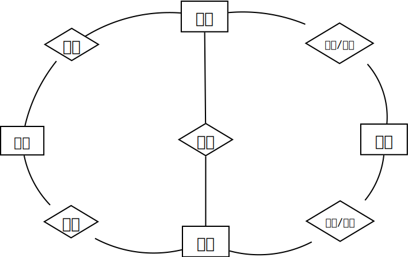

## 部署架构

微信前端和浏览器请求通过Nginx转发给Tomcat，如果需要缓存，就请求Redis，否则就请求MySQL

## 微服务

[微服务](./docs/wiki/微服务.md)

## SpringCloud

[SpringCloud](./docs/wiki/SpringCloud.md)

## 分布式系统

[分布式系统](./docs/分布式系统.md)

## MyBatis

[MyBatis](./docs/MyBatis.md)

## Redis

[Redis](./docs/Redis.md)

## 数据库设计

1. 表之间的关系

2. 具体表

| #          | Table            |
| :--------- | :--------------- |
| 商品分类表 | product_category |
| 商品详情表 | product_info     |
| 订单主表   | order_master     |
| 订单详情表 | order_detail     |
| 卖家信息表 | seller_info      |

## *开发环境搭建*  

| #          | Version        | #           | Version     |
| :--------- | :------------- | :---------- | :---------- |
| SpringBoot | 2.3.12.RELEASE | SpringCloud | Hoxton.SR12 |
| Idea       | 2022.2         | JDK         | 1.8.0_361   |
| Maven      | 3.9.4          | MySQL       | 5.7.25      |
| Nginx      | 1.18.0         | Redis       | 6.2.13      |
| RabbitMQ   | 3.12.4         | Docker      | 20.10.12    |

## *日志*

[日志框架](./docs/logger.md)

## *功能实现*

1. 买家端
   - [x] 查询商品类目
   - [x] 查询上架商品
   - [x] 创建订单
   - [x] 查看订单
   - [x] 取消订单

2. 卖家端
   - [x] 查看、完结和取消订单
   - [x] 查看、更新和上下架商品
   - [x] 卖家端新增商品和类目

3. 微信端
   - [x] 微信授权
   - [x] 微信登录
   - [x] 微信支付
   - [x] 微信退款

4. 买家和卖家端联通
   - [x] 分布式session
   - [x] 卖家信息表
   - [x] 登陆登出

5. 优化
   - [x] 异常捕获
   - [x] MyBatis
   - [x] 并发(Redis分布式锁)
   - [x] Redis(缓存层)

## *项目演示*

- 部分演示：

  - 买家端-查询商品类目

  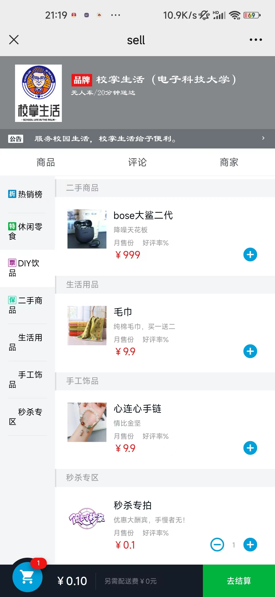

  - 买家端-创建订单

  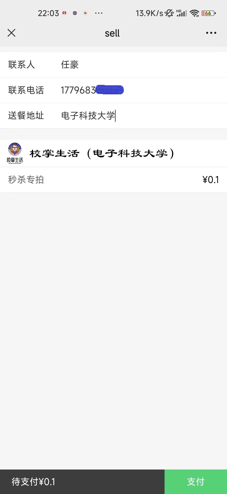

  - 卖家管理系统-订单列表

  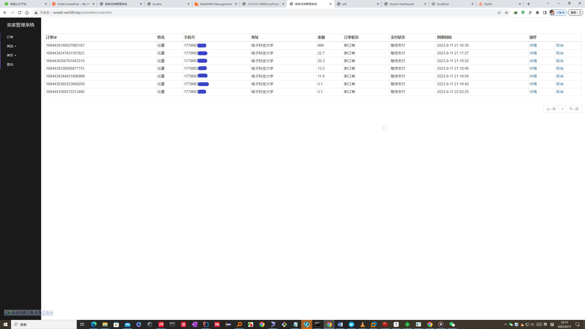

  - 卖家管理系统-完结订单

  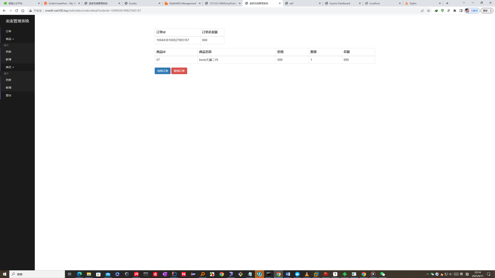

  - 卖家管理系统-商品列表

  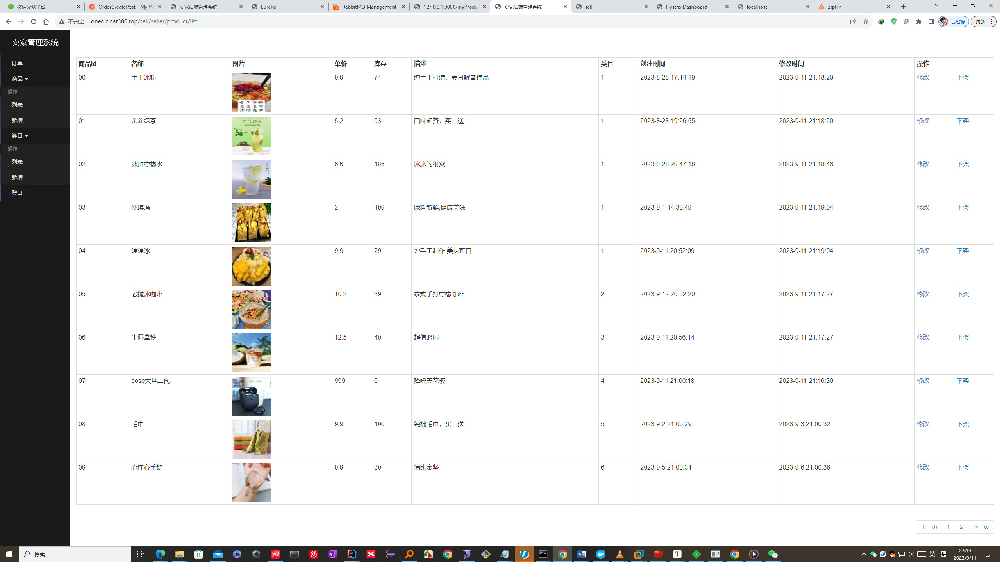

  - 卖家管理系统-添加商品

  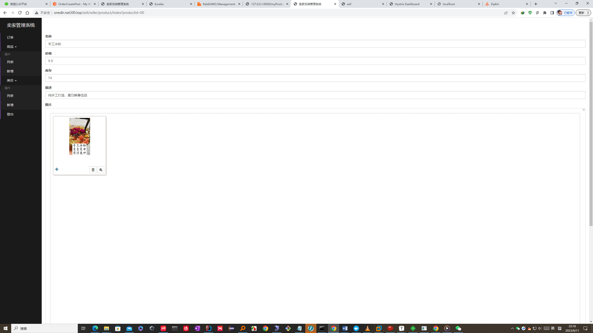

  - 卖家管理系统-分类列表

  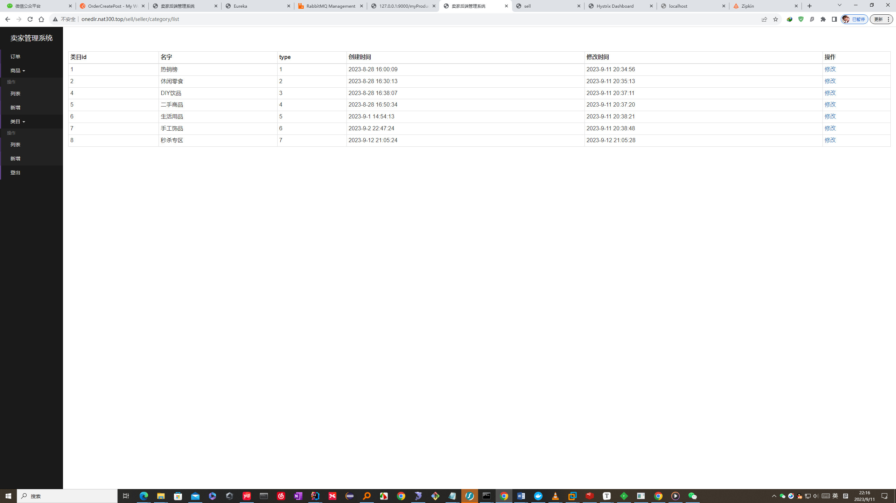

  - 卖家管理系统-添加分类

  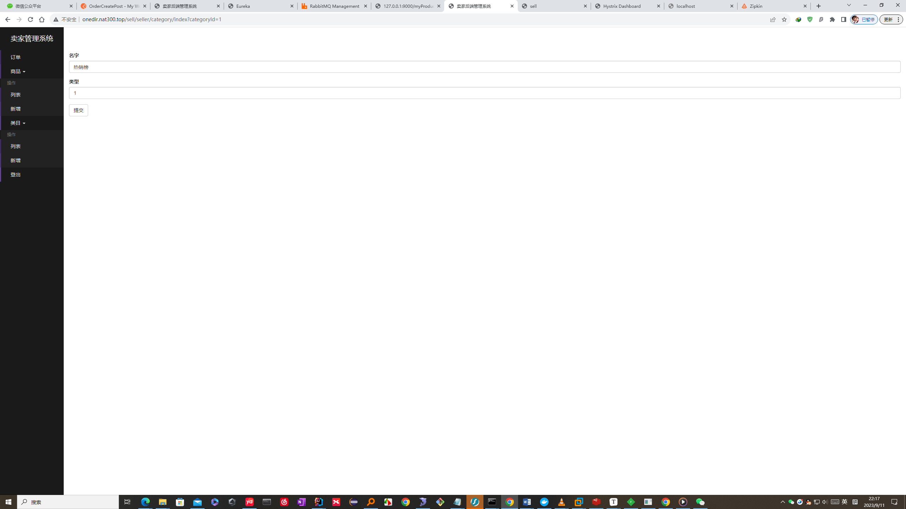

  - 卖家管理系统-新订单提示

    使用PostMan接口测试，模拟新建订单，后台管理WebSocket收到新订单，发送提示到页面上，并播放音乐。

  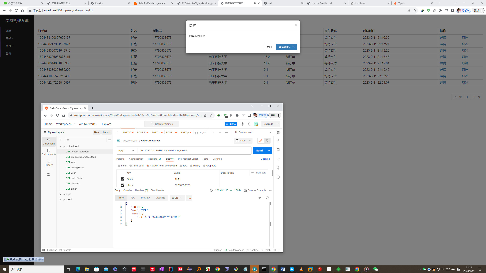

## 项目总结

### Spring Cloud总览

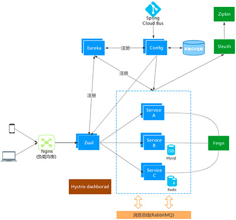

### *一、服务注册与发现（Eureka）*

[服务注册与发现](./docs/summary/服务注册与发现.md)

### *二、如何将单体架构拆分为微服务架构*

[微服务拆分](./docs/summary/微服务拆分.md)

### *三、拆分商品微服务*

[商品微服务](./docs/summary/拆分商品微服务.md)

### *四、拆分订单微服务*

[订单微服务](./docs/summary/订单微服务.md)

### *五、应用通信（Feign）*

[商品微服务与订单微服务之间的调用](./docs/summary/商品微服务与订单微服务之间的调用.md)

### *六、项目改造成多模块*

[项目改造成多模块](./docs/summary/项目改造成多模块.md)

### *七、统一配置中心（Config）*

[统一配置中心](./docs/summary/统一配置中心.md)

### *八、订单异步处理（RabbitMQ）*

[订单异步处理](./docs/summary/订单异步处理.md)

### *九、服务网关（Zuul）*

[服务网关](./docs/summary/服务网关.md)

### *十、用户微服务*

[用户微服务](./docs/summary/用户微服务.md)

### *十一、服务容错（Hystrix）*

[服务容错](./docs/summary/服务容错.md)

### *十二、服务追踪（Sleuth + zipkin）*

[服务追踪](./docs/summary/服务追踪.md)