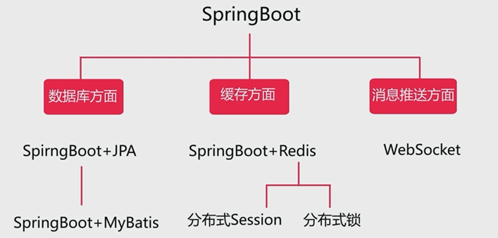

# *基于微信公众号的校园商铺平台总结一*

##  一. 课程技术栈

本门课程以Spring Boot和微信特性为核心技术栈，实现一个从下单到接单流程完整，包含买家端和卖家端前后台功能的微信点餐系统。

关键技术：SpringBoot+Redis+分布式session+微信支付+微信网页授权+微信网站扫码登录+Freemaker+JPA+MyBatis+Redis分布式锁+WebSocket消息+Redis缓存层

1. 后端技术包括
2. 微信特性包括：微信扫码登录(需要企业资质账号)、微信网页授权（微信公众号开发测试帐号即可，需要使用到内网穿透工具）、微信支付与退款（需要企业资质账号）、模板消息推送
3. 项目采用前后端分离的方式：前后端通过 RESTful 风格接口相连
4. 开发环境：SpringBoot2.3.12.RELEASE、JDK1.8.0.361、Maven3.9.4、Redis6.2.13、IDEA2022.2
5. 开发之前，需要对项目进行详细的分析设计————分角色、功能模块、部署架构、数据库表等多个维度进行分析与设计！

## 二、创建SpringBoot项目

使用某个jar包的常用套路：pom中引入依赖–> application.yml中配置 –> 代码中使用

## 三. pom中引入的常用jar包

1. spring-boot-starter-* 起步依赖：是SpringBoot核心之处，它提供了Spring和相关技术的一站式服务，让开发者不再关心Spring相关配置，简化了传统的依赖注入操作过程。

2. 日志框架： slf4j+logback

3. Lombok：Lombok可以减少很多重复代码的书写。比如说getter/setter/toString等方法的编写。常用注解有 @Getter，@Setter，@Data

4. pom文件结构如下：

   ```xml
   <?xml version="1.0" encoding="UTF-8"?>
   <project xmlns="http://maven.apache.org/POM/4.0.0" xmlns:xsi="http://www.w3.org/2001/XMLSchema-instance"
            xsi:schemaLocation="http://maven.apache.org/POM/4.0.0 https://maven.apache.org/xsd/maven-4.0.0.xsd">
       <modelVersion>4.0.0</modelVersion>
       <parent>
           <groupId>org.springframework.boot</groupId>
           <artifactId>spring-boot-starter-parent</artifactId>
           <version>2.3.12.RELEASE</version>
           <relativePath/> <!-- lookup parent from repository -->
       </parent>
       <groupId>com.pro</groupId>
       <artifactId>sell</artifactId>
       <version>0.0.1-SNAPSHOT</version>
       <name>sell</name>
       <description>sell</description>
       <properties>
           <java.version>1.8</java.version>
       </properties>
       <dependencies>
           <dependency>
               <groupId>org.springframework.boot</groupId>
               <artifactId>spring-boot-starter-web</artifactId>
           </dependency>
           <dependency>
               <groupId>org.springframework.boot</groupId>
               <artifactId>spring-boot-configuration-processor</artifactId>
               <optional>true</optional>
           </dependency>
           <dependency>
               <groupId>mysql</groupId>
               <artifactId>mysql-connector-java</artifactId>
               <version>5.1.39</version>
           </dependency>
           <dependency>
               <groupId>org.springframework.boot</groupId>
               <artifactId>spring-boot-starter-data-jpa</artifactId>
           </dependency>
           <dependency>
               <groupId>org.projectlombok</groupId>
               <artifactId>lombok</artifactId>
               <optional>true</optional>
           </dependency>
           <dependency>
               <groupId>org.springframework.boot</groupId>
               <artifactId>spring-boot-starter-test</artifactId>
               <scope>test</scope>
           </dependency>
           <!-- https://mvnrepository.com/artifact/junit/junit -->
           <dependency>
               <groupId>junit</groupId>
               <artifactId>junit</artifactId>
               <version>4.13.2</version>
               <scope>test</scope>
           </dependency>
           <dependency>
               <groupId>org.springframework</groupId>
               <artifactId>spring-test</artifactId>
           </dependency>
           <dependency>
               <groupId>org.springframework.boot</groupId>
               <artifactId>spring-boot-test</artifactId>
           </dependency>
           <dependency>
               <groupId>javax.validation</groupId>
               <artifactId>validation-api</artifactId>
           </dependency>
           <dependency>
               <groupId>com.google.code.gson</groupId>
               <artifactId>gson</artifactId>
               <version>2.8.6</version>
           </dependency>
           <dependency>
               <groupId>com.github.binarywang</groupId>
               <artifactId>weixin-java-mp</artifactId>
               <version>4.5.0</version>
           </dependency>
           <!-- https://mvnrepository.com/artifact/cn.springboot/best-pay-sdk -->
           <dependency>
               <groupId>cn.springboot</groupId>
               <artifactId>best-pay-sdk</artifactId>
               <version>1.3.7</version>
           </dependency>
   
           <!-- https://mvnrepository.com/artifact/org.springframework.boot/spring-boot-starter-freemarker -->
           <dependency>
               <groupId>org.springframework.boot</groupId>
               <artifactId>spring-boot-starter-freemarker</artifactId>
               <version>1.3.8.RELEASE</version>
           </dependency>
           <!-- https://mvnrepository.com/artifact/org.springframework.boot/spring-boot-starter-data-redis -->
           <dependency>
               <groupId>org.springframework.boot</groupId>
               <artifactId>spring-boot-starter-data-redis</artifactId>
               <version>2.3.12.RELEASE</version>
           </dependency>
           <!-- https://mvnrepository.com/artifact/org.springframework.boot/spring-boot-starter-websocket -->
           <dependency>
               <groupId>org.springframework.boot</groupId>
               <artifactId>spring-boot-starter-websocket</artifactId>
               <version>2.3.2.RELEASE</version>
           </dependency>
           <!-- https://mvnrepository.com/artifact/org.mybatis.spring.boot/mybatis-spring-boot-starter -->
           <dependency>
               <groupId>org.mybatis.spring.boot</groupId>
               <artifactId>mybatis-spring-boot-starter</artifactId>
               <version>1.3.2</version>
           </dependency>
       </dependencies>
   
       <build>
           <finalName>sell</finalName>
           <plugins>
               <plugin>
                   <groupId>org.springframework.boot</groupId>
                   <artifactId>spring-boot-maven-plugin</artifactId>
                   <configuration>
                       <excludes>
                           <exclude>
                               <groupId>org.projectlombok</groupId>
                               <artifactId>lombok</artifactId>
                           </exclude>
                       </excludes>
                   </configuration>
               </plugin>
           </plugins>
       </build>
   
   </project>
   
   ```

## 四. 配置文件

1. application.yml：通过该配置文件进行项目的统一配置和管理。注意：这个文件中只能配置简单的日

2. logback-spring.xml：可以配置复杂日志。在resources文件夹下创建logback-spring.xml文件，并在其中配置日志输出格式及内容，springBoot将自动读取该配置文件。其内容如下：

   ```yaml
   spring:
     datasource:
       driver-class-name: com.mysql.jdbc.Driver
       username: root
       password: 123456
       url: jdbc:mysql://192.168.138.130/sell?characterEncoding=utf-8&useSSL=false
     jpa:
       show-sql: true
     jackson:
       default-property-inclusion: non_null
     freemarker:
       suffix: .ftl
     redis:
       host: 192.168.138.130
       port: 6379
   server:
     port: 8080
     servlet:
       context-path: /sell
   wechat:
     # 公众账号，授权
     mpAppId: wxc04e98f5d9a97247
     mpAppSecret: e05e76975febf731eab62c92e13d0d0b
     # 开放平台，卖家扫码登录用
     openAppId: wx6ad144e54af67d87
     openAppSecret: 91a2ff6d38a2bbccfb7e9xxxxxx
     # 支付/商户号
     mchId: 1483469312
     mchKey: 06C56A89949D617xxxxxxxxxxx
     # 发起支付不需要证书，退款需要
     keyPath: /var/weixin_cert/h5.p12
     notifyUrl: http://onedir.nat300.top/sell/pay/notify
     templateId:
       orderStatus: ggMal_wIHZyYqieU2AIVngkks4XsEsoqA4nLfkSc9UU
   projectUrl:
     wechatMpAuthorize: http://onedir.nat300.top
     wechatOpenAuthorize: http://onedir.nat300.top
     sell: http://onedir.nat300.top
   logging:
     level:
       com.pro.sell.dataobject.mapper: trace
   mybatis:
     mapper-locations: classpath:mapper/*.xml
   
   ```

   

## 五. 设计与开发顺序

编写API文档 –> 实体类 –> DAO层（Dao接口、单元测试）–> Service层（Service接口及其实现类、单元测试）–> Controller层

```
单元测试贯穿Dao层和Service层开发始终

开发流程: 项目业务分析、建库建表、实体类、DTO、Repository层、单元测试、Service层、单元测试、Controller、Form对象与校验、VO对象
```

## 六. 实体类开发

1. @Entity声明该类为实体类，对应数据库的表，反映数据库表和Java实体间的映射关系。创建实体类时，类名和属性名都采用驼峰命名法，Jpa会自动转换。

2. 自增主键添加 @GeneratedValue(strategy = GenerationType.IDENTITY) 注解，否则会报‘关系 “hibernate_sequence” 不存在‘ 的错误；

3. 注意@DynamicInsert()、@DynamicUpdate()的使用 。@DynamicUpdate 表示update对象的时候,生成动态的update语句。如果字段有更新，Hibernate才会对该字段进行更新，比如下面的updateTime字段。参考 https://blog.csdn.net/itguangit/article/details/78696767

   ```java
   /**
    * 商品种类
    */
   @Entity
   @DynamicUpdate
   @Data
   public class ProductCategory {
       /** 类目id. */
       @Id
       @GeneratedValue(strategy = GenerationType.IDENTITY)
       private Integer categoryId;
       /** 类目名字. */
       private String categoryName;
       /** 类目编号. */
       private Integer categoryType;
       private Date createTime;
       private Date updateTime;
       public ProductCategory() {
       }
       public ProductCategory(String categoryName, Integer categoryType) {
           this.categoryName = categoryName;
           this.categoryType = categoryType;
       }
   }
   ```

4. @JsonIgnore 的作用是在将ResponseBody中的Javabean返回前端过程中，被springmvc自带的jackson转化成json字符串时，不返回被@JsonIgnore标记的属性。

## 七. 基于JPA的Dao层开发

1. 创建dao层接口时，需继承JpaRepository接口来实现对数据库的CRUD操作

   ```java
   public interface ProductCategoryRepository extends JpaRepository<ProductCategory, Integer> {
       List<ProductCategory> findByCategoryTypeIn(List<Integer> categoryTypeList);
   }
   ```

   

## 八. Dao层单元测试

1. 单元测试中加上@Transactional注解后会执行回滚，以保持数据库表数据的干净

   ```java
   @RunWith(SpringRunner.class)
   @SpringBootTest
   public class ProductCategoryRepositoryTest {
       @Autowired
       private ProductCategoryRepository repository;
   
       @Test
       public void findOneTest() {
           ProductCategory productCategory = repository.findById(1).orElse(null);
           System.out.println(productCategory.toString());
       }
   
       @Test
       @Transactional
       public void saveTest() {
           ProductCategory productCategory = new ProductCategory("女生最爱", 4);
           ProductCategory result = repository.save(productCategory);
           Assert.assertNotNull(result);
   //        Assert.assertNotEquals(null, result);
       }
   
       @Test
       public void findByCategoryTypeInTest() {
           List<Integer> list = Arrays.asList(2,3,4);
   
           List<ProductCategory> result = repository.findByCategoryTypeIn(list);
           Assert.assertNotEquals(0, result.size());
       }
   }
   ```

   

## 九. Service接口及其实现类

1. 所有的业务逻辑都放到Service层实现

   ```java
   @Service
   public class CategoryServiceImpl implements CategoryService {
   
       @Autowired
       private ProductCategoryRepository repository;
   
       @Override
       public ProductCategory findOne(Integer categoryId) {
           /**
            * 查不到返回null
            * .get 抛异常
            */
           return repository.findById(categoryId).orElse(null);
       }
   
       @Override
       public List<ProductCategory> findAll() {
           return repository.findAll();
       }
   
       @Override
       public List<ProductCategory> findByCategoryTypeIn(List<Integer> categoryTypeList) {
           return repository.findByCategoryTypeIn(categoryTypeList);
       }
   
       @Override
       public ProductCategory save(ProductCategory productCategory) {
           return repository.save(productCategory);
       }
   }
   
   ```

   

## 十. 数据层传输对象DTO

1. DTO：数据传输对象，专门用于在各层之间传输数据

2. 在各层之间传输数据最好使用DTO对象

   ```java
   @Data
   //@JsonSerialize(include = JsonSerialize.Inclusion.NON_NULL)
   //@JsonInclude(JsonInclude.Include.NON_NULL) //空值不返回
   public class OrderDTO {
       /** 订单id. */
       private String orderId;
       /** 买家名字. */
       private String buyerName;
       /** 买家手机号. */
       private String buyerPhone;
       /** 买家地址. */
       private String buyerAddress;
       /** 买家微信Openid. */
       private String buyerOpenid;
       /** 订单总金额. */
       private BigDecimal orderAmount;
       /** 订单状态, 默认为0新下单. */
       private Integer orderStatus;
       /** 支付状态, 默认为0未支付. */
       private Integer payStatus;
       /** 创建时间. */
       @JsonSerialize(using = Date2LongSerializer.class)
       private Date createTime;
       /** 更新时间. */
       @JsonSerialize(using = Date2LongSerializer.class)
       private Date updateTime;
       //买家的所有订单
       List<OrderDetail> orderDetailList;
       @JsonIgnore
       public OrderStatusEnum getOrderStatusEnum() {
           return EnumUtil.getByCode(orderStatus, OrderStatusEnum.class);
       }
       @JsonIgnore
       public PayStatusEnum getPayStatusEnum() {
           return EnumUtil.getByCode(payStatus, PayStatusEnum.class);
       }
   }
   ```

   

## 十一. API文档与统一的返回格式VO

1. 代码未动，文档先行  [api文档](./docs/API.md)

2. VO：返回给前端的对象

   统一创建返回给前端的对象：ResultVO，只返回前端需要的字段，出于信息安全考虑，原则上不直接返回实体类。

   ```java
   /**
    * http请求返回的最外层对象
    */
   @Data
   //@JsonInclude(JsonInclude.Include.NON_NULL)
   public class ResultVO<T> implements Serializable {
   
       private static final long serialVersionUID = 9148921404840892546L;
   
       /** 错误码. */
       private Integer code;
   
       /** 提示信息. */
       private String msg;
   
       /** 具体内容. */
       private T data;
   }
   ```

   

## 十二. 表单校验

1. @Valid 用于对表单的校验，如果校验不通过，BindingResult对象不为空，并可通过bindingResult.getFieldError().getDefaultMessage()方法获取错误信息;

2. 通过如下注解完成对表单填写信息的约束，并在不符合约束时将message信息返回

   ```java
   /**
    * 前端传入的相关参数
    */
   @Data
   public class OrderForm {
   
       /**
        * 买家姓名
        */
       @NotEmpty(message = "姓名必填")
       private String name;
   
       /**
        * 买家手机号
        */
       @NotEmpty(message = "手机号必填")
       private String phone;
   
       /**
        * 买家地址
        */
       @NotEmpty(message = "地址必填")
       private String address;
   
       /**
        * 买家微信openid
        */
       @NotEmpty(message = "openid必填")
       private String openid;
   
       /**
        * 购物车
        */
       @NotEmpty(message = "购物车不能为空")
       private String items;
   }
   ```

   

## 十三.freemarker

1. 使用freemarker时，配置文件中需要做如下配置

   ```yaml
   spring:
     freemarker:
       cache: false
       charset: UTF-8
       content-type: text/html
       template-loader-path: classpath:/templates
       suffix: .ftl
   ```

2. 使用freemarker时，Controller需要返回ModelAndView对象

   ```java
   /**
    * 卖家，操作订单相关功能
    */
   @Controller
   @RequestMapping("/seller/order")
   @Slf4j
   public class SellerOrderController {
   
       @Autowired
       private OrderService orderService;
   
       /**
        * 订单列表
        * @param page 第几页, 从1页开始
        * @param size 一页有多少条数据
        * @return
        */
       @GetMapping("/list")
       public ModelAndView list(@RequestParam(value = "page", defaultValue = "1") Integer page,
                                @RequestParam(value = "size", defaultValue = "10") Integer size,
                                Map<String, Object> map) {
           PageRequest request = PageRequest.of(page - 1, size);
           Page<OrderDTO> orderDTOPage = orderService.findList(request);
           map.put("orderDTOPage", orderDTOPage);
           map.put("currentPage", page);
           map.put("size", size);
   //        orderDTOPage.getTotalPages()
           return new ModelAndView("order/list", map);
       }
   
       /**
        * 取消订单
        * @param orderId
        * @return
        */
       @GetMapping("/cancel")
       public ModelAndView cancel(@RequestParam("orderId") String orderId,
                                  Map<String, Object> map) {
           try {
               OrderDTO orderDTO = orderService.findOne(orderId);
               orderService.cancel(orderDTO);
           } catch (SellException e) {
               log.error("【卖家端取消订单】发生异常{}", e);
               map.put("msg", e.getMessage());
               map.put("url", "/sell/seller/order/list");
               return new ModelAndView("common/error", map);
           }
   
           map.put("msg", ResultEnum.ORDER_CANCEL_SUCCESS.getMessage());
           map.put("url", "/sell/seller/order/list");
           return new ModelAndView("common/success");
       }
   
       /**
        * 订单详情
        * @param orderId
        * @param map
        * @return
        */
       @GetMapping("/detail")
       public ModelAndView detail(@RequestParam("orderId") String orderId,
                                  Map<String, Object> map) {
           OrderDTO orderDTO = new OrderDTO();
           try {
               orderDTO = orderService.findOne(orderId);
           }catch (SellException e) {
               log.error("【卖家端查询订单详情】发生异常{}", e);
               map.put("msg", e.getMessage());
               map.put("url", "/sell/seller/order/list");
               return new ModelAndView("common/error", map);
           }
   
           map.put("orderDTO", orderDTO);
           return new ModelAndView("order/detail", map);
       }
   
       /**
        * 完结订单
        * @param orderId
        * @param map
        * @return
        */
       @GetMapping("/finish")
       public ModelAndView finished(@RequestParam("orderId") String orderId,
                                    Map<String, Object> map) {
           try {
               OrderDTO orderDTO = orderService.findOne(orderId);
               orderService.finish(orderDTO);
           } catch (SellException e) {
               log.error("【卖家端完结订单】发生异常{}", e);
               map.put("msg", e.getMessage());
               map.put("url", "/sell/seller/order/list");
               return new ModelAndView("common/error", map);
           }
   
           map.put("msg", ResultEnum.ORDER_FINISH_SUCCESS.getMessage());
           map.put("url", "/sell/seller/order/list");
           return new ModelAndView("common/success");
       }
   
   
   }
   ```

   

## 十四. 统一处理异常类

1. 首先需要自定义异常类，这些异常类都需要继承自RuntimeException。在构造方法中完成对code和message的初始化。

   ```java
   /**
    * 自定义异常
    */
   @Getter
   public class SellException extends RuntimeException {
   
       private Integer code;
   
       public SellException(ResultEnum resultEnum) {
           super(resultEnum.getMessage());
   
           this.code = resultEnum.getCode();
       }
   
       public SellException(Integer code, String message) {
           super(message);
           this.code = code;
       }
   }
   ```

   

2. 开发全程如果出现异常则直接抛出异常，而无需处理

   ```java
   /**
    * 买家端，操作订单相关功能
    */
   @RestController
   @RequestMapping("/buyer/order")
   @Slf4j
   public class BuyerOrderController {
       @Autowired
       private OrderService orderService;
       @Autowired
       private BuyerService buyerService;
   
       //创建订单
       @PostMapping("/create")
       public ResultVO<Map<String, String>> create(@Valid OrderForm orderForm,
                                                   BindingResult bindingResult) {
            //判断表单校验后，是否有错误
           if (bindingResult.hasErrors()) {
               log.error("【创建订单】参数不正确, orderForm={}", orderForm);
               throw new SellException(ResultEnum.PARAM_ERROR.getCode(),
                       bindingResult.getFieldError().getDefaultMessage());
           }
           //将orderForm转为orderDTO
           OrderDTO orderDTO = OrderForm2OrderDTOConverter.convert(orderForm);
           //判断orderDTO中的orderDetailList是否为空
           if (CollectionUtils.isEmpty(orderDTO.getOrderDetailList())) {
               log.error("【创建订单】购物车不能为空");
               throw new SellException(ResultEnum.CART_EMPTY);
           }
           //创建订单
           OrderDTO createResult = orderService.create(orderDTO);
   
           Map<String, String> map = new HashMap<>();
           map.put("orderId", createResult.getOrderId());
           //将json返回前端
           return ResultVOUtil.success(map);
       }
   
       //订单列表
       @GetMapping("/list")
       public ResultVO<List<OrderDTO>> list(@RequestParam("openid") String openid,
                                            @RequestParam(value = "page", defaultValue = "0") Integer page,
                                            @RequestParam(value = "size", defaultValue = "10") Integer size) {
           if (StringUtils.isEmpty(openid)) {
               log.error("【查询订单列表】openid为空");
               throw new SellException(ResultEnum.PARAM_ERROR);
           }
   
           PageRequest request = PageRequest.of(page, size);
           Page<OrderDTO> orderDTOPage = orderService.findList(openid, request);
   
           return ResultVOUtil.success(orderDTOPage.getContent());
       }
   
       //订单详情
       @GetMapping("/detail")
       public ResultVO<OrderDTO> detail(@RequestParam("openid") String openid,
                                        @RequestParam("orderId") String orderId) {
           //直接使用orderService是不安全的做法（任何人都可以访问到），需要改进
           OrderDTO orderDTO = buyerService.findOrderOne(openid, orderId);
           return ResultVOUtil.success(orderDTO);
       }
   
       //取消订单
       @PostMapping("/cancel")
       public ResultVO cancel(@RequestParam("openid") String openid,
                              @RequestParam("orderId") String orderId) {
           //直接使用orderService是不安全的做法（任何人都可以访问到），需要改进
           buyerService.cancelOrder(openid, orderId);
           return ResultVOUtil.success();
       }
   }
   ```

3. 最后通过@ControllerAdvice进行统一全局异常处理

   1. @ControllerAdvice 注解：可以用于定义@ExceptionHandler、@InitBinder、@ModelAttribute，并应用到所有@RequestMapping中。该注解很多时候是应用在全局异常处理中，如下代码。

   2. @ExceptionHandler(value= xxxException.class)注解实现对特定的异常的捕获，并获取异常的详细信息和错误码
   3. @ResponseStatus(HttpStatus.FORBIDDEN) 注解可以设置响应状态码，具体状态码参考HttpStatus枚举类

   ```java
   @ControllerAdvice
   public class SellExceptionHandler {
   
       @Autowired
       private ProjectUrlConfig projectUrlConfig;
   
       //拦截登录异常，出现异常时，自动重新登录
       @ExceptionHandler(value = SellerAuthorizeException.class)
   //    @ResponseStatus(HttpStatus.FORBIDDEN)
       public ModelAndView handlerAuthorizeException() {
           Map<String, Object> map = new HashMap<>();
           map.put("msg", "登录状态异常！");
           map.put("url", "/sell/seller/login?openid=abc");
           return new ModelAndView("common/error", map);
       }
   
       @ExceptionHandler(value = SellException.class)
       @ResponseBody
       public ResultVO handlerSellerException(SellException e) {
           return ResultVOUtil.error(e.getCode(), e.getMessage());
       }
   
       //@ResponseStatus: 返回指定HttpStatus
       @ExceptionHandler(value = ResponseBankException.class)
       @ResponseStatus(HttpStatus.FORBIDDEN)
       public void handleResponseBankException() {
   
       }
   }
   ```

   

## 十五. 设置系统常量

1. 在开发中，有时需要用到一些常量并且共享，为方便对此常量值进行统一维护。常采用接口类进行常量的定义和初始化(接口中的常量默认用public static final修饰)。

   ```java
   /**
    * redis常量
    */
   public interface RedisConstant {
   
       String TOKEN_PREFIX = "token_%s";
   
       Integer EXPIRE = 7200; //2小时
   }
   ```

   

## 十六. 枚举的使用

1. 使用枚举类对项目中一些状态值或者错误码进行统一管理。

   ```java
   /**
    * 可能返回的结果或者异常
    */
   @Getter
   public enum ResultEnum {
   
       SUCCESS(0, "成功"),
   
       PARAM_ERROR(1, "参数不正确"),
   
       PRODUCT_NOT_EXIST(10, "商品不存在"),
   
       PRODUCT_STOCK_ERROR(11, "商品库存不正确"),
   
       ORDER_NOT_EXIST(12, "订单不存在"),
   
       ORDERDETAIL_NOT_EXIST(13, "订单详情不存在"),
   
       ORDER_STATUS_ERROR(14, "订单状态不正确"),
   
       ORDER_UPDATE_FAIL(15, "订单更新失败"),
   
       ORDER_DETAIL_EMPTY(16, "订单详情为空"),
   
       ORDER_PAY_STATUS_ERROR(17, "订单支付状态不正确"),
   
       CART_EMPTY(18, "购物车为空"),
   
       ORDER_OWNER_ERROR(19, "该订单不属于当前用户"),
   
       WECHAT_MP_ERROR(20, "微信公众账号方面错误"),
   
       WXPAY_NOTIFY_MONEY_VERIFY_ERROR(21, "微信支付异步通知金额校验不通过"),
   
       ORDER_CANCEL_SUCCESS(22, "订单取消成功"),
   
       ORDER_FINISH_SUCCESS(23, "订单完结成功"),
   
       ORDER_PAY_SUCCESS(27, "订单支付成功"),
   
       PRODUCT_STATUS_ERROR(24, "商品状态不正确"),
   
       LOGIN_FAIL(25, "登录失败, 登录信息不正确"),
   
       LOGOUT_SUCCESS(26, "登出成功"),
       ;
   
       private Integer code;
   
       private String message;
   
       ResultEnum(Integer code, String message) {
           this.code = code;
           this.message = message;
       }
   }
   ```

   

