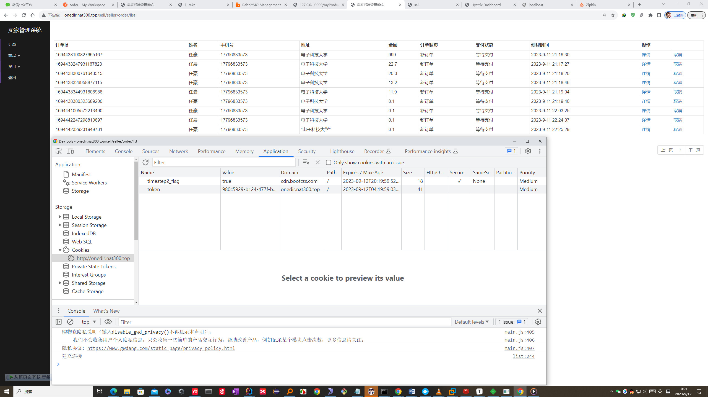
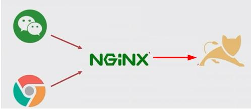
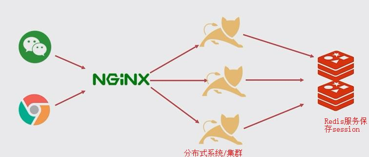
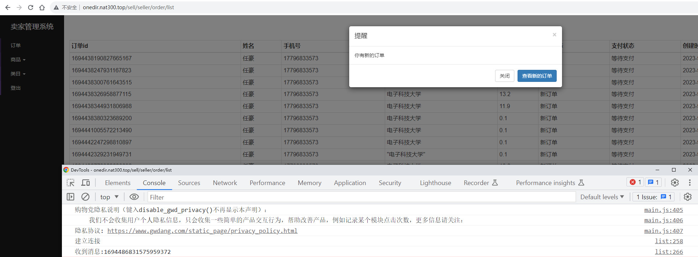

# *基于微信公众号的校园商铺平台总结二*

## 一、分布式session

1. 分布式系统的三大特点

   多节点、消息通信、不共享内存

2. 易混淆的三个概念(分布式系统、集群、分布式计算)

   |          | 分布式系统           | 集群                                     |
   | -------- | -------------------- | ---------------------------------------- |
   | 相同点   | 多节点               | 多节点                                   |
   | 不同点   | 各节点的业务功能不同 | 各节点的业务功能相同                     |
   | 联系     |                      | 集群不一定是分布式系统，如allInOne的系统 |
   | 同义表述 | 垂直拆分             | 水平拆分                                 |

​      分布式计算：如Hadoop中的MapReduce

3. session会话管理
   - session的作用：保存用户信息与状态
   - session的本质：一种保存key-value的机制
   - session的两种key形式：sessionid和token
   - session的key特点：全局唯一、一个用户对应唯一session的key
   - session的value特点：用户信息

​	session在浏览器中的存在：

4. 常规系统，session保存在Tomcat应用的内存中

5. 分布式session：session保存在独立的Redis服务中

6. 分布式session的登录controller层代码示例

   ```java
   /**
        * 卖家端，登录功能，设置redis和cookie
        * @param openid
        * @param response
        * @param map
        * @return
        */
       @GetMapping("/login")
       public ModelAndView login(@RequestParam("openid") String openid,
                                 HttpServletResponse response,
                                 Map<String, Object> map) {
           //1. openid去和数据库里的数据匹配
           SellerInfo sellerInfo = sellerService.findSellerInfoByOpenid(openid);
           if (sellerInfo == null) {
               map.put("msg", ResultEnum.LOGIN_FAIL.getMessage());
               map.put("url", "/sell/seller/order/list");
               return new ModelAndView("common/error");
           }
   
           //2. 设置token至redis
           String token = UUID.randomUUID().toString();
           Integer expire = RedisConstant.EXPIRE; //过期时间
   
           redisTemplate.opsForValue().set(String.format(RedisConstant.TOKEN_PREFIX, token), openid, expire, TimeUnit.SECONDS);
   
           //3. 设置token至cookie
           CookieUtil.set(response, CookieConstant.TOKEN, token, expire);
   
           //跳转的时候，建议用完整的HTTP地址
           return new ModelAndView("redirect:" + projectUrlConfig.getSell() + "/sell/seller/order/list");
   
       }
   ```

   

7. 分布式session的退出controller层代码示例

   ```java
   /**
        * 买家端，登出功能，清除redis和cookie
        * @param request
        * @param response
        * @param map
        * @return
        */
       @GetMapping("/logout")
       public ModelAndView logout(HttpServletRequest request,
                                  HttpServletResponse response,
                                  Map<String, Object> map) {
           //1. 从cookie里查询
           Cookie cookie = CookieUtil.get(request, CookieConstant.TOKEN);
           if (cookie != null) {
               //2. 清除redis
               redisTemplate.opsForValue().getOperations().delete(String.format(RedisConstant.TOKEN_PREFIX, cookie.getValue()));
   
               //3. 清除cookie
               CookieUtil.set(response, CookieConstant.TOKEN, null, 0);
           }
   
           map.put("msg", ResultEnum.LOGOUT_SUCCESS.getMessage());
           map.put("url", "/sell/seller/order/list"); //登出后等待3s自动跳转到订单列表页
           return new ModelAndView("common/success", map);
       }
   ```

   

## 二、使用AOP实现身份验证

1. 身份验证：每次访问url都需要校验用户是否已登录

2. 实现方式：从cookie中获取sessionid，并与redis中的进行比对，一致则说明已登录，否则就是未登录，跳转到登录页面

3. AOP实现身份验证代码示例

   ```java
   /**
    * seller在执行相应操作之前，判断cookie和redis中是否有值，即是否已登录，
    * 如果未登录，则抛异常，进行异常捕获；
    */
   @Aspect
   @Component
   @Slf4j
   public class SellerAuthorizeAspect {
       @Autowired
       private StringRedisTemplate redisTemplate;
   
       @Pointcut("execution(public * com.pro.sell.controller.Seller*.*(..))" +
               "&& !execution(public * com.pro.sell.controller.SellerUserController.*(..))")
       public void verify() {}
   
       @Before("verify()")
       public void doVerify() {
           ServletRequestAttributes attributes = (ServletRequestAttributes) RequestContextHolder.getRequestAttributes();
           HttpServletRequest request = attributes.getRequest();
   
           //查询cookie
           Cookie cookie = CookieUtil.get(request, CookieConstant.TOKEN);
           if (cookie == null) {
               log.warn("【登录校验】Cookie中查不到token");
               throw new SellerAuthorizeException();
           }
   
           //去redis里查询
           String tokenValue = redisTemplate.opsForValue().get(String.format(RedisConstant.TOKEN_PREFIX, cookie.getValue()));
           if (StringUtils.isEmpty(tokenValue)) {
               log.warn("【登录校验】Redis中查不到token");
               throw new SellerAuthorizeException();
           }
       }
   }
   ```

   

## 三、使用WebSocket实现客户端与服务器端消息通信

### WebSocket客户端开发

1. 直接使用Html5原生WebSocket，在JS中编写如下代码即可：

   ```javascript
   <script>
       var websocket = null;
       if('WebSocket' in window) {
           websocket = new WebSocket('ws://onedir.nat300.top/sell/webSocket');
       }else {
           alert('该浏览器不支持websocket!');
       }
   
       websocket.onopen = function (event) {
           console.log('建立连接');
       }
   
       websocket.onclose = function (event) {
           console.log('连接关闭');
       }
   
       websocket.onmessage = function (event) {
           console.log('收到消息:' + event.data)
           //弹窗提醒
           $('#myModal').modal('show');
           //播放音乐
           document.getElementById('notice').play();
       }
   
       websocket.onerror = function () {
           alert('websocket通信发生错误！');
       }
   
       window.onbeforeunload = function () {
           websocket.close();
       }
   
   </script>
   ```

   

### WebSocket服务端开发

1. 引入依赖

   ```yaml
   <dependency>
       <groupId>org.mybatis.spring.boot</groupId>
       <artifactId>mybatis-spring-boot-starter</artifactId>
       <version>1.3.2</version>
   </dependency>
   ```

2. 编写配置类

   ```java
   @Component
   public class WebSocketConfig {
   
       //使用SpringBootTest时，需要先将此bean注释
       //因为ServerEndpointExporter Bean的创建需要一个真实的Tomcat环境
       @Bean
       public ServerEndpointExporter serverEndpointExporter() {
           return new ServerEndpointExporter();
       }
   }
   ```

3. 编写WebSocket的服务端类

   ```java
   /**
    * WebSocket server endpoint
    */
   @Component
   @ServerEndpoint("/webSocket")
   @Slf4j
   public class WebSocket {
   
       private Session session;
       private static CopyOnWriteArraySet<WebSocket> webSocketSet = new CopyOnWriteArraySet<>();
   
   
       @OnOpen
       public void onOpen(Session session) {
           this.session = session;
           webSocketSet.add(this);
           log.info("【websocket消息】有新的连接, 总数:{}", webSocketSet.size());
       }
   
       @OnClose
       public void onClose() {
           webSocketSet.remove(this);
           log.info("【websocket消息】连接断开, 总数:{}", webSocketSet.size());
       }
   
       @OnMessage
       public void onMessage(String message) {
           log.info("【websocket消息】收到客户端发来的消息:{}", message);
       }
   
       public void sendMessage(String message) {
           for (WebSocket webSocket: webSocketSet) {
               log.info("【websocket消息】广播消息, message={}", message);
               try {
                   webSocket.session.getBasicRemote().sendText(message);
               } catch (Exception e) {
                   e.printStackTrace();
               }
           }
       }
   
   }
   ```

   

4. 在特定的业务Service中发送WebSocket消息

   ```java
   @Override
   @Transactional
   public OrderDTO create(OrderDTO orderDTO) {
       //生成唯一订单号
       String orderId = KeyUtil.genUniqueKey();
       //订单总金额
       BigDecimal orderAmount = new BigDecimal(BigInteger.ZERO);
       //        List<CartDTO> cartDTOList = new ArrayList<>();
       //1.查询订单中的商品（数量，价格）
       for (OrderDetail orderDetail : orderDTO.getOrderDetailList()) {
           ProductInfo productInfo = productService.findOne(orderDetail.getProductId());
           if(productInfo == null){
               throw new SellException(ResultEnum.PRODUCT_NOT_EXIST);
           }
           //2.计算订单总金额
           orderAmount = productInfo.getProductPrice()
               .multiply(new BigDecimal(orderDetail.getProductQuantity()))
               .add(orderAmount);
           //订单详情orderDetail入库
           orderDetail.setDetailId(KeyUtil.genUniqueKey()); //生成唯一主键
           orderDetail.setOrderId(orderId);
           BeanUtils.copyProperties(productInfo, orderDetail);
           orderDetailRepository.save(orderDetail);
   
           //            CartDTO cartDTO = new CartDTO(orderDetail.getProductId(), orderDetail.getProductQuantity());
           //            cartDTOList.add(cartDTO);
       }
       //3.orderMaster写入订单数据库（orderMaster和orderDetail）
       OrderMaster orderMaster = new OrderMaster();
       orderDTO.setOrderId(orderId);
       //注意此处copy要放在set之前，否则会将null值copy过去
       BeanUtils.copyProperties(orderDTO, orderMaster);
       orderMaster.setOrderAmount(orderAmount);
       orderMaster.setOrderStatus(OrderStatusEnum.NEW.getCode());
       orderMaster.setPayStatus(PayStatusEnum.WAIT.getCode());
       orderMasterRepository.save(orderMaster);
       //4.扣除库存
       List<CartDTO> cartDTOList = orderDTO.getOrderDetailList().stream().map(e ->
                                                                              new CartDTO(e.getProductId(), e.getProductQuantity())
                                                                             ).collect(Collectors.toList());
       productService.decreaseStock(cartDTOList);
   
       //发送webSocket消息
       webSocket.sendMessage(orderDTO.getOrderId());
   
       return orderDTO;
   }
   ```

   

5. 测试