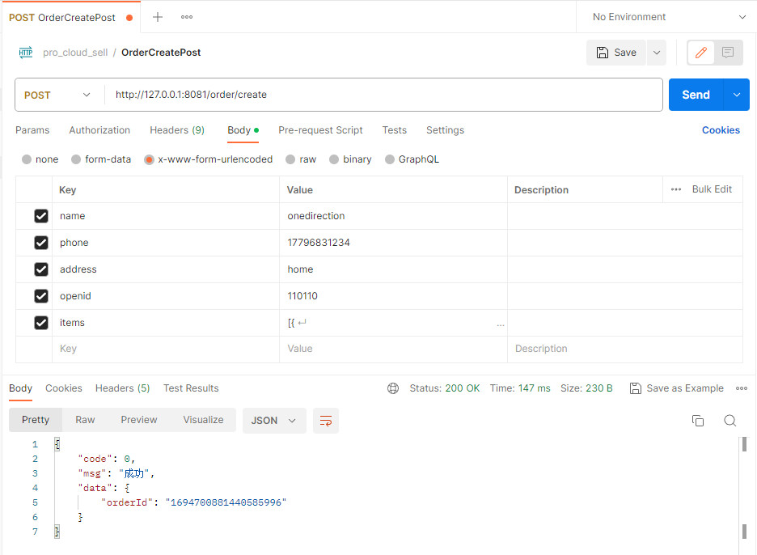

# 商品微服务与订单微服务之间的调用

## 微服务之间调用的几种方式

> 应用之间通信主要有两种方式：
>
> - RPC – 代表 Dubbo (可以基于TCP协议，也可以基于HTTP协议)
> - HTTP  – 代表 Spring Cloud (基于HTTP协议)

### HTTP方式之RestTemplate

> 测试使用order微服务调用product微服务

product作为服务端，先对外暴露一个测试接口

```java
@RestController
public class ServerController {
    @GetMapping("/msg")
    public String msg() {
        return "this is product msg 1";
    }
}
```

order作为客户端调用该接口

```java
@RestController
@Slf4j
public class ClientController {

//    @Autowired
//    private LoadBalancerClient loadBalancerClient;

//    @Autowired
//    private RestTemplate restTemplate;
    @Autowired
    private ProductClient productClient;

    @GetMapping("/getProductMsg")
    public String getProductMsg(){
        //1.第一种方式(直接使用restTemplate, url写死)
//        RestTemplate restTemplate = new RestTemplate();
//        String response = restTemplate.getForObject("http://127.0.0.1:8080/msg", String.class);

        //2.第二种方式(利用loadBalancerClient通过应用名获取url，然后再使用restTemplate)
//        RestTemplate restTemplate = new RestTemplate();
//        ServiceInstance serviceInstance = loadBalancerClient.choose("PRODUCT");
//        String url = String.format("http://%s:%s", serviceInstance.getHost(), serviceInstance.getPort()) + "/msg";
//        String response = restTemplate.getForObject(url, String.class);

        //3.第三种方式(利用@LoadBalanced，可在restTemplate里使用应用名字)
//        String response = restTemplate.getForObject("http://PRODUCT/msg", String.class);

        //4.第四种方式(使用Feign)
        String response = productClient.productMsg();

        log.info("response={}", response);
        return response;
    }
}
```

#### 方式一 ：直接使用restTemplate访问URL，url写死

> 缺点：地址写死，并且只能请求一个，如果有多个地址就比较麻烦了，而且还是IP地址，一旦改变就需要改动代码。

```java
@RestController
@Slf4j
public class ClientController {
    @GetMapping("/getProductMsg")
    public String getProductMsg(){
        //1.第一种方式(直接使用restTemplate, url写死)
        RestTemplate restTemplate = new RestTemplate();
        String response = restTemplate.getForObject("http://127.0.0.1:1080/msg", String.class);
        
        log.info("response={}", response);
        return response;
    }
}
```

#### 方式二 ：使用LoadBalancerClient通过应用名获取url,拼装请求地址，然后再使用restTemplate

> `loadBalancerClient.choose("PRODUCT");` 通过loadBalancerClient 选择 注册到Eurek Server上的ip，需要填写注册到注册中心的应用名字PRODUCT。

```java
@RestController
@Slf4j
public class ClientController {
    
    @Autowired
    private LoadBalancerClient loadBalancerClient;
    
    @GetMapping("/getProductMsg")
    public String getProductMsg(){
        //1.2.第二种方式(利用loadBalancerClient通过应用名获取url，然后再使用restTemplate)
       RestTemplate restTemplate = new RestTemplate();
        ServiceInstance serviceInstance = loadBalancerClient.choose("PRODUCT");
        String url = String.format("http://%s:%s", serviceInstance.getHost(), serviceInstance.getPort()) + "/msg";
        String response = restTemplate.getForObject(url, String.class);
        
        log.info("response={}", response);
        return response;
    }
}
```

#### 方式三 ：使用@LoadBalanced注解

> **先初始化RestTemplate ,并且标注 @LoadBalanced 注解**

```java
/**
 * 测试使用RestTemplate进行不同服务之间的通信
 * @author RenHao
 * @create 2023-09-04 23:35
 */
@Component
public class RestTemplateConfig {

    @Bean
    @LoadBalanced
    public RestTemplate restTemplate(){
        return new RestTemplate();
    }
}
```

再直接使用RestTemplate

```java
@RestController
@Slf4j
public class ClientController {
    
    @Autowired
    private RestTemplate restTemplate;
    
    @GetMapping("/getProductMsg")
    public String getProductMsg(){
        //3.第三种方式(利用@LoadBalanced，可在restTemplate里使用应用名字)
        String response = restTemplate.getForObject("http://PRODUCT/msg", String.class);
        
        log.info("response={}", response);
        return response;
    }
}
```

### Fegin 的使用

> 在作为客户端的order微服务中，使用Feign的步骤如下:
>
> 1. 添加依赖
> 2. 添加注解@EnableFeignClients
> 3. 开发接口
> 4. 使用

1. 在pom中添加依赖

   ```xml
   <!--    Feign相关依赖    -->
   <!-- https://mvnrepository.com/artifact/org.springframework.cloud/spring-cloud-starter-feign -->
   <dependency>
       <groupId>org.springframework.cloud</groupId>
       <artifactId>spring-cloud-starter-openfeign</artifactId>
   </dependency>
   ```

   

2. 添加注解@EnableFeignClients

   > 注意在添加注解时，还需要添加服务端的扫描路径，否则不会主动扫描

   ```java
   @SpringCloudApplication
   @EnableFeignClients(basePackages = "com.pro.product.client")
   public class OrderApplication {
   
       public static void main(String[] args)  {
           SpringApplication.run(OrderApplication.class, args);
       }
   
   }
   ```

   

3. 编写client接口

   ```java
   /**
    * ORDER服务调用PRODUCT服务
    * @author RenHao
    * @create 2023-09-05 10:27
    */
   // name为注册在注册中心上的名称
   @FeignClient(name = "product")
   public interface ProductClient {
   
       //product微服务接口的访问路径
       @GetMapping("/msg")
       String productMsg();
   }
   ```

   

4. 调用

   ```java
   @RestController
   @Slf4j
   public class ClientController {
   
       @Autowired
       private ProductClient productClient;
   
       @GetMapping("/getProductMsg")
       public String getProductMsg(){
           //4.第四种方式(使用Feign)
           String response = productClient.productMsg();
   
           log.info("response={}", response);
           return response;
       }
   }
   ```

   

## 商品微服务功能开发

### 功能1：根据productId获取商品列表

> 创建订单时，我们需要根据前端传递的productId列表获取商品信息列表，并在订单微服务中使用

```
name: "任豪"
phone: "1779683xxxx"
address: "电子科技大学"
openid: "ew3euwhd7sjw9diwkq" //用户的微信openid
items: [{
    productId: "1423113435324",
    productQuantity: 2 //购买数量
}]
```

#### 创建DAO层

```java
/**
 * JpaRepository<Product, String>  第一个参数为具体的domain对象，第二个参数为主键类型
 */
public interface ProductInfoRepository extends JpaRepository<ProductInfo, String>{

    //根据商品状态查询商品
    List<ProductInfo> findByProductStatus(Integer productStatus);

    //根据productId查询商品列表
    List<ProductInfo> findByProductIdIn(List<String> productIdList);
}
```

##### 单元测试

```java
@RunWith(SpringRunner.class)
@SpringBootTest
public class ProductInfoRepositoryTest {

    @Autowired
    private ProductInfoRepository productInfoRepository;
    
    @Test
    public void findByProductIdIn() {
        List<ProductInfo> list = productInfoRepository.findByProductIdIn(Arrays.asList("01", "02"));
        Assert.assertTrue(list.size() > 0);
    }
}
```

#### 创建Service层

##### 接口

```java
public interface ProductService {

    /**
     * 查询所有在架商品列表
     */
    List<ProductInfo> findUpAll();

    /**
     * 根据productId查询商品列表
     * @param productIdList
     * @return
     */
    List<ProductInfoOutput> findList(List<String> productIdList);
}
```

##### 实现类

```java
@Service
public class ProductServiceImpl implements ProductService {

    @Autowired
    private ProductInfoRepository productInfoRepository;

    @Override
    public List<ProductInfo> findUpAll() {
        return productInfoRepository.findByProductStatus(ProductStatusEnum.UP.getCode());
    }

    @Override
    public List<ProductInfoOutput> findList(List<String> productIdList) {
        return productInfoRepository.findByProductIdIn(productIdList).stream()
                .map(e -> {
                    ProductInfoOutput productInfoOutput = new ProductInfoOutput();
                    BeanUtils.copyProperties(e, productInfoOutput);
                    return productInfoOutput;
                })
                .collect(Collectors.toList());
    }
}
```

##### 单元测试

```java
@Component
public class ProductServiceTest extends ProductApplicationTests {

    @Autowired
    private ProductService productService;

    @Test
    public void findUpAll() {
        List<ProductInfo> list = productService.findUpAll();
        Assert.assertTrue(list.size() > 0);
    }

    @Test
    public void findList() {
        List<ProductInfoOutput> list = productService.findList(Arrays.asList("01", "02"));
        Assert.assertTrue(list.size() > 0);
    }
}
```

#### 创建Controller层

```java
/**
     * 获取商品列表(给订单服务用的)
     * 根据productIdList查询商品列表，提供给Order微服务用
     * @param productIdList
     * @return
     */
@PostMapping("/listForOrder")
public List<ProductInfoOutput> listForOrder(@RequestBody List<String> productIdList) {
    return productService.findList(productIdList);
}
```

### 在订单微服务中测试功能1

> 在订单微服务中调用该接口查询商品列表，测试是否能够成功调用

#### 增加接口方法

```java
/**
 * ORDER服务调用PRODUCT服务
 * @author RenHao
 * @create 2023-09-05 10:27
 */
//@FeignClient(name = "product")
public interface ProductClient {

    @GetMapping("/msg")
    String productMsg();

    //调用PRODUCT服务查询ProductInfo
    @PostMapping("/product/listForOrder")
    List<ProductInfo> listForOrder(@RequestBody List<String> productIdList);
}
```

#### 调用接口

> 启动服务，测试该接口是否能够正常返回

```java
@GetMapping("/getProductList")
public String getProductList(){
    List<ProductInfo> productInfoList = productClient.listForOrder(Arrays.asList("01", "02"));
    log.info("productInfoList={}", productInfoList);
    return "ok";
}
```

### 功能：扣库存功能开发

> 在订单微服务中创建订单时，需要调用商品微服务中的扣库存功能；
>
> 商品微服务中的扣库存功能，需要根据前端传递的productId和productQuantity集合扣除相应商品的库存；

```
name: "任豪"
phone: "1779683xxxx"
address: "电子科技大学"
openid: "ew3euwhd7sjw9diwkq" //用户的微信openid
items: [{
    productId: "1423113435324",
    productQuantity: 2 //购买数量
}]
```

#### 创建DTO

> 为方便减库存功能的编写，将前端传递的参数封装成DTO对象

```java
/**
 * 减库存入参
 * @author RenHao
 * @create 2023-09-05 21:17
 */
@Data
public class DecreaseStockInput {
    private String productId;

    private Integer productQuantity;

    public DecreaseStockInput() {
    }

    public DecreaseStockInput(String productId, Integer productQuantity) {
        this.productId = productId;
        this.productQuantity = productQuantity;
    }
}
```

#### 创建DAO层

> 扣减库存，可以直接使用JPA内置的save()方法

#### 创建Service层

```java
@Override
public void decreaseStock(List<DecreaseStockInput> decreaseStockInputList) {
    List<ProductInfo> productInfoList = decreaseStockProcess(decreaseStockInputList);
    //productInfoList -> productInfoOutputList
    List<ProductInfoOutput> productInfoOutputList = productInfoList.stream().map(e -> {
        ProductInfoOutput output = new ProductInfoOutput();
        BeanUtils.copyProperties(e, output);
        return output;
    }).collect(Collectors.toList());
    //发送mq消息
    amqpTemplate.convertAndSend("productInfo", JsonUtil.toJson(productInfoOutputList));
}

//因为是直接操作数据库，所以加个事务控制
@Transactional
public List<ProductInfo> decreaseStockProcess(List<DecreaseStockInput> decreaseStockInputList) {
    List<ProductInfo> productInfoList = new ArrayList<>();
    //遍历decreaseStockInputList
    for (DecreaseStockInput decreaseStockInput : decreaseStockInputList) {
        //根据productId查询Product
        Optional<ProductInfo> productInfoOptional = productInfoRepository.findById(decreaseStockInput.getProductId());
        //判断商品是否存在
        if(!productInfoOptional.isPresent()){
            throw new ProductException(ResultEnum.PRODUCT_NOT_EXIST);
        }

        ProductInfo productInfo = productInfoOptional.get();
        //判断库存是否足够
        Integer result = productInfo.getProductStock() - decreaseStockInput.getProductQuantity();
        if(result < 0){
            throw new ProductException(ResultEnum.PRODUCT_STOCK_ERROR);
        }
        // 将剩余库存设置到product,并更新数据库
        productInfo.setProductStock(result);
        productInfoRepository.save(productInfo);

        productInfoList.add(productInfo);

    }
    return productInfoList;
}
```

##### 单元测试

```java
@Test
public void decreaseStock() throws Exception {
    DecreaseStockInput decreaseStockInput = new DecreaseStockInput("07", 2);
    productService.decreaseStock(Arrays.asList(decreaseStockInput));
}
```

#### 创建Controller层

```java
@PostMapping("/decreaseStock")
public void decreaseStock(@RequestBody List<DecreaseStockInput> decreaseStockInputList) {
    productService.decreaseStock(decreaseStockInputList);
}
```

### 在订单微服务中测试功能2

> 在订单微服务中调用该接口扣库存，测试是否能够成功调用

#### 增加接口方法

> ProductClient接口新增方法

```java
//调用PRODUCT服务扣库存
@PostMapping("/product/decreaseStock")
void decreaseStock(@RequestBody List<CartDTO> cartDTOList);
```

#### 调用接口

> 启动服务，测试该接口是否能够正常返回

```java
@GetMapping("/productDecreaseStock")
public String productDecreaseStock(){
    productClient.decreaseStock(Arrays.asList(new CartDTO("164103465734242707", 3)));
    return "ok";
}
```

## 在订单微服务中调用商品微服务

> 主要完成订单微服务中的几个TODO

```java
@Service
public class OrderServiceImpl implements OrderService {

    @Autowired
    private OrderDetailRepository orderDetailRepository;
    @Autowired
    private OrderMasterRepository orderMasterRepository;

    @Override
    @Transactional
    public OrderDTO create(OrderDTO orderDTO) {
        String orderId = KeyUtil.genUniqueKey();

        // TODO 查询商品信息(调用商品微服务)
        // TODO 计算订单总价
        // TODO 扣减库存(调用商品微服务)

        //订单入库
        OrderMaster orderMaster = new OrderMaster();
        orderDTO.setOrderId(orderId);
        //复制属性
        BeanUtils.copyProperties(orderDTO, orderMaster);
        //设置其它属性
        orderMaster.setOrderAmount(orderAmout);
        orderMaster.setOrderStatus(OrderStatusEnum.NEW.getCode());
        orderMaster.setPayStatus(PayStatusEnum.WAIT.getCode());
        orderMasterRepository.save(orderMaster);
        
        return orderDTO;
    }
}
```

>  将Product微服务中的功能1和功能2整合进订单微服务

```java
    @Override
    @Transactional
    public OrderDTO create(OrderDTO orderDTO) {
        String orderId = KeyUtil.genUniqueKey();

        //查询商品信息(调用商品服务)
        List<String> productIdList = orderDTO.getOrderDetailList().stream()
                .map(OrderDetail::getProductId)
                .collect(Collectors.toList());
        List<ProductInfoOutput> productInfoList = productClient.listForOrder(productIdList);

        //计算订单总价
        BigDecimal orderAmout = new BigDecimal(BigInteger.ZERO);
        for (OrderDetail orderDetail: orderDTO.getOrderDetailList()) {
            for (ProductInfoOutput productInfo: productInfoList) {
                if (productInfo.getProductId().equals(orderDetail.getProductId())) {
                    //单价*数量
                    orderAmout = productInfo.getProductPrice()
                            .multiply(new BigDecimal(orderDetail.getProductQuantity()))
                            .add(orderAmout);
                    BeanUtils.copyProperties(productInfo, orderDetail);
                    orderDetail.setOrderId(orderId);
                    orderDetail.setDetailId(KeyUtil.genUniqueKey());
                    //订单详情入库
                    orderDetailRepository.save(orderDetail);
                }
            }
        }

        //扣库存(调用商品微服务)
        List<DecreaseStockInput> decreaseStockInputList = orderDTO.getOrderDetailList().stream()
                .map(e -> new DecreaseStockInput(e.getProductId(), e.getProductQuantity()))
                .collect(Collectors.toList());
        productClient.decreaseStock(decreaseStockInputList);

        //订单入库
        OrderMaster orderMaster = new OrderMaster();
        orderDTO.setOrderId(orderId);
        //复制属性
        BeanUtils.copyProperties(orderDTO, orderMaster);
        //设置其它属性
        orderMaster.setOrderAmount(orderAmout);
        orderMaster.setOrderStatus(OrderStatusEnum.NEW.getCode());
        orderMaster.setPayStatus(PayStatusEnum.WAIT.getCode());
        orderMasterRepository.save(orderMaster);
        return orderDTO;
    }
```

## 测试订单微服务中的创建订单功能

> 主要测试在订单微服务中，是否可以使用Feign成功调用商品微服务；
>
> 使用postman访问http://127.0.0.1:8081/order/create，可以看到创建订单成功：
>
> - 库存成功扣除
> - 订单金额计算正常
> - order_master和order_detail都已成功入库



## 知识点总结

### 知识点1

> **Spring MVC在接收集合请求参数时，需要在Controller方法的集合参数前添加@RequestBody**
>
> **当参数中标注了@RequestBody , 则必须使用POST方法**

```java
/**
     * 获取商品列表(给订单服务用的)
     * 根据productIdList查询商品列表，提供给Order微服务用
     * @param productIdList
     * @return
     */
@PostMapping("/listForOrder")
public List<ProductInfoOutput> listForOrder(@RequestBody List<String> productIdList) {
    return productService.findList(productIdList);
}
```

