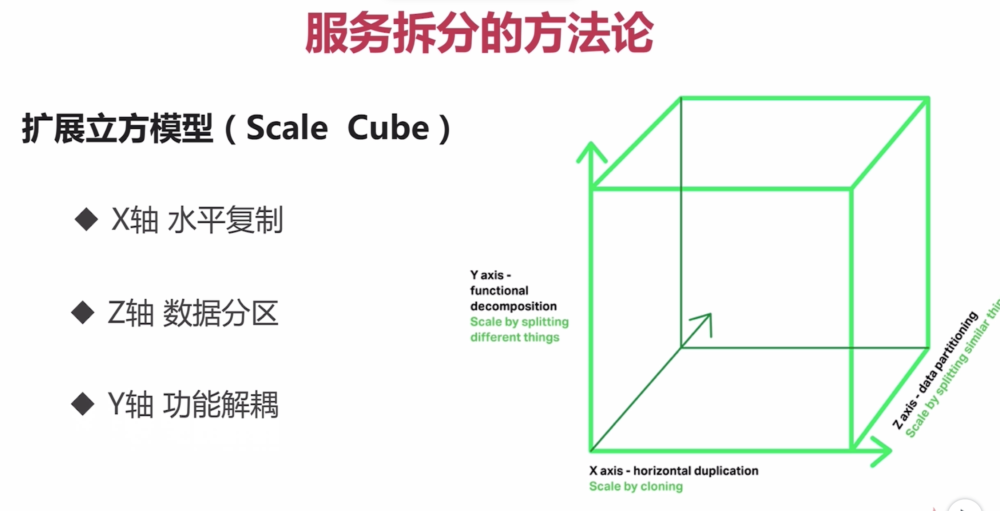

# 微服务拆分

## 应用架构的起点和终点

> 起点：审视既有架构的形态，到底是否适合微服务架构
>
> 终点：好的架构不是设计出来的，而是进化出来的

### 不适合微服务的场景

- 系统中包含很多很多强事物场景的
- 业务相对稳定，迭代周期长
- 访问压力不大，可用性要求不高

## 康威定律和微服务的特点

###  康威定律

> Organizations which design Systems are constrained to produce design which are copies of the communication structures of these organiztions
>
> 任务组织在设计一套系统时，所交付的设计方案在架构上都与该组织的沟通结构保持一致

###  微服务的特点（康威定律的结论）

1. 一系列微小的服务共同组成

2. 单独部署，跑在自己的进程里

3. 每个服务为独立的业务开发

4. 分布式的管理

   

## 服务拆分的方法和依据

### 服务拆分的方法

- 水平复制：通过副本扩展，将应用程序水平复制，通过负载均衡运行程序多个完全一样的副本的方式来实现应用程序的伸缩性，提高应用程序的容量和可用度
- 数据分区：每个服务器负责一个数据子集，每个服务器运行的代码是一样的
- 功能解耦：将不同职责的模块分成不同的服务

### 服务拆分的依据

#### 如何拆“功能”

- 单一职责，松耦合（服务之间耦合度低，修改一个服务，不用导致另外一个服务跟着修改），高内聚（服务内部相关的行为都聚集在一个服务内，修改一个行为时，只需要修改一个服务即可）
- 关注点分离
  - 按职责
  - 按通用性
  - 按粒度级别

#### 服务和数据的关系

- 先考虑业务功能，再考虑数据

-  无状态服务（如果一个数据需要被多服务共享，才能完成一个请求，那么这个数据就是状态，进而依赖这个状态数据的服务被称为有状态服务，反之称为无状态服务）

  