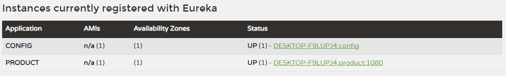
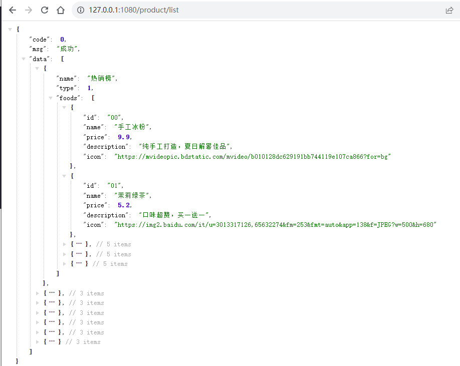

# 拆分商品微服务

## 商品微服务模块的库表设计

> - 商品类目
> - 商品信息

1. 商品信息要归属于某个商品类目，我们通过在**category_type**字段来将商品信息product_info和商品类目product_category关联起来。

   ```sql
    -- 商品类目
   CREATE TABLE `product_category` (
       `category_id` INT NOT NULL AUTO_INCREMENT,
       `category_name` VARCHAR(64) NOT NULL COMMENT '类目名字',
       `category_type` INT NOT NULL COMMENT '类目编号',
       `create_time` TIMESTAMP NOT NULL DEFAULT CURRENT_TIMESTAMP COMMENT '创建时间',
       `update_time` TIMESTAMP NOT NULL DEFAULT CURRENT_TIMESTAMP ON UPDATE CURRENT_TIMESTAMP COMMENT '修改时间',
       PRIMARY KEY (`category_id`),
       UNIQUE KEY `uqe_category_type` (`category_type`)
   );
   -- 商品信息
   CREATE TABLE `product_info` (
       `product_id` VARCHAR(32) NOT NULL,
       `product_name` VARCHAR(64) NOT NULL COMMENT '商品名称',
       `product_price` DECIMAL(8,2) NOT NULL COMMENT '单价',
       `product_stock` INT NOT NULL COMMENT '库存',
       `product_description` VARCHAR(64) COMMENT '描述',
       `product_icon` VARCHAR(512) COMMENT '小图',
       `product_status` TINYINT(3) DEFAULT '0' COMMENT '商品状态,0正常1下架',
       `category_type` INT NOT NULL COMMENT '类目编号',
       `create_time` TIMESTAMP NOT NULL DEFAULT CURRENT_TIMESTAMP COMMENT '创建时间',
       `update_time` TIMESTAMP NOT NULL DEFAULT CURRENT_TIMESTAMP ON UPDATE CURRENT_TIMESTAMP COMMENT '修改时间',
       PRIMARY KEY (`product_id`)
   );
   ```

   

## 创建商品微服务

### 创建 Eureka Client

1. 在pom.xml 中引入依赖，作为Client，将其注册到Server上

   ```xml
   <dependency>
       <groupId>org.springframework.cloud</groupId>
       <artifactId>spring-cloud-starter-netflix-eureka-client</artifactId>
   </dependency>
   <dependency>
       <groupId>org.springframework.boot</groupId>
       <artifactId>spring-boot-starter-web</artifactId>
   </dependency>
   <dependency>
       <groupId>org.springframework.boot</groupId>
       <artifactId>spring-boot-starter-test</artifactId>
       <scope>test</scope>
   </dependency>
   ```

   

2. 启动类增加@EnableDiscoveryClient注解

   ```java
   @SpringBootApplication
   @EnableDiscoveryClient
   public class ProductApplication {
   
       public static void main(String[] args) {
           SpringApplication.run(ProductApplication.class, args);
       }
   
   }
   ```

   

3. 在配置文件中添加以下配置：

   ```yaml
   spring:
     application:
       name: product
   eureka:
     client:
       service-url:
         defaultZone: http://localhost:8761/eureka/    
   ```

   

4. 启动并验证

   先启动eureka-server这个服务，然后启动 artisan-product这个服务。访问eureka的地址 http://localhost:8761/

   

   

### API-约定前后端数据交互格式

商品列表

```shell
GET product/list
```

参数

```
无
```

返回

```json
{
    "code": 0,
    "msg": "成功",
    "data": [
        {
            "name": "热销榜",
            "type": 1,
            "foods": [
                {
                    "id": "123456",
                    "name": "手工冰粉",
                    "price": 6.6,
                    "description": "纯手工打造，夏日解暑佳品",
                    "icon": "http://xxx.com"
                }
            ]
        },
        {
            "name": "休闲零食",
            "type": 2,
            "foods": [
                {
                    "id": "123457",
                    "name": "卧龙锅巴",
                    "price": 5.9,
                    "description": "追剧伴侣，买一送一",
                    "icon": "http://xxx.com"
                }
            ]
        }
    ]
}
```

### 持久层

- 持久层使用 spring-data-jpa
- 数据库使用mysql
- 为了简化代码，引入了lombok （**IDEA记得安装lombok插件**）

#### 引入依赖

```xml
<dependency>
    <groupId>org.springframework.boot</groupId>
    <artifactId>spring-boot-starter-data-jpa</artifactId>
</dependency>
<dependency>
    <groupId>mysql</groupId>
    <artifactId>mysql-connector-java</artifactId>
    <version>5.1.39</version>
</dependency>
<dependency>
    <groupId>org.projectlombok</groupId>
    <artifactId>lombok</artifactId>
    <optional>true</optional>
</dependency>
```

#### 添加配置

```yaml
spring:
  # datasource
  datasource:
    driver-class-name: com.mysql.jdbc.Driver
    username: root
    password: abc123
    url: jdbc:mysql://127.0.0.1:13306/springcloudsell?characterEncoding=utf-8&useSSL=false
  jpa:
    # jpa 输出sql
    show-sql: true

```

### 创建实体类

> 创建和库表对应的实体类ProductInfo以及ProductCategory

```java
/**
 * 商品信息
 */
// lombok
@Data
// @Table指定这个实体类对应数据库的表名 
// product_info ProductInfo这种格式的可以省略不写 ，如果 实体类叫product , 表名叫t_product 那么就要显式指定了
//@Table(name = "product_info")
// @Entity表示这个类是一个实体类
@Entity
public class ProductInfo {

    // @Id标识主键 及主键生成策略 
    @Id
    @GeneratedValue(strategy = GenerationType.IDENTITY)
    private String productId;

    /** 名字. */
    private String productName;

    /** 单价. */
    private BigDecimal productPrice;

    /** 库存. */
    private Integer productStock;

    /** 描述. */
    private String productDescription;

    /** 小图. */
    private String productIcon;

    /** 状态, 0正常1下架. */
    private Integer productStatus;

    /** 类目编号. */
    private Integer categoryType;

    private Date createTime;

    private Date updateTime;
}
```

### 创建Dao层

> 继承 JpaRepository<T, ID>的接口ProductInfoRepository以及ProductCategoryRepository

```java
/**
 * JpaRepository<Product, String>  第一个参数为具体的domain对象，第二个参数为主键类型
 */
public interface ProductInfoRepository extends JpaRepository<ProductInfo, String>{

    // 根据产品状态查询产品
    List<ProductInfo> findByProductStatus(Integer productStatus);
}
```

#### 单元测试

> Spring Boot的单元测试需要添加注解
>
> @RunWith(SpringRunner.class)
> @SpringBootTest
>
> 或者继承ArtisanProductApplicationTests 后，再加上@Component注解

```java
@RunWith(SpringRunner.class)
@SpringBootTest
public class ProductInfoRepositoryTest {

    @Autowired
    private ProductInfoRepository productInfoRepository;

    @Test
    public void findByProductStatus() {
        List<ProductInfo> list = productInfoRepository.findByProductStatus(0);
        Assert.assertTrue(list.size() > 0);
    }
}
```

### 创建Service层

#### 创建接口

```java
public interface ProductService {

    /**
     * 查询所有在架商品列表
     */
    List<ProductInfo> findUpAll();
}
```

#### 创建接口实现类

```java
@Service
public class ProductServiceImpl implements ProductService {

    @Autowired
    private ProductInfoRepository productInfoRepository;

    @Autowired
    private AmqpTemplate amqpTemplate;

    @Override
    public List<ProductInfo> findUpAll() {
        return productInfoRepository.findByProductStatus(ProductStatusEnum.UP.getCode());
    }
}
```

#### 单元测试

```java
@Component
public class ProductServiceTest extends ProductApplicationTests {

    @Autowired
    private ProductService productService;

    @Test
    public void findUpAll() {
        List<ProductInfo> list = productService.findUpAll();
        Assert.assertTrue(list.size() > 0);
    }
}
```

### 枚举的使用

> 为了方便管理，将商品状态封装到了Enum中

```java
/**
 * 商品上下架状态
 */
@Getter
public enum ProductStatusEnum {
    UP(0, "在架"),
    DOWN(1, "下架"),
    ;

    private Integer code;

    private String message;

    ProductStatusEnum(Integer code, String message) {
        this.code = code;
        this.message = message;
    }
}
```

### VO封装

- ResultVO:  前后台交互的统一格式模板

  ```java
  /**
   * http请求返回的最外层对象
   */
  @Data
  public class ResultVO<T> {
      /**
       * 错误码
       */
      private Integer code;
  
      /**
       * 提示信息
       */
      private String msg;
  
      /**
       * 具体内容
       */
      private T data;
  }
  ```

  

- ProductVO ：返回给前台的商品信息格式，包含类目信息

  ```java
  /**
   * 中间层
   */
  @Data
  public class ProductVO {
      @JsonProperty("name")
      private String categoryName;
  
      @JsonProperty("type")
      private Integer categoryType;
  
      @JsonProperty("foods")
      List<ProductInfoVO> productInfoVOList;
  }
  ```

  

- ProductInfoVO: 具体商品的详细数据VO

  ```java
  /**
   * 最里层
   */
  @Data
  public class ProductInfoVO {
      @JsonProperty("id")
      private String productId;
  
      @JsonProperty("name")
      private String productName;
  
      @JsonProperty("price")
      private BigDecimal productPrice;
  
      @JsonProperty("description")
      private String productDescription;
  
      @JsonProperty("icon")
      private String productIcon;
  }
  ```

  

### 创建Controller层

分析约定的前后台交互的JSON格式：

- 每个ProductVO中我们需要获取产品类目名称以及产品类目中的category_type ，调用ProductCategoryService#categoryService方法即可。
- categoryService的入参为categoryTypeList,因此需要调用ProductService#getAllUpProduct获取所有上架商品对应的categoryType.
- 获取到了后台的数据后，按照约定的格式拼装返回JSON串即可

```java
/**
 * 商品
 * @author RenHao
 * @create 2023-09-04 20:47
 */
@RestController
@RequestMapping("/product")
public class ProductController {

    @Autowired
    private ProductService productService;
    @Autowired
    private CategoryService categoryService;

    /**
     * 1. 查询所有在架的商品
     * 2. 获取类目type列表
     * 3. 查询类目
     * 4. 构造数据
     */
    @GetMapping("/list")
    public ResultVO<ProductVO> list() {
        //1. 查询所有在架的商品
        List<ProductInfo> productInfoList = productService.findUpAll();

        //2. 获取类目type列表
        List<Integer> categoryTypeList = productInfoList.stream()
                .map(ProductInfo::getCategoryType)
                .collect(Collectors.toList());

        //3. 从数据库查询类目
        List<ProductCategory> categoryList = categoryService.findByCategoryTypeIn(categoryTypeList);

        //4. 构造数据
        List<ProductVO> productVOList = new ArrayList<>();
        for (ProductCategory productCategory: categoryList) {
            ProductVO productVO = new ProductVO();
            //设置属性
            productVO.setCategoryName(productCategory.getCategoryName());
            productVO.setCategoryType(productCategory.getCategoryType());

            //ProductInfoVO 集合
            List<ProductInfoVO> productInfoVOList = new ArrayList<>();
            for (ProductInfo productInfo: productInfoList) {
                //挂到对应的的categoryType下
                if (productInfo.getCategoryType().equals(productCategory.getCategoryType())) {
                    ProductInfoVO productInfoVO = new ProductInfoVO();
                    // 将属性copy到productInfoVO，避免逐个属性set，更简洁
                    BeanUtils.copyProperties(productInfo, productInfoVO);
                    productInfoVOList.add(productInfoVO);
                }
            }
            productVO.setProductInfoVOList(productInfoVOList);
            productVOList.add(productVO);
        }

        return ResultVOUtil.success(productVOList);
    }
}
```

## 测试商品微服务

访问 http://127.0.0.1:1080/product/list



## 知识点总结

### Java8的Stream

> 使用Java8中的Stream可以方便的对集合对象进行各种便利、高效的聚合操作，或者大批量数据操作
>
> 注意：流只能使用一次，使用结束之后，这个流就无法使用了。

```java
//2. 获取类目type列表
List<Integer> categoryTypeList = productInfoList.stream()
    .map(Product::getCategoryType)
    .collect(Collectors.toList());

```

### Beanutils.copyProperties( )

> org.springframework.beans.BeanUtils# copyProperties作用是将一个Bean对象中的数据封装到另一个属性结构相似的Bean对象中。

```java
// 将属性copy到productInfoVO，避免逐个属性set，更简洁
BeanUtils.copyProperties(product, productInfoVO);
```

