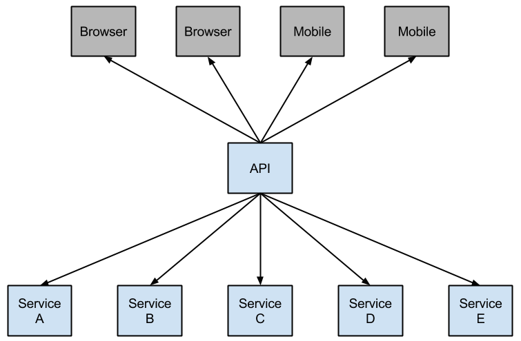
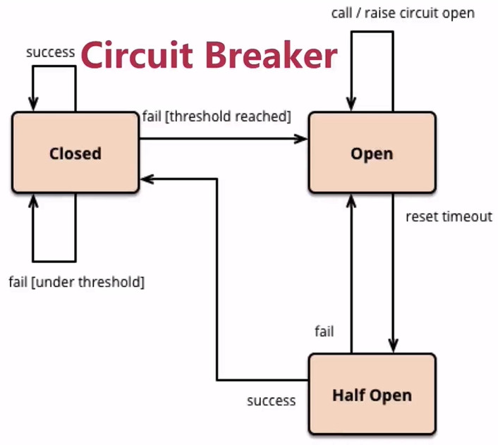
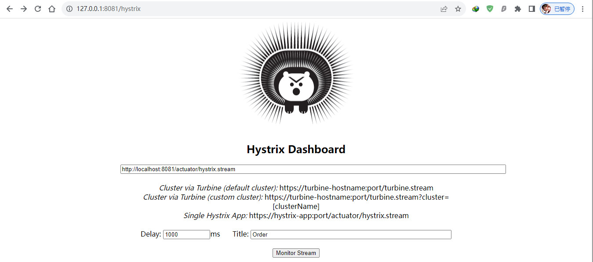
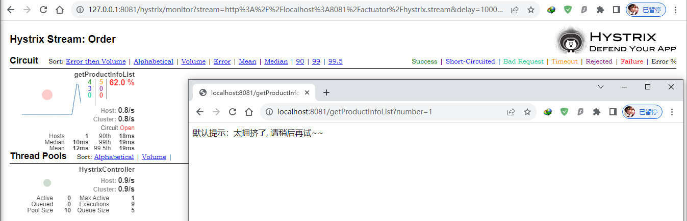

# 服务容错

## 概述

在微服务架构中，根据业务来拆分成一个个的服务，服务与服务之间可以相互调用（RPC），在Spring Cloud可以用RestTemplate+Ribbon和Feign来调用。为了保证其高可用，单个服务通常会集群部署。

由于网络原因或者自身的原因，服务并不能保证100%可用，如果单个服务出现问题，调用这个服务就会出现线程阻塞，此时若有大量的请求涌入，Servlet容器的线程资源会被消耗完毕，导致服务瘫痪。由于服务与服务之间的依赖性，故障会传播，会对整个微服务系统造成灾难性的严重后果，这就是服务故障的**“雪崩”效应**。

## 断路器简介

> hystrix是netflix开源的一个容灾框架，解决当外部依赖故障时拖垮业务系统、甚至引起雪崩的问题。

Netflix开源了Hystrix组件，实现了断路器模式，SpringCloud对这一组件进行了整合。 在微服务架构中，一个请求需要调用多个服务是非常常见的，如下图：



较底层的服务如果出现故障，会导致连锁故障。当对特定服务的调用的不可用达到一个阀值（Hystrix 是5秒20次） 断路器将会被打开。


断路打开后，可用避免连锁故障，fallback方法可以直接返回一个固定值。

## 服务降级

- 优先核心服务，非核心服务不可用或弱可用
- 通过HystrixCommand注解指定
- fallbackMethod(回退函数)中具体实现降级逻辑

### 在order微服务中使用Hystrix实现服务降级

1. 引入依赖

   ```xml
   <!--        熔断Hystrix相关依赖-->
   <!-- https://mvnrepository.com/artifact/org.springframework.cloud/spring-cloud-starter-netflix-hystrix -->
   <dependency>
       <groupId>org.springframework.cloud</groupId>
       <artifactId>spring-cloud-starter-netflix-hystrix</artifactId>
   </dependency>
   ```

   

2. 启动类添加注解@EnableCircuitBreaker

   ```java
   @SpringCloudApplication
   @EnableHystrixDashboard
   @EnableFeignClients(basePackages = "com.pro.product.client")
   public class OrderApplication {
   
       public static void main(String[] args)  {
           SpringApplication.run(OrderApplication.class, args);
       }
   
   }
   ```

   

3. 回退功能测试

   > 方法内部出现异常时，自动调用fallback方法

   ```java
   /**
    * Hystrix测试：
    * 回退；超时配置；熔断；
    * @author RenHao
    * @create 2023-09-08 15:10
    */
   @RestController
   @DefaultProperties(defaultFallback = "defaultFallback") //默认回退方法
   public class HystrixController {
   
       @HystrixCommand(fallbackMethod = "fallback") //方法内部触发异常时，调用fallback方法
       @GetMapping("/getProductInfoList")
       public String getProductInfoList(@RequestParam("number") Integer number) {
           if (number % 2 == 0) {
               return "success";
           }
   
           RestTemplate restTemplate = new RestTemplate();
           return restTemplate.postForObject("http://127.0.0.1:1080/product/listForOrder",
                   Arrays.asList("00"),
                   String.class);
       }
   
       private String fallback() {
           return "太拥挤了, 请稍后再试~~";
       }
   
       private String defaultFallback() {
           return "默认提示：太拥挤了, 请稍后再试~~";
       }
   }
   ```

   

4. 超时配置测试

   > Hystrix的默认超时时间为1s；
   >
   > 当请求访问时间超过设定的时间后，自动调用fallback方法

   ```java
   /**
    * Hystrix测试：
    * 超时配置；
    * @author RenHao
    * @create 2023-09-08 15:10
    */
   @RestController
   @DefaultProperties(defaultFallback = "defaultFallback") //默认回退方法
   public class HystrixController {
   
       //超时配置，请求最长访问时间设置为3s，超时后调用defaultFallback方法
   	@HystrixCommand(commandProperties = {
   			@HystrixProperty(name = "execution.isolation.thread.timeoutInMilliseconds", value = "3000")
   	})
       @GetMapping("/getProductInfoList")
       public String getProductInfoList(@RequestParam("number") Integer number) {
           if (number % 2 == 0) {
               return "success";
           }
   
           RestTemplate restTemplate = new RestTemplate();
           return restTemplate.postForObject("http://127.0.0.1:1080/product/listForOrder",
                   Arrays.asList("00"),
                   String.class);
       }
   
       private String fallback() {
           return "太拥挤了, 请稍后再试~~";
       }
   
       private String defaultFallback() {
           return "默认提示：太拥挤了, 请稍后再试~~";
       }
   }
   ```

   

5. 熔断测试

   > 熔断是一种自我保护机制，当某个服务单元出现不可用或者响应超时的情况时，为了防止整个系统出现雪崩，通过断路器的故障监控，直接切断服务的主逻辑调用。

   ```java
   /**
    * Hystrix测试：
    * 超时配置；
    * @author RenHao
    * @create 2023-09-08 15:10
    */
   @RestController
   @DefaultProperties(defaultFallback = "defaultFallback") //默认回退方法
   public class HystrixController {
   
   	@HystrixCommand(commandProperties = {
   			@HystrixProperty(name = "circuitBreaker.enabled", value = "true"),  				//设置开启熔断
   			@HystrixProperty(name = "circuitBreaker.requestVolumeThreshold", value = "10"),	//时间窗口内的最小请求数
   			@HystrixProperty(name = "circuitBreaker.sleepWindowInMilliseconds", value = "10000"), //休眠时间窗时间为10s
   			@HystrixProperty(name = "circuitBreaker.errorThresholdPercentage", value = "60"),	//时间窗口内的错误率达到60%，断路器为打开状态，否则为关闭状态
   	})
       @GetMapping("/getProductInfoList")
       public String getProductInfoList(@RequestParam("number") Integer number) {
           if (number % 2 == 0) {
               return "success";
           }
   
           RestTemplate restTemplate = new RestTemplate();
           return restTemplate.postForObject("http://127.0.0.1:1080/product/listForOrder",
                   Arrays.asList("00"),
                   String.class);
       }
   
       private String fallback() {
           return "太拥挤了, 请稍后再试~~";
       }
   
       private String defaultFallback() {
           return "默认提示：太拥挤了, 请稍后再试~~";
       }
   }
   ```

   

6. Circuit Breaker:断路器

   断路器的原理为：当断路器监控到某个服务出现故障后，断路器为打开状态，此时降级逻辑为服务的主逻辑。当达到设置的休眠时间窗后，进入半熔断状态，此时如果服务恢复，则断路器关闭，否则继续开启。

   

7. 为了使代码看起来更简洁，可以将Hystrix的配置放在yml文件中

   ```yaml
   #熔断超时配置
   hystrix:
     command:
       default:
         execution:
           isolation:
             thread:
               #请求的最长访问时间，超时后触发降级
               timeoutInMilliseconds: 1000
       #为getProductInfoList()方法单独设置超时时间
       getProductInfoList:
         execution:
           isolation:
             thread:
               timeoutInMilliseconds: 1000
   ```

   

## Hystrix Dashboard

> 在微服务架构中为了保证程序的可用性，防止程序出错导致网络阻塞，出现了断路器模型。断路器的状况反应了一个程序的可用性和健壮性，它是一个重要指标。Hystrix Dashboard作为断路器状态的一个组件，提供了数据监控和友好的图形化界面。
>
> Hystrix Dashboard仪表盘是根据系统一段时间内发生的请求情况来展示的可视化面板。
> Hystrix的指标需要端口进行支撑，所以需要增加actuator依赖。

1. 在pom的工程文件引入相应的依赖：

   ```xml
   <!--        熔断可视化插件-->
   <!-- https://mvnrepository.com/artifact/org.springframework.cloud/spring-cloud-starter-netflix-hystrix-dashboard -->
   <dependency>
       <groupId>org.springframework.cloud</groupId>
       <artifactId>spring-cloud-starter-netflix-hystrix-dashboard</artifactId>
   </dependency>
   ```

   

2. 在程序的入口类，加上@EnableHystrixDashboard注解，开启HystrixDashboard

   ```java
   @SpringCloudApplication
   @EnableHystrixDashboard
   @EnableFeignClients(basePackages = "com.pro.product.client")
   public class OrderApplication {
   
       public static void main(String[] args)  {
           SpringApplication.run(OrderApplication.class, args);
       }
   
   }
   ```

   

3. 添加配置

   > 需要配置代理地址，以及暴露hystrix.stream端点

   ```yaml
   #熔断超时配置
   hystrix:
     command:
       default:
         execution:
           isolation:
             thread:
               #请求的最长访问时间，超时后触发降级
               timeoutInMilliseconds: 1000
       #为getProductInfoList()方法单独设置超时时间
       getProductInfoList:
         execution:
           isolation:
             thread:
               timeoutInMilliseconds: 1000
     #配置代理地址
     dashboard:
       proxy-stream-allow-list: "localhost"
   #自定义管理端点路径
   management:
     context-path: /
     #暴露hystrix.stream端点
     endpoints:
       web:
         exposure:
           include: hystrix.stream
   ```

   

4. 访问http://127.0.0.1:8081/hystrix，可以看见以下界面

   

5. 在界面依次输入：http://localhost:8081/actuator/hystrix.stream 、1000 、order ，点击确定，同时在另一个窗口访问http://localhost:8081/getProductInfoList?number=1，触发熔断。

   重新刷新hystrix.stream网页，可以看到良好的图形化界面：

   

   