# 服务注册与发现

## 服务发现组件概述

> 在微服务中，服务发现组件的位置如下:

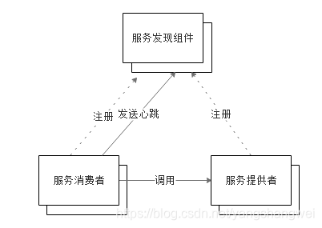

- 各个微服务在启动时，**将自己的网络地址等信息注册到服务发现组件**中
- 服务消费者可以**从服务发现组件中查询服务提供者的地址**，并使用该地址调用服务提供者提供的接口
- 各个微服务与服务发现组件在使用一定的机制（比如**心跳机制**）来通信。当服务发现组件长时间无法与某微服务实例通信，将注销该实例
- 微服务网络地址发生变更（比如实例增减或者ip端口发生变化）时，**会重新注册到服务发现组件**。 使用这种方式，服务消费者就无需人工修改提供者的网络地址了
- Spring Cloud支持Eureka、Consul 、Zookeeper 等

## Eureka

### Eureka概述

> Eureka是Netflix开源的服务发现组件，一个基于REST的服务。 包含Server和Client两部分。 Spring Cloud将它集成在子项目Spring Cloud Netflix中，从而实现微服务的注册与发现

### Eureka原理

> **Eureka是开源的服务发现组件，本身是一个基于REST的服务。包含两个组件：Eureka Server和Eureka Client**
>
> 1. Eureka Server提供服务发现的能力，各个微服务启动时，会向Eureka Server注册自己的信息，它会存储这些信息。
> 2. Eureka Client是一个java客户端，用于简化与Eureka Server的交互。

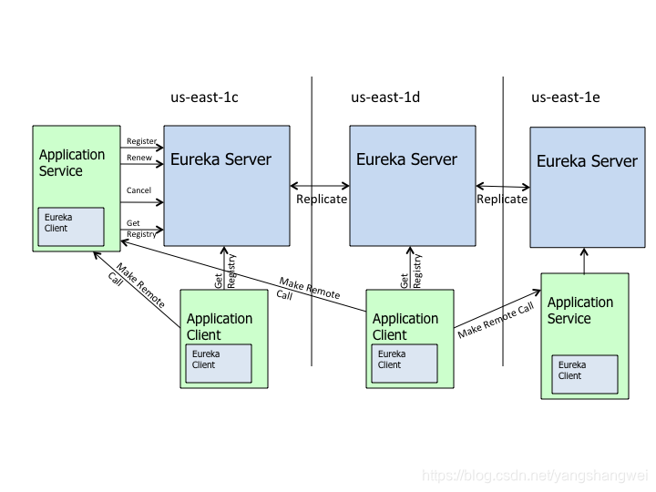

- Eureka Server: 提供服务发现的能力，各个微服务启动时，会向Eureka Server注册信息，比如ip、端口、微服务名称等。 Eureka Server会存储这些信息

- Eureka Client: Java 客户端，用于简化与Eureka Server的交互

- 微服务启动后，会周期性（默认30S）向Eureka Server发送心跳以续约自己的“租期”

- 如果Eureka Server在一定时间内（默认90S）没有接收到某个微服务实例的心跳，Eureka Server将注销该实例。

- 默认情况下，Eureka Server 同时也是 Eureka Client，多个Eureka Server之间通过复制的方式来实现服务注册表中数据的同步

- Eureka Client会缓存服务注册表中的信息，两个好处 第一，微服务**无需每次都请求查询Eureka Server** ,降低Server的压力。 第二，即使Eureka Server所有节点都宕掉，服务消费者**依然可以使用缓存中的信息找到服务提供者并完成调用**。
  

### 创建服务发现组件（Eureka Server）

1. 使用idea中的Spring Initializr快速创建spring boot项目，并为项目添加以下依赖:

   ```xml
   <dependency>
       <groupId>org.springframework.cloud</groupId>
       <artifactId>spring-cloud-starter-netflix-eureka-server</artifactId>
   </dependency>
   ```

   

2. 在启动类上添加如下注解:

   ```java
   /**
   （1）@SpringBootApplication 该注解告诉spring boot框架，这是项目的引导类
   （2）@EnableEurekaServer    该注解声明这是一个Eureka Server项目
   */
   @SpringBootApplication
   @EnableEurekaServer
   public class EurekaApplication {
   
       public static void main(String[] args) {
           SpringApplication.run(EurekaApplication.class, args);
       }
   
   }
   ```

   

3. 在application.yml文件中添加以下内容，配置属性含义见代码

   ```yaml
   eureka:
     client:
       service-url:
         #设置Eureka Server交互的地址，查询和注册服务都需要依赖这个地址
         defaultZone: http://localhost:8761/eureka/
       #设置不添加这个项目到注册中心
       register-with-eureka: false
     server:
     	#开发过程中可以关闭“自我保护模式”，生产环境禁止关闭
       enable-self-preservation: false
   #服务应用名
   spring:
     application:
       name: eureka
   #服务端口号    
   server:
     port: 8761
   ```

   - eureka.client.register-with-eureka: 是否将自己注册到Eureka Server ,默认为true.因为当前应用是作为Eureka Server用，因此设置为false
   - eureka.client.fetch-registry: 是否从Eureka Server获取注册信息，默认为true， 因为我们这里是个单节点的Eureka Server ,不需要与其他的Eureka Server节点的数据，因此设为false
   - eureka.client.service-url.defaultZone : 设置与Eureka Server交互的地址，查询服务和注册服务都依赖这个地址，默认为 http://localhost:8761/eureka ，多个地址可使用 , 分隔。

   

### 启动Eureka Server测试

运行程序，然后访问http://localhost:8761看到如下内容说明注册成功了

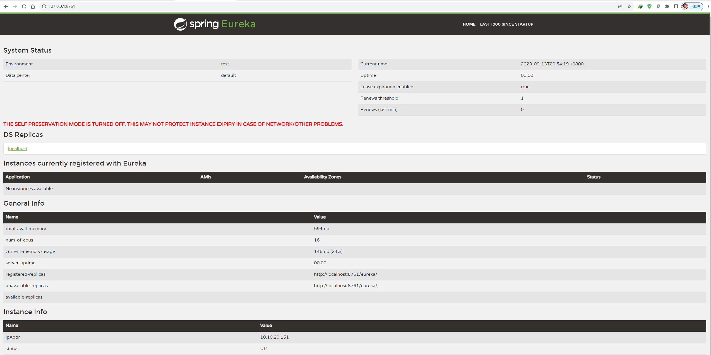

Eureka Server 首页展示的信息包括 当前实例的系统状态、注册到Eureka Server的服务实例、常用信息、实例信息等 。

### Eureka的高可用

> 为了实现高可用，可以将多台 eureka 互相注册

1. 将两台eureka互相注册

   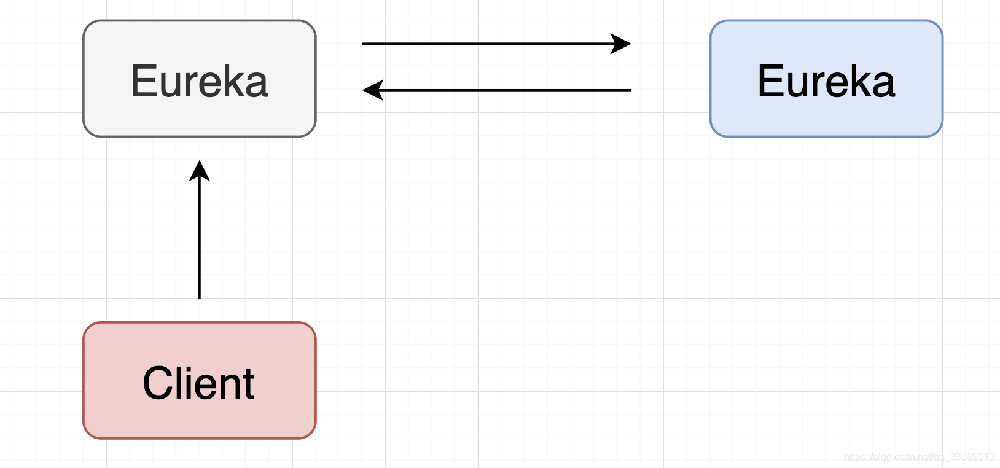

2. 以端口号区分不同的eureka

   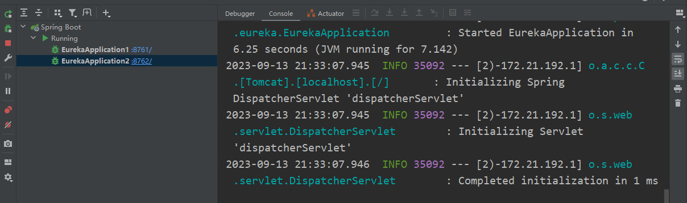

3. 将 eureka1注册到 eureka2上并启动

   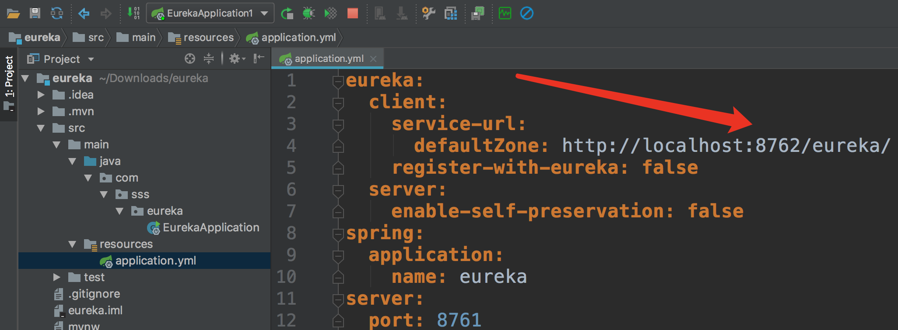

4. 将 eureka2注册到 eureka1上并启动

   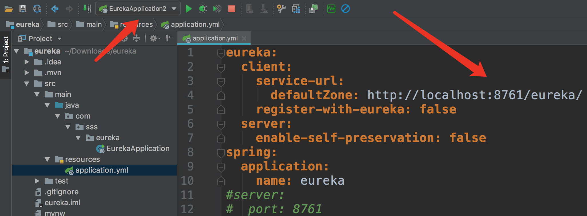

5. 可以看到eureka1和eureka2已经互相注册

   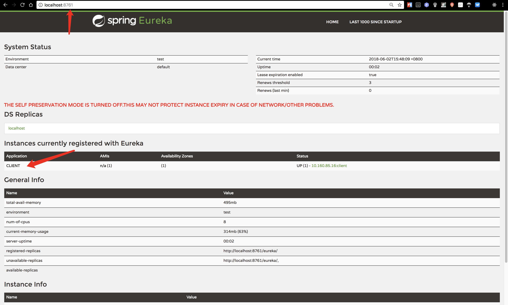

   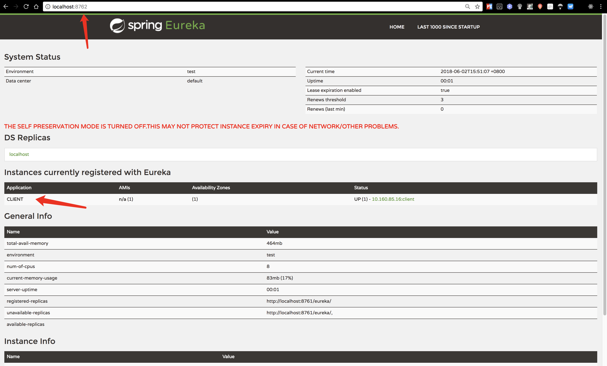

6. 假如此时 eureka1宕机，则eureka2仍然存活，且client还在连接

   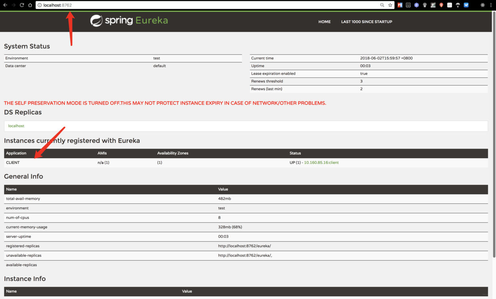

7. 为了保证eureka1宕机后，client仍能注册在eureka2上，需要保证client每次都同时向eureka1和eureka2注册

   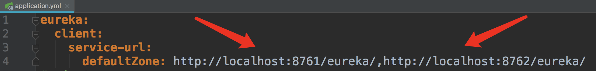

### 创建服务注册组件（Eureka Client）

1. 与创建注册中心一样，先创建spring boot项目，引入依赖如下：

   - spring的web依赖
   - eureka-client依赖
   - spring-boot测试依赖

   ```xml
   <dependency>
       <groupId>org.springframework.cloud</groupId>
       <artifactId>spring-cloud-starter-netflix-eureka-client</artifactId>
   </dependency>
   
   <dependency>
       <groupId>org.springframework.boot</groupId>
       <artifactId>spring-boot-starter-web</artifactId>
   </dependency>
   
   
   <dependency>
       <groupId>org.springframework.boot</groupId>
       <artifactId>spring-boot-starter-test</artifactId>
       <scope>test</scope>
   </dependency>
   ```

   

2. 在启动类上声明这是一个Eureka Client项目

   ```java
   @SpringBootApplication
   @EnableDiscoveryClient
   public class ClientApplication {
   
       public static void main(String[] args) {
           SpringApplication.run(ClientApplication.class, args);
       }
   
   }
   ```

   

3. 在配置文件中添加以下配置：

   ```yml
   eureka:
     client:
       service-url:
         #注册目标地址信息，可以向多个eureka注册
         defaultZone: http://localhost:8761/eureka/,http://localhost:8762/eureka/
     instance:
       #自定义hostname
       hostname: clientName
   spring:
     application:
       #服务应用名
       name: client
   ```

### 启动Eureka Client测试

启动该项目，访问注册中心，会发现Application中有了这一项

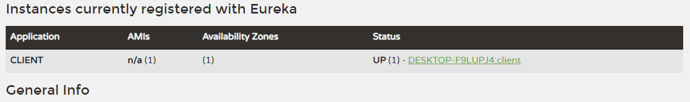

### Eureka总结

- @EnableEurekaServer @EnableEurekaClient
- 心跳检测、健康检查、负载均衡等功能
- Eureka的高可用,生产上建议至少两台以上
- **分布式系统中 ，服务注册中心是最重要的基础部分**

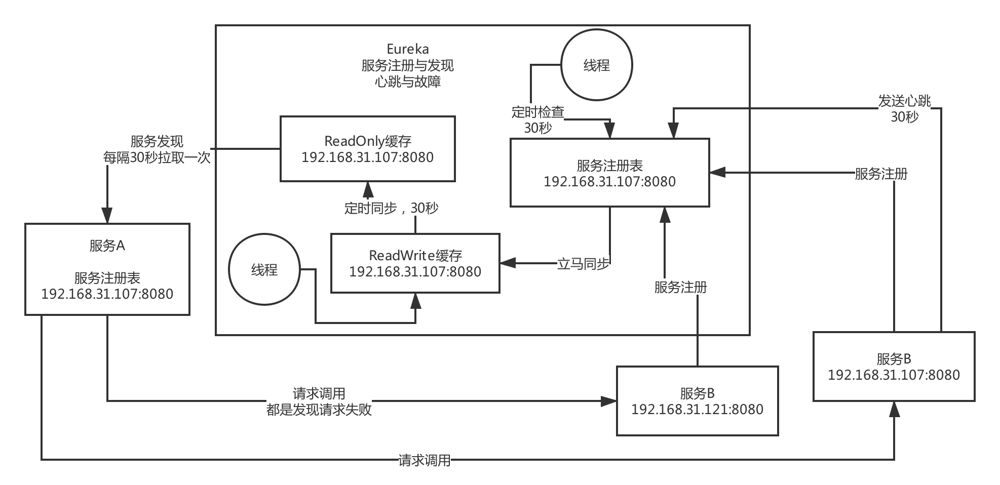