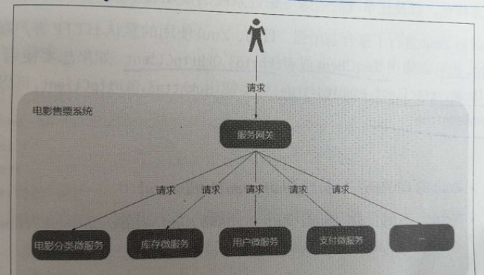
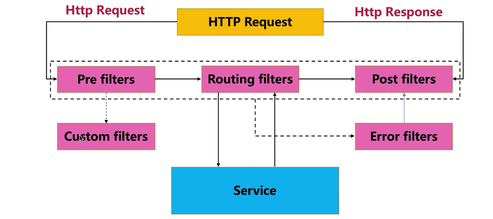
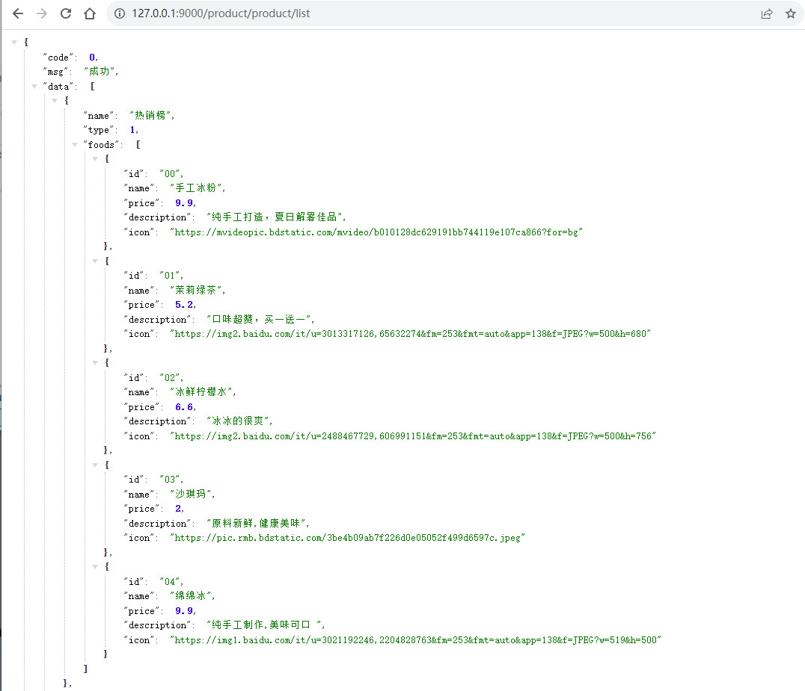
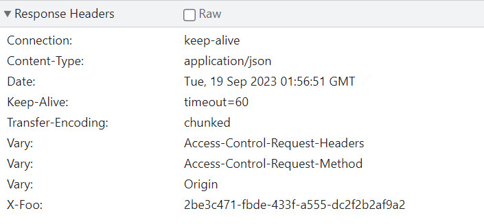
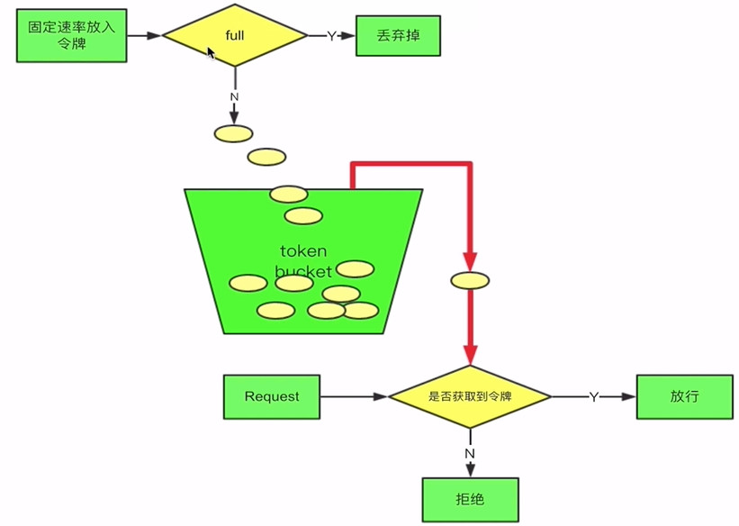
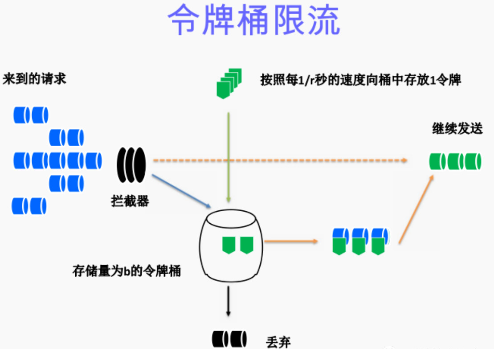
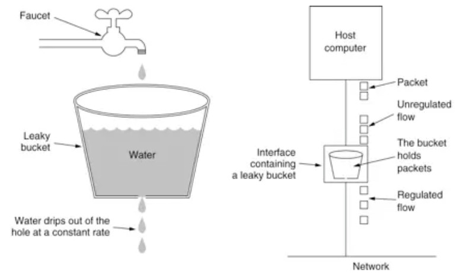

# 微服务网关

## 概述

不同的微服务一般会有不同的网络地址，而外部客户端（例如手机APP）可能需要调用多个服务的接口才能完成一个业务需求。

例如一个电影购票的手机APP,可能会调用多个微服务的接口，才能完成一次购票的业务流程。


如果让客户端直接与各个微服务通信，会有以下的问题：

- 客户端会多次请求不同的微服务，增加了客户端的复杂性。
- 存在跨域请求，在一定场景下处理相对复杂。
- 认证复杂，每个服务都需要独立认证。
- 难以重构，随着项目的迭代，可能需要重新划分微服务。例如，可能将多个服务合并成一个或者将一个服务拆分成多个。如果客户端直接与微服务通信，那么重构将会很难实施。
- 某些微服务可能使用了防火墙/浏览器不友好的协议，直接访问会有一定的困难。

以上问题可借助微服务网关解决。微服务网关是介于客户端和服务器端之间的中间层, 所有的外部请求都会先经过微服务网关。使用微服务网关后，架构可演变成下图：



如图，微服务网关封装了应用程序的内部结构，客户端只须跟网关交互，而无须直接调用特定微服务的接口。

这样，开发就可以得到简化。不仅如此，使用微服务网关还有以下优点：

- 易于监控。可在微服务网关收集监控数据并将其推送到外部系统进行分析。
- 易于认证。可在微服务网关上进行认证，然后再将请求转发到后端的微服务，而无须在每个微服务中进行认证。
- 减少了客户端与各个微服务之间的交互次数。

## 服务网关的要素

- 稳定，高可用
- 安全性
- 性能、并发性
- 扩展性

## Zuul

### 简介

Zuul是Netflix开源的微服务网关，它可以和Eureka、Ribbon、Hystrix等组件配合使用。

Zuul的核心是**一系列的过滤器**，这些过滤器可以完成以下功能:

- 身份认证与安全；识别每个资源的验证要求，并拒绝那些与要求不符的请求。
- 审查与监控：在边缘位置追踪有意义的数据和统计结果，从而带来精确的生产视图。
- 动态路由：动态地将请求路由到不同的后端集群。
- 压力测试：逐渐增加指向集群的流量，以了解性能。
- 负载分配：为每一种负载类型分配对应容量，并弃用超岀限定值的请求。
- 静态响应处理：在边缘位置直接建立部分响应，从而避免其转发到内部集群。
- 多区域弹性:跨越AWS Region进行请求路由，旨在实现ELB ( Elastic Load Balancing) 使用的多样化，以及让系统的边缘更贴近系统的使用者。
  

### 过滤器

zuul过滤器分四种：

- PRE Filters(前置过滤器)
  当请求路由转发到具体后端服务器前执行的过滤器，如：

- 鉴权过滤器
  日志过滤器
  路由选择过滤器
  ROUTING Filters （路由过滤器）
  一般通过Apache HttpClient 或 Netflix Ribbon，把请求具体转发到后端服务器

- POST Filters（后置过滤器）

  当把请求路由到具体后端服务器后执行的过滤器；场景有：

  - 添加标准HTTP响应头
  - 收集一些统计数据（比如请求耗时等）
  - 写入请求结果到请求方
  - …

- ERROR Filters（错误过滤器）

  当上面任何一个类型过滤器执行出错时，执行该过滤器。

### 架构图

Zuul Core本质上就是Web Servlet，一系列过滤器，用于过滤请求或响应结果。

### 请求生命周期



Zuul接收到请求后：

- Pre事前
  - 请求被路由之前调用首先由前置过滤器处理
  - 身份验证
- Routing事中
  - 由路由过滤器具体地把请求转发到后端应用微服务
  - Apache HttpClient 或 Netflix Ribbon 请求微服务
- Post事后
  - 远程调用后执行
  - 再执行后置过滤器把执行结果写回请求方
  - HTTP Header、收集统计信息和指标、Response
- Error错误时
  - 当上面任何一个类型过滤器出错时执行
    

### 搭建apigateway工程

搭建一个新的Spring Boot工程apigateway，需要注意的是Spring Boot的版本需要是2.4以下的版本，才能使用Zuul

#### 引入依赖

```xml
<dependency>
    <groupId>org.springframework.cloud</groupId>
    <artifactId>spring-cloud-starter-netflix-eureka-client</artifactId>
</dependency>
<!-- https://mvnrepository.com/artifact/org.springframework.cloud/spring-cloud-starter-netflix-zuul -->
<dependency>
    <groupId>org.springframework.cloud</groupId>
    <artifactId>spring-cloud-starter-netflix-zuul</artifactId>
</dependency>
<!--    配置中心相关依赖    -->
<dependency>
    <groupId>org.springframework.cloud</groupId>
    <artifactId>spring-cloud-config-client</artifactId>
</dependency>
<!--		SpringBoot2.4以下不需要-->
<!--		<dependency>-->
<!--			<groupId>org.springframework.cloud</groupId>-->
<!--			<artifactId>spring-cloud-starter-bootstrap</artifactId>-->
<!--		</dependency>-->
<dependency>
    <groupId>org.springframework.cloud</groupId>
    <artifactId>spring-cloud-starter-bus-amqp</artifactId>
</dependency>
```

#### 添加配置

```yaml
spring:
  application:
    name: apigateway
  cloud:
    config:
      discovery:
        enabled: true
        service-id: CONFIG
      profile: dev
eureka:
  client:
    service-url:
      defaultZone: http://localhost:8761/eureka/
```

#### 启动类添加注解

> 在其入口applicaton类加上注解@EnableZuulProxy，开启zuul的功能：

```java
@SpringBootApplication
@EnableZuulProxy
public class ApigatewayApplication {

	public static void main(String[] args) {
		SpringApplication.run(ApigatewayApplication.class, args);
	}

    //设置配置信息的动态注入
	@ConfigurationProperties("zuul")
	@RefreshScope
	public ZuulProperties zuulProperties(){
		return new ZuulProperties();
	}

}
```

#### 测试路由转发功能

> 启动apigateway以及product微服务，测试是否能通过apigateway路由到指定端口

访问http://127.0.0.1:9000/product/product/list，其中第一个product指的是服务名，后面是地址



#### 自定义路由规则

> 只需在配置文件中添加以下配置信息

```yaml
zuul:
  routes:
  	# 自定义路由规则
    # /myProduct/product/list -> /product/product/list
    myProduct:
      path: /myProduct/**
      service-id: product
  #简洁写法
  product: /myProduct/**
#zuul:
#  routes:
#    # 自定义路由规则
#    # /myProduct/product/list -> /product/product/list
#    myProduct:
#      path: /myProduct/**
#      service-id: product
#      #设置可以传递cookie
#      sensitive-headers:
#  #排除某些路由
#  ignored-patterns:
#    - /**/product/listForOrder
#  #简洁写法
#    product: /myProduct/**
#management:
#  security:
#    enabled: false
```

#### 典型应用场景

##### 前置（Pre）

- 限流
- 鉴权
- 参数校验调整

##### 后置（Post）

- 统计
- 日志

#### Zuul的高可用

- 多个Zuul节点注册到Eureka Server
- Nginx和Zuul“混搭”

## Zuul应用

### 前置（Pre）过滤器

>  1、访问前进行参数校验
>
> 使用Pre过滤器进行鉴权，校验用户的访问权限，具体实现办法为：
>
> pre-filter:请求到目标结果之前，对返回的结果进行加工，访问连接中需要添加token，进行接口加密校验，在前置过滤器中判断请求中是否带有“token”

```java
@Component
public class TokenFilter extends ZuulFilter {
    @Override
    public String filterType() {
        return "pre";
    }

    @Override
    public int filterOrder() {
        return 0;
    }

    @Override
    public boolean shouldFilter() {
        return true;
    }

    @Override
    public Object run() throws ZuulException {
        RequestContext requestContext = RequestContext.getCurrentContext();
        HttpServletRequest request = requestContext.getRequest();

        //这里从url参数里获取, 也可以从cookie, header里获取
        String token = request.getParameter("token");
        if (StringUtils.isEmpty(token)) {
            //设置Zuul不通过
            requestContext.setSendZuulResponse(false);
            //设置返回状态码
            requestContext.setResponseStatusCode(HttpStatus.UNAUTHORIZED.value());
        }
        return null;
    }
}

```

### 后置（Post）过滤器

> 2、post-fileter : 请求到目标结果之后，对返回的结果进行加工
>
> 使用Zuul的后置过滤器在返回结果的响应头里添加指定信息

```java
/**
 * 后置过滤器测试
 * @author RenHao
 * @create 2023-09-07 21:17
 */
@Component
public class addResponseHeaderFilter extends ZuulFilter {
    @Override
    public String filterType() {
        return "post";
    }

    @Override
    public int filterOrder() {
        return 0;
    }

    @Override
    public boolean shouldFilter() {
        return true;
    }

    @Override
    public Object run() throws ZuulException {
        RequestContext requestContext = RequestContext.getCurrentContext();
        HttpServletResponse response = requestContext.getResponse();
        response.setHeader("X-Foo", UUID.randomUUID().toString());
        return null;
    }
}
```

查看返回结果响应头中的信息：



### Zuul:限流

> 使用Zuul进行限流，时机：请求被转发之前调用

#### 令牌桶限流算法

> 拿到令牌的请求放行：
>
> 令牌桶算法最初来源于计算机网络。在网络传输数据时，为了防止网络拥塞，需限制流出网络的流量，使流量以比较均匀的速度向外发送。令牌桶算法就实现了这个功能，可控制发送到网络上数据的数目，并允许突发数据的发送。
>
> 大小固定的令牌桶可自行以恒定的速率源源不断地产生令牌。如果令牌不被消耗，或者被消耗的速度小于产生的速度，令牌就会不断地增多，直到把桶填满。后面再产生的令牌就会从桶中溢出。最后桶中可以保存的最大令牌数永远不会超过桶的大小。





#### 令牌桶算法与漏桶算法

> 漏桶算法思路很简单，水（请求）先进入到漏桶里，漏桶以一定的速度出水，当水流入速度过大会直接溢出，可以看出漏桶算法能强行限制数据的传输速率。



令牌桶算法不能与另外一种常见算法漏桶算法相混淆。这两种算法的主要区别在于：

漏桶算法能够强行限制数据的传输速率，而令牌桶算法在能够限制数据的平均传输速率外，**还允许某种程度的突发传输**。在令牌桶算法中，只要令牌桶中存在令牌，那么就允许突发地传输数据直到达到用户配置的上限，**因此它适合于具有突发特性的流量**。

#### 使用Guava的RateLimiter实现令牌桶限流接口

Guava是Google开源的Java工具类，里面包罗万象，也提供了限流工具类RateLimiter，该类里面实现了令牌桶算法。我们可以在Zuul的前置过滤器中使用令牌桶算法，对请求进行限流。

```java
@Component
public class RateLimitFilter extends ZuulFilter {

    //初始化令牌桶类，每秒放行100个请求。
    private static final RateLimiter RATE_LIMITER = RateLimiter.create(100);

    @Override
    public String filterType() {
        return "pre";
    }

    @Override
    public int filterOrder() {
        return 0;
    }

    @Override
    public boolean shouldFilter() {
        return true;
    }

    @Override
    public Object run() throws ZuulException {
        //如果没有拿到令牌，则抛异常
        if (!RATE_LIMITER.tryAcquire()) {
            throw new RateLimitException();
        }
        return null;
    }
}
```

### Zuul:权限校验

>使用Zuul进行权限校验，完成以下功能：
>
>/order/create 只能买家访问
>
>/order/finish 只能卖家访问
>
>/product/list 都可访问

#### 买家端权限校验

> 买家端权限校验可以使用Zuul的前置过滤器，判断Cookie中有没有设置openid。如果cookie中没有openid，则进行拦截

```java
/**
 * 买家权限判断
 * @author RenHao
 * @create 2023-09-07 21:30
 */
@Component
public class AuthBuyerFilter extends ZuulFilter {

    @Autowired
    private StringRedisTemplate stringRedisTemplate;
    @Override
    public String filterType() {
        return "pre";
    }

    @Override
    public int filterOrder() {
        return 0;
    }

    @Override
    public boolean shouldFilter() {
        RequestContext requestContext = RequestContext.getCurrentContext();
        HttpServletRequest request = requestContext.getRequest();

        /**
         * /order/create 只能买家访问(cookie里有openid)
         * /order/finish 只能卖家访问(cookie里有token, 并且对应有redis的值)
         * /product/list 都可以访问
         */
        if("/order/order/create".equals(request.getRequestURI())){
            return true;
        }
        return false;
    }

    @Override
    public Object run() {
        RequestContext requestContext = RequestContext.getCurrentContext();
        HttpServletRequest request = requestContext.getRequest();
        //判断cookie中有没有openid
        Cookie cookie = CookieUtil.get(request, "openid");
        if(cookie == null || StringUtils.isEmpty(cookie.getValue())){
            //使用Zuul进行拦截
            requestContext.setSendZuulResponse(false);
            //设置返回状态码
            requestContext.setResponseStatusCode(HttpStatus.UNAUTHORIZED.value());
        }
        return null;
    }
}
```


#### 卖家端权限校验

> 卖家端权限校验可以使用Zuul的前置过滤器，判断Cookie和Reids中有没有存储openid。如果cookie或者Redis中没有openid，则进行拦截

```java
/**
 * 权限拦截
 * @author RenHao
 * @create 2023-09-07 21:30
 */
@Component
public class AuthSellerFilter extends ZuulFilter {

    @Autowired
    private StringRedisTemplate stringRedisTemplate;
    @Override
    public String filterType() {
        return "pre";
    }

    @Override
    public int filterOrder() {
        return 0;
    }

    @Override
    public boolean shouldFilter() {
        RequestContext requestContext = RequestContext.getCurrentContext();
        HttpServletRequest request = requestContext.getRequest();

        /**
         * /order/create 只能买家访问(cookie里有openid)
         * /order/finish 只能卖家访问(cookie里有token, 并且对应有redis的值)
         * /product/list 都可以访问
         */
        if("/order/order/finish".equals(request.getRequestURI())) {
            return true;
        }
        return false;
    }

    @Override
    public Object run() {
        RequestContext requestContext = RequestContext.getCurrentContext();
        HttpServletRequest request = requestContext.getRequest();
        //cookie中没有token或redis中没有token
        Cookie cookie = CookieUtil.get(request, "token");
        if(cookie == null
                || StringUtils.isEmpty(cookie.getValue())
                || StringUtils.isEmpty(stringRedisTemplate.opsForValue().get(String.format(RedisConstant.TOKEN_TEMPLATE, cookie.getValue())))){
            //使用Zuul进行拦截
            requestContext.setSendZuulResponse(false);
            //设置返回状态码
            requestContext.setResponseStatusCode(HttpStatus.UNAUTHORIZED.value());
        }
        return null;
    }
}
```

### Zuul:跨域

> 当一个请求url的**协议、域名、端口**三者之间任意一个与当前页面url不同即为跨域；
>
> 非同源限制：
>
> - 无法读取非同源网页的Cookie、LocalStorage和IndexedDB
> - 无法接触非同源网页的 DOM
> - 无法向非同源地址发送 AJAX 请求
>
> 跨域问题的解决方法有很多种，可以在单个接口上加注解，也可以在 Zuul 网关上统一处理

#### 在接口上添加注解实现跨域

在接口上添加 `@CrossOrigin` 注解即可使这个接口实现跨域

#### Zuul 解决跨域

添加一个允许跨域的统一配置信息即可

```java
/**
 * 使用zuul进行跨域配置
 * C - Cross  O - Origin  R - Resource  S - Sharing
 */
@Configuration
public class CorsConfig {

	@Bean
	public CorsFilter corsFilter() {
		final UrlBasedCorsConfigurationSource source = new UrlBasedCorsConfigurationSource();
		final CorsConfiguration config = new CorsConfiguration();

		config.setAllowCredentials(true); //允许跨域
		config.setAllowedOrigins(Arrays.asList("*")); //http:www.a.com
		config.setAllowedHeaders(Arrays.asList("*"));
		config.setAllowedMethods(Arrays.asList("*")); //允许的方法
		config.setMaxAge(300l); //300 seconds

		source.registerCorsConfiguration("/**", config);
		return new CorsFilter(source);
	}
}
```

