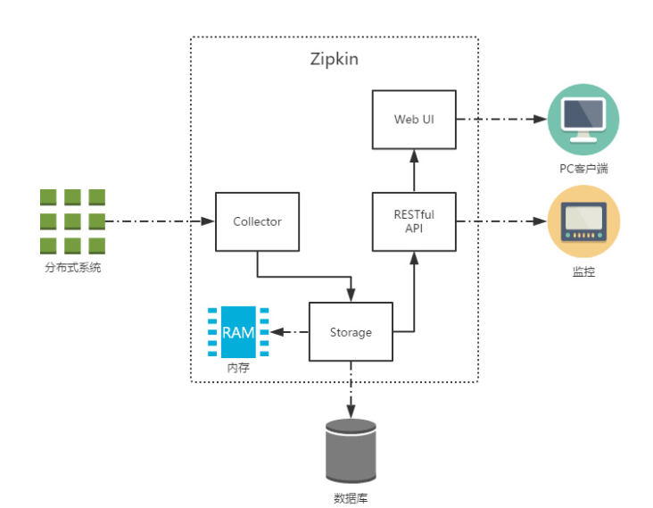
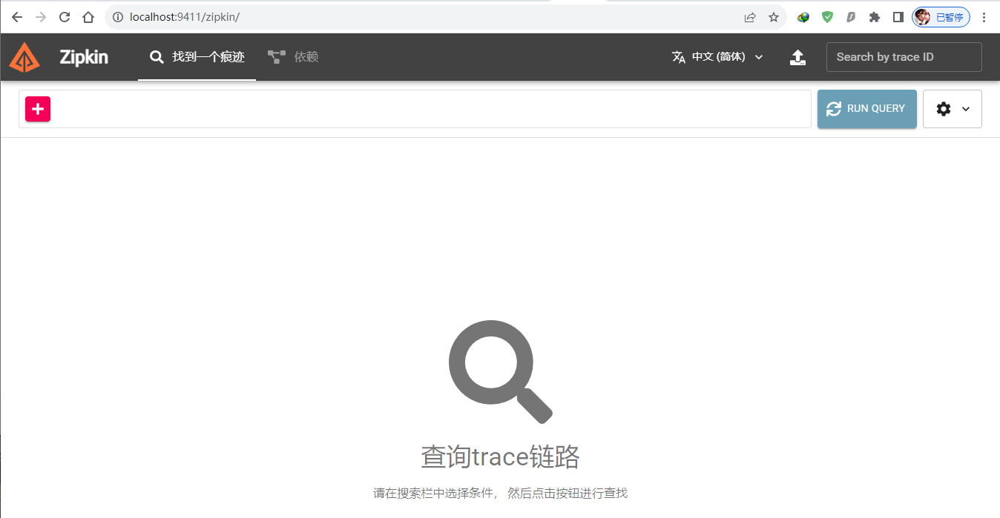
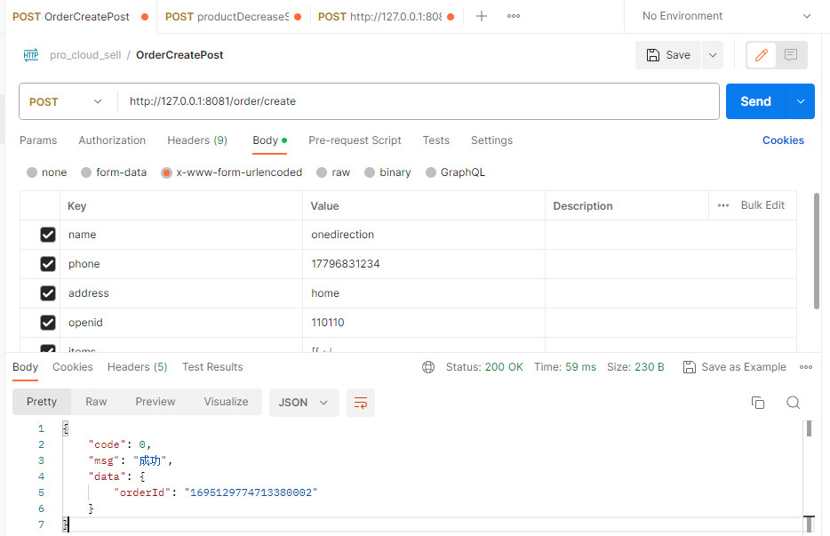
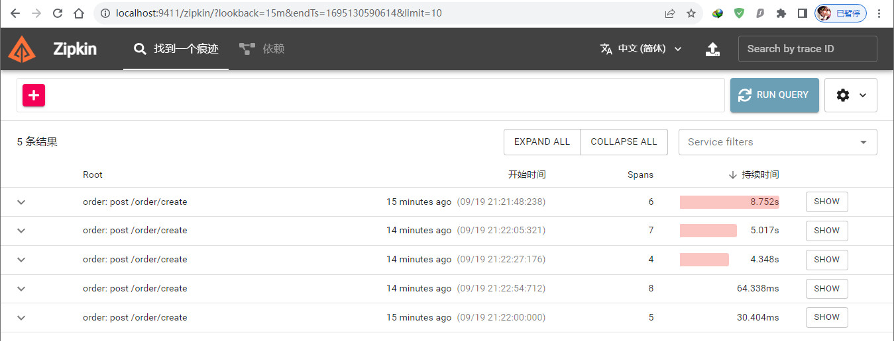
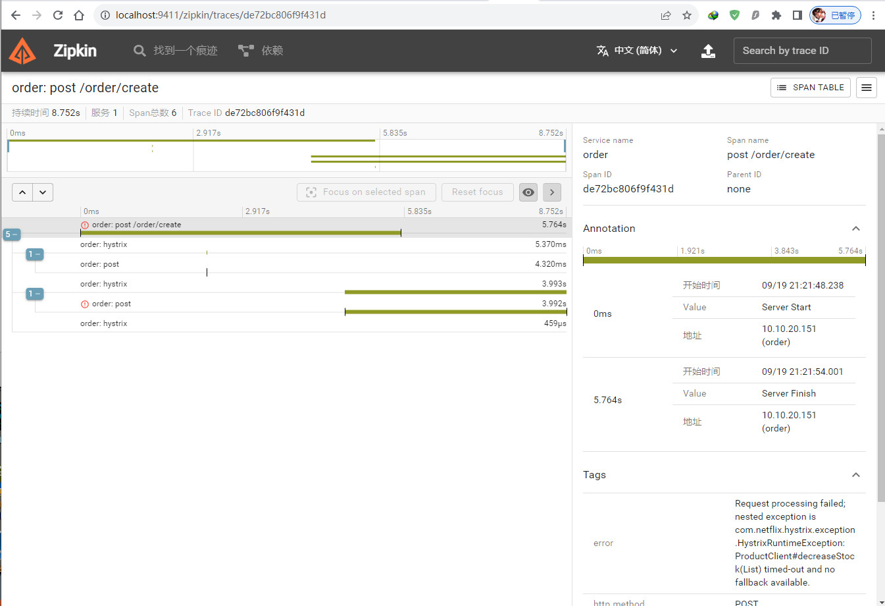
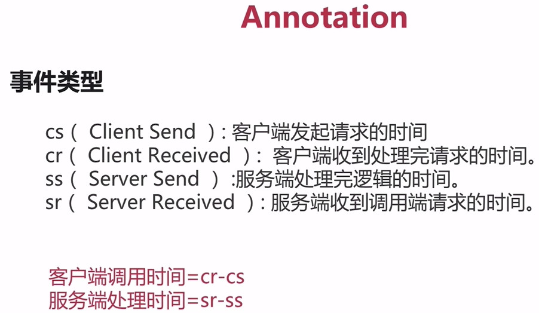

# 服务追踪

## 概述

微服务架构是通过业务来划分服务的，通过REST调用对外暴露的接口，可能需要很多个服务协同才能完成这个接口功能，如果链路上任何一个服务出现问题或者网络超时，都会导致接口调用失败。随着业务的不断扩张，服务之间互相调用会越来越复杂。

Spring Cloud Sleuth 主要功能就是在分布式系统中提供追踪解决方案，并且兼容支持了 zipkin，只需要在pom文件中引入相应的依赖即可。

## Sleuth简介

Spring Cloud Sleuth为Spring Cloud提供了分布式跟踪的解决方案，但是对于分布式链路的跟踪仅仅是生成一些数据，这些数据不便于人类阅读，所以我们一般把这种跟踪数据上传给Zipkin Server，由Zipkin通过UI页面统一进行数据的展示。

## Zipkin简介

Zipkin是Twitter开源的分布式实时数据跟踪系统（Distributed Tracking System），它的主要功能是收集系统的时序数据，从而追踪微服务架构的系统延时等问题，从而达到链路调用监控跟踪作用，另外Zipkin还提供了一个非常友好的UI界面，来帮助分析追踪数据。除此之外，Zipkin提供了可插拔数据存储方式：In-Memory、MySql、Cassandra以及Elasticsearch。

下图展示了Zipkin的基础架构，它主要由4个核心组件构成：

Sleuth和Zipkin的关系就好比Spring Boot Actuator和Spring Boot Admin之间的关系，一个用于产生数据，一个用于展示数据。

### 安装

可以使用Docker安装使用Zipkin

```shell
docker run -d -p 9411:9411 openzipkin/zipkin
```


## 搭建Zipkin服务

1. 在Order微服务中引入依赖

   ```xml
   <!--        包含sleuth和zipkin-->
   <!-- https://mvnrepository.com/artifact/org.springframework.cloud/spring-cloud-starter-zipkin -->
   <dependency>
       <groupId>org.springframework.cloud</groupId>
       <artifactId>spring-cloud-starter-zipkin</artifactId>
   </dependency>
   ```

2. 在Product微服务中引入依赖

   ```xml
   <!--        链路追踪sleuth-->
   <!-- https://mvnrepository.com/artifact/org.springframework.cloud/spring-cloud-starter-sleuth -->
   <dependency>
       <groupId>org.springframework.cloud</groupId>
       <artifactId>spring-cloud-starter-sleuth</artifactId>
   </dependency>
   ```

   

3. 设置日志级别，在控制台打印debug信息

   ```yaml
   #设置日志级别
   logging:
     level:
       org.springframework.cloud.openfeign: debug
   ```

   

4. 配置zipkin

   ```yaml
   spring:
     #zipkin设置
     zipkin:
       base-url: http://localhost:9411/ #服务端地址
     sleuth:
       sampler:
         percentage: 1 #抽样率，将所有的请求都发送出去
         probability: 1 #设置可以将请求发送出去
   ```

   

5. 打开浏览器输入`Zipkin`的web界面地址：http://localhost:9411/zipkin，

   

## 测试Zipkin服务

1. 使用postman发送创建订单请求：

   

2. 链路跟踪：http://localhost:9411/zipkin

   

3. 点击查找 -> 点击链路

   

   

## 分布式追踪系统

### 核心步骤

- 数据采集
- 数据存储
- 查询展示

