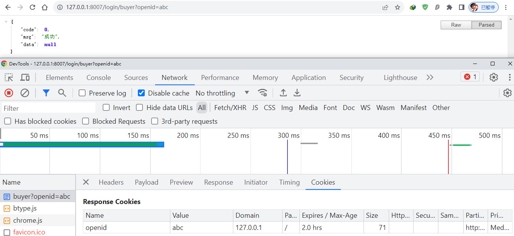
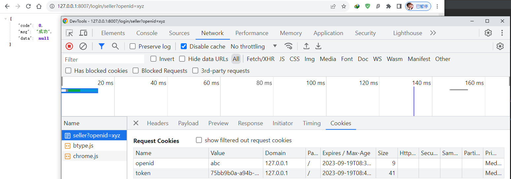
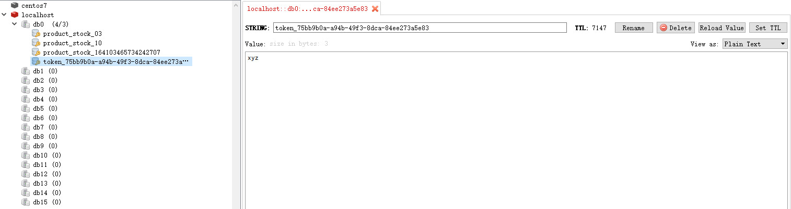

# 用户微服务

## 概述

提供用户登录功能，包括买家端以及卖家端登录。当用户成功登录后，设置Cookie以及Redis值，用于网关的权限校验。

## api文档

### 买家登录

```
GET /login/buyer
```

参数

```
openid: abc
```

返回

`cookie里设置openid=abc`

```
{
    code: 0,
    msg: "成功",
    data: null
}
```

### 卖家登录

```
GET /login/seller
```

参数

```
openid: xyz
```

返回

`cookie里设置token=UUID, redis设置key=UUID, value=xyz`

```json
 {    
     code: 0,    
     msg: "成功",    
     data: null
 }
```

## 数据库设计

### 用户表

```sql
-- 用户
CREATE TABLE `user_info` (
  `id` VARCHAR(32) NOT NULL,
  `username` VARCHAR(32) DEFAULT '',
  `password` VARCHAR(32) DEFAULT '',
  `openid` VARCHAR(64) DEFAULT '' COMMENT '微信openid',
  `role` TINYINT(1) NOT NULL COMMENT '1买家2卖家',
  `create_time` TIMESTAMP NOT NULL DEFAULT CURRENT_TIMESTAMP COMMENT '创建时间',
  `update_time` TIMESTAMP NOT NULL DEFAULT CURRENT_TIMESTAMP ON UPDATE CURRENT_TIMESTAMP COMMENT '修改时间',
  PRIMARY KEY (`id`)
);
```

## 创建用户微服务(user)

#### 新建Spring Boot工程，引入依赖

```xml
<dependency>
    <groupId>org.springframework.boot</groupId>
    <artifactId>spring-boot-starter-web</artifactId>
</dependency>
<dependency>
    <groupId>org.springframework.boot</groupId>
    <artifactId>spring-boot-starter-data-jpa</artifactId>
</dependency>
<dependency>
    <groupId>org.springframework.boot</groupId>
    <artifactId>spring-boot-starter-data-redis</artifactId>
</dependency>
<dependency>
    <groupId>org.springframework.cloud</groupId>
    <artifactId>spring-cloud-starter-netflix-eureka-client</artifactId>
</dependency>
<dependency>
    <groupId>mysql</groupId>
    <artifactId>mysql-connector-java</artifactId>
    <version>5.1.39</version>
</dependency>
<dependency>
    <groupId>org.springframework.boot</groupId>
    <artifactId>spring-boot-starter-test</artifactId>
    <scope>test</scope>
</dependency>

<!--    配置中心相关依赖    -->
<dependency>
    <groupId>org.springframework.cloud</groupId>
    <artifactId>spring-cloud-starter-config</artifactId>
</dependency>
<dependency>
    <groupId>org.springframework.cloud</groupId>
    <artifactId>spring-cloud-config-client</artifactId>
</dependency>
<dependency>
    <groupId>org.springframework.cloud</groupId>
    <artifactId>spring-cloud-starter-bus-amqp</artifactId>
</dependency>

```

#### 添加配置

本地bootstrap中的配置:

```yaml
spring:
  application:
    name: user
  cloud:
    config:
      discovery:
        enabled: true
        service-id: CONFIG
      profile: dev
eureka:
  client:
    service-url:
      defaultZone: http://localhost:8761/eureka/
```

git中的配置:

```yaml
spring:
  datasource:
    driver-class-name: com.mysql.jdbc.Driver
    username: root
    password: abc123
    url: jdbc:mysql://127.0.0.1:13306/springcloudsell?characterEncoding=utf-8&useSSL=false
  jpa:
    show-sql: true
  redis:
    host: localhost
    port: 6379 
```

#### 启动类添加注解

> 添加@EnableDiscoveryClient注解，作为Eureka Client

```java
@SpringBootApplication
@EnableDiscoveryClient
public class UserApplication {

    public static void main(String[] args) {
        SpringApplication.run(UserApplication.class, args);
    }

}
```

#### 创建实体类

```java
/**
 * 用户信息实体类
 */
@Data
@Entity
public class UserInfo {

	@Id
	private String id;

	private String username;

	private String password;

	private String openid;

	private Integer role;
}
```


#### 创建DAO层

```java
public interface UserInfoRepostory extends JpaRepository<UserInfo, String> {

	UserInfo findByOpenid(String openid);
}
```


##### 单元测试

```java
@SpringBootTest
@RunWith(SpringRunner.class)
public class UserInfoRepostoryTest {

    @Autowired
    private UserInfoRepostory userInfoRepostory;

    @Test
    public void findByOpenid() {
        UserInfo userInfo = userInfoRepostory.findByOpenid("abc");
        Assert.assertNotNull(userInfo);
    }
}
```


#### 创建Service层

##### 创建接口

```java
public interface UserService {

	/**
	 * 通过openid来查询用户信息
	 * @param openid
	 * @return
	 */
	UserInfo findByOpenid(String openid);
}
```


##### 创建实现类

```java
@Service
public class UserServiceImpl implements UserService {

	@Autowired
	private UserInfoRepostory repostory;
	/**
	 * 通过openid来查询用户信息
	 *
	 * @param openid
	 * @return
	 */
	@Override
	public UserInfo findByOpenid(String openid) {
		return repostory.findByOpenid(openid);
	}
}
```


##### 单元测试

```java
@RunWith(SpringRunner.class)
@SpringBootTest
public class UserServiceImplTest {

    @Autowired
    private UserService userService;

    @Test
    public void findByOpenid() {
        UserInfo userInfo = userService.findByOpenid("abc");
        Assert.assertNotNull(userInfo);
    }
}
```


#### 创建Controller层

##### 买家登录

```java
/**
     * 买家登录
     * @param openid
     * @param response
     * @return
     */
@GetMapping("/buyer")
public ResultVO buyer(@RequestParam("openid") String openid,
                      HttpServletResponse response) {
    //1. openid和数据库里的数据是否匹配
    UserInfo userInfo = userService.findByOpenid(openid);
    if (userInfo == null) {
        return ResultVOUtil.error(ResultEnum.LOGIN_FAIL);
    }

    //2. 判断角色
    if (RoleEnum.BUYER.getCode() != userInfo.getRole()) {
        return ResultVOUtil.error(ResultEnum.ROLE_ERROR);
    }

    //3. cookie里设置openid=abc
    CookieUtil.set(response, CookieConstant.OPENID, openid, CookieConstant.expire);

    return ResultVOUtil.success();
}
```


##### 卖家登录

```java
@GetMapping("/seller")
public ResultVO seller(@RequestParam("openid") String openid,
                       HttpServletRequest request,
                       HttpServletResponse response) {
    //判断是否已登录
    Cookie cookie = CookieUtil.get(request, CookieConstant.TOKEN);
    if (cookie != null &&
        !StringUtils.isEmpty(stringRedisTemplate.opsForValue().get(String.format(RedisConstant.TOKEN_TEMPLATE, cookie.getValue())))) {
        return ResultVOUtil.success();
    }

    //1. openid和数据库里的数据是否匹配
    UserInfo userInfo = userService.findByOpenid(openid);
    if (userInfo == null) {
        return ResultVOUtil.error(ResultEnum.LOGIN_FAIL);
    }

    //2. 判断角色
    if (RoleEnum.SELLER.getCode() != userInfo.getRole()) {
        return ResultVOUtil.error(ResultEnum.ROLE_ERROR);
    }

    //3. redis设置key=UUID, value=xyz
    String token = UUID.randomUUID().toString();
    Integer expire = CookieConstant.expire;
    stringRedisTemplate.opsForValue().set(String.format(RedisConstant.TOKEN_TEMPLATE, token),
                                          openid,
                                          expire,
                                          TimeUnit.SECONDS);

    //4. cookie里设置token=UUID
    CookieUtil.set(response, CookieConstant.TOKEN, token, CookieConstant.expire);

    return ResultVOUtil.success();
}
```


### 测试user微服务

#### 买家端登录功能测试

>  买家端登录成功后，会向浏览器中设置Cookie值

浏览器访问http://127.0.0.1:8007/login/buyer?openid=abc，查看返回结果是否正确以及Cookie是否设置成功



#### 卖家端登录功能测试

> 卖家端登录成功后，会将openid存入Redis和Cookie

浏览器访问http://127.0.0.1:8007/login/seller?openid=xyz，查看返回结果是否正确以及Cookie和Redis是否设置成功



