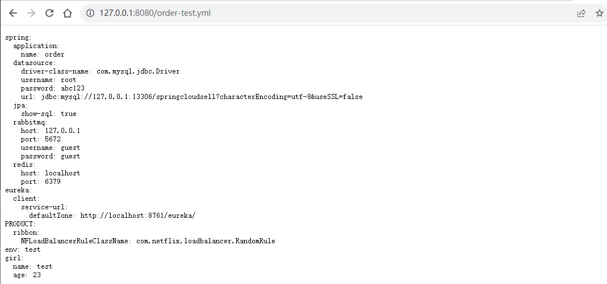
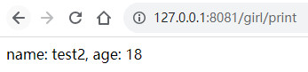

# 统一配置中心

## 简介

在分布式系统中，由于服务数量众多，为了方便统一管理服务配置文件，实时更新，所以需要分布式配置中心组件。在Spring Cloud中，有分布式配置中心组件spring cloud config ，它支持将配置服务放在配置服务的内存中（即本地），也支持放在远程Git仓库中。在spring cloud config 组件中，分两个角色，一是config server，二是config client。

## 搭建Config Server

> 使用Spring Cloud的三部曲：
>
> 1. 增加依赖
> 2. 启用注解@EnableXXX
> 3. 配置文件

### Step1: 新建Config Server微服务，添加依赖

关键依赖如下：

```xml
<dependency>
    <groupId>org.springframework.cloud</groupId>
    <artifactId>spring-cloud-config-server</artifactId>
</dependency>

<dependency>
    <groupId>org.springframework.cloud</groupId>
    <artifactId>spring-cloud-starter-netflix-eureka-client</artifactId>
</dependency>
```

### Step2: 将Config Server 注册到EurekaServer上

启动类增加 @EnableEurekaClient 注解，作为Eureka Client 注册到注册中心上去

```java
@SpringBootApplication
@EnableDiscoveryClient
public class ConfigApplication {

    public static void main(String[] args) {
        SpringApplication.run(ConfigApplication.class, args);
    }

}
```

application.yml 新增配置如下

```yaml
spring:
  application:
    name: config
eureka:
  client:
    service-url:
      defaultZone: http://localhost:8761/eureka/
```

### Step3: 启动类增加@EnableConfigServer，将服务变更为Config Server

启动类增加 @EnableConfigServer注解

```java
@SpringBootApplication
@EnableDiscoveryClient
@EnableConfigServer
public class ConfigApplication {

    public static void main(String[] args) {
        SpringApplication.run(ConfigApplication.class, args);
    }

}
```

application.yml 新增远程git配置如下

```yaml
spring:
  application:
    name: config
  cloud:
    config:
      server:
        git:
          #远端配置文件存放的地址
          uri: https://gitee.com/renhao9683/config-repo
          #git用户名和密码
          username: *********
          password: *********
          #指定分支
          default-label: master
          #本地缓存的配置文件存放位置
          basedir: F:\code\IdeaProjects\SpringCloud\config\basedir
eureka:
  client:
    service-url:
      defaultZone: http://localhost:8761/eureka/
```

> Cannot pull from remote the working tree is not clean. 这种报错可以通过配置强制拉属性force-pull: true 。 由于Spring Cloud配置服务器会复制远程git存储库，如果本地副本变得不干净，那么Spring Cloud配置服务器就不能更新远程存储库中的本地副本。通过设置强制拉属性为true，使Spring Cloud配置服务器从远程存储库中强制pull。

### Step4: 新建远端Git工程，用于存放配置文件

git地址：https://gitee.com/renhao9683/config-repo/tree/master

git工程中，新建order-test.yml文件：

```yaml
spring:
  application:
    name: order
  datasource:
    driver-class-name: com.mysql.jdbc.Driver
    username: root
    password: abc123
    url: jdbc:mysql://127.0.0.1:13306/springcloudsell?characterEncoding=utf-8&useSSL=false
  jpa:
    show-sql: true
  rabbitmq:
    host: 127.0.0.1
    port: 5672
    username: guest
    password: guest
  redis:
    host: localhost
    port: 6379 
eureka:
  client:
    service-url:
      defaultZone: http://localhost:8761/eureka/
PRODUCT:
  ribbon:
    NFLoadBalancerRuleClassName: com.netflix.loadbalancer.RandomRule
env:
  test
girl:
  name: test
  age: 23
```


### Step5: 启动测试

启动Eureka Server 和 Config Server，访问http://127.0.0.1:8761/，查看是否注册成功：


访问http://127.0.0.1:8080/order-test.yml，查看是否能够成功拉取git上的配置文件：


在本地缓存的配置文件的存放位置：


## 搭建Config Client

> 搭建Config Server后，还需要配置Config Client，才能在服务中直接使用远程配置文件，上面我们把Order微服务的配置文件放到了远端的Git，自然而然本地的工程直接使用远端存储的配置文件就可以了。

### Step1.添加spring-cloud-config-client依赖

在Order微服务中添加 spring-cloud-config-client 依赖：

```xml
<!--    配置中心相关依赖    -->
<dependency>
    <groupId>org.springframework.cloud</groupId>
    <artifactId>spring-cloud-config-client</artifactId>
</dependency>
```

### Step2. 新建bootstrap.yml

> 1. bootstrap.yml 是被一个父级的 Spring ApplicationContext 加载的，在加载application.yml 的 ApplicationContext之前。配置在 bootstrap.yml 中的属性优先级更高，默认情况下不能被本地配置覆盖。
> 2. 配置信息一定要写到bootstrap.yml中。 如果配到了application.yml中，spring.cloud.config.uri 就会访问默认的8888端口，而非配置的端口了。

```yaml
spring:
  application:
    name: order
  cloud:
    config:
      discovery:
        # 表示使用服务发现组件中的Config Server,而不自己指定Config Server的uri,默认为false
        enabled: true
        # 指定Config Server在服务发现中的service Id ,默认为configserver
        service-id: CONFIG
      profile: test
      # 可配置多个uri,但是不推荐使用,因为需要设置具体的ip.服务端修改或者新增IP后,要同步修改
      # uri: http://localhost:9898/,http://localhost:9999/
```

### Step3. 启动order微服务

访问http://127.0.0.1:8761/，查看order微服务是否注册成功：


### Step4. 验证

> 验证order微服务能否使用远端git中的配置文件

编写测试接口，查看是否能够访问到远端配置中的属性：

```java
@RestController
@RequestMapping("/girl")
public class GirlController {

    @Autowired
    private GirlConfig girlConfig;

    @GetMapping("/print")
    public String print(){
        return "name: " + girlConfig.getName() + "age: " + girlConfig.getAge();
    }
}
```

访问http://127.0.0.1:8081/girl/print，可见Order微服务已能成功访问到远端git中配置的属性：


## 配置中心的高可用

### Config Server注册到注册中心上的场景

> 这种情况最简单，**启动多个Config Server即可**。 下面我们来验证下


配置中心再启动另外一个端口:


访问Eureka Server，可以看到已经成功注册：


### Config Server未注册到注册中心上的场景


## 使用Spring Cloud Bus手动更新配置

> Spring Cloud中主要通过@RefreshScope和/actuator/busrefresh接口实现配置的自动刷新，当远端Git中的配置更改时，通过配置webhooks实现自动访问Config Server的busrefresh接口，从而通知Config Client自动刷新配置信息

### Step1. 添加依赖

Config Server和Config Client都需要接入到消息队列中，因此都需要引入下面依赖：

```xml
<dependency>
    <groupId>org.springframework.cloud</groupId>
    <artifactId>spring-cloud-starter-bus-amqp</artifactId>
</dependency>
```

### Step2. 配置RabbitMQ信息

application.yml增加 RabbitMQ的配置信息如下：

```yaml
spring:
  application:
    name: order
  datasource:
    driver-class-name: com.mysql.jdbc.Driver
    username: root
    password: abc123
    url: jdbc:mysql://127.0.0.1:13306/springcloudsell?characterEncoding=utf-8&useSSL=false
  jpa:
    show-sql: true
  rabbitmq:
    host: 127.0.0.1
    port: 5672
    username: guest
    password: guest
```

### Step3. Config Server暴露/actuator/busrefresh端点

> Spring Cloud是通过Config Server暴露出来的endpoints来请求Config Server, 所以需要在Config Server中暴露端点，这里我们设置默认全部暴露出来；
>
> 需要注意的是确保依赖中有spring-boot-starter-actuator 。 由于spring-cloud-config-server依赖了spring-boot-starter-actuator ，故无需重复引用。

application.yml增加 暴露端点的配置信息如下：

```yaml
#actuator  启用所有的监控端点 “*”号代表启用所有的监控端点，可以单独启用，例如，health，info，metrics
#  spring boot 升为 2.0 后，为了安全，默认 Actuator 只暴露了2个端点，heath 和 info
management:
  endpoints:
    web:
      exposure:
        include: "*"
  endpoint:
    health:
      show-details: ALWAYS
```

### Step4. 启动RabbitMQ的Docker镜像

```shell
docker run -d --hostname my-rabbitmq -p 5672:5672 -p 15672:15672 rabbitmq:3.12.4-management
```

### Step5. 启动Config Server微服务

登录RabbitMQ查看，可以看到Config Server自动创建了一个队列 


### Step6. 启动Order 微服务

查看消息队列中的队列，可以看到Order微服务连接RabbitMQ，也自动创建了一个消息队列:


### Step7. Order微服务中写个测试类 验证自动刷新

> **@RefreshScope** 重点是这个注解

```java
@Data
@Component
@ConfigurationProperties("girl")
@RefreshScope
public class GirlConfig {

    private String name;
    private Integer age;

}
```

通过Config Server访问http://127.0.0.1:8080/order-test.yml，查看此时远端git中的配置信息如下：



通过Order微服务访问http://127.0.0.1:8081/girl/print，查看配置中的属性：


将git中的属性girl的信息修改如下：


再次通过Order微服务访问http://127.0.0.1:8081/girl/print，查看配置中的属性，发现并未更新：


手动发送POST请求：


再次通过Order微服务访问http://127.0.0.1:8081/girl/print，查看配置中的属性，发现已经更新：


## 使用Spring Cloud Bus自动更新配置

> 从上面的测试可以看出，Config Client的配置之所以未跟随Config Server自动更新，是因为Config Server中的配置更新后，并未访问/autuator/busrefresh接口，提醒Config Client更新配置；
>
> 在Spring Cloud中，可以通过引入monitor依赖，并在git中设置WebHooks路径，来实现当git中的配置更新后，自动访问/autuator/busrefresh接口的目的。

### 内网穿透

> 为了实现在外网也可以访问本机项目，需要使用内网穿透工具，本项目中使用natapp


### 设置WebHooks

> 在github中配置WebHooks


### Config Server端引入 monitor依赖

```xml
<dependency>
    <groupId>org.springframework.cloud</groupId>
    <artifactId>spring-cloud-config-monitor</artifactId>
</dependency>
```

### 测试

> 测试Config Client是否能跟随Config Server自动更新配置

通过Config Server访问http://127.0.0.1:8080/order-test.yml，查看此时远端git中的配置信息如下：


通过Order微服务访问http://127.0.0.1:8081/girl/print，查看配置中的属性：


将git中的属性girl的信息修改如下：


再次通过Order微服务访问http://127.0.0.1:8081/girl/print，查看配置中的属性，发现自动更新成功：

