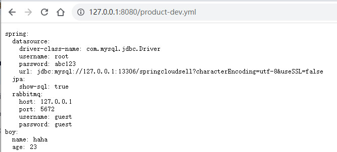
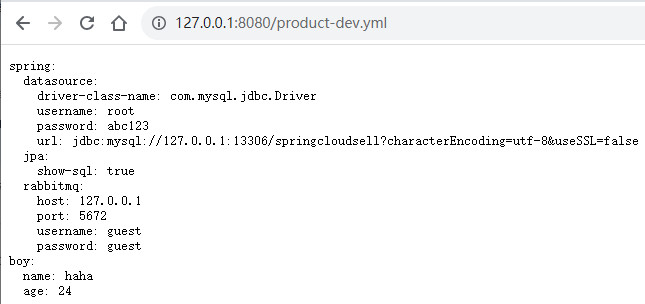
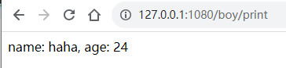
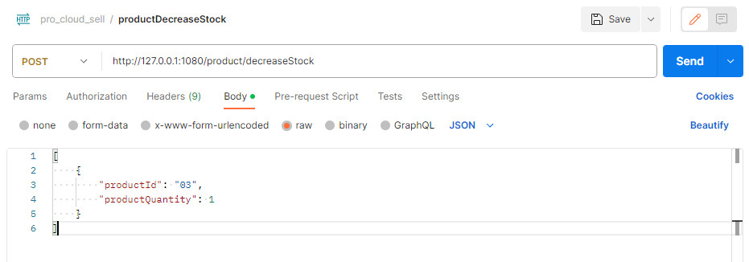
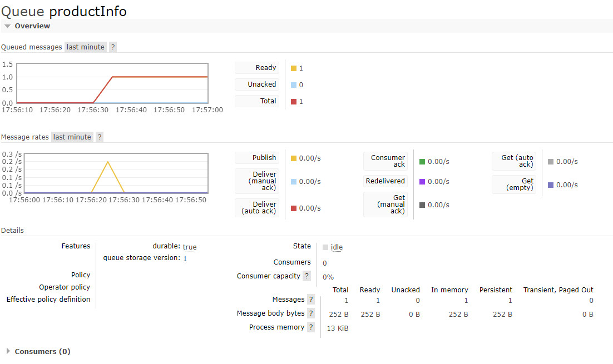
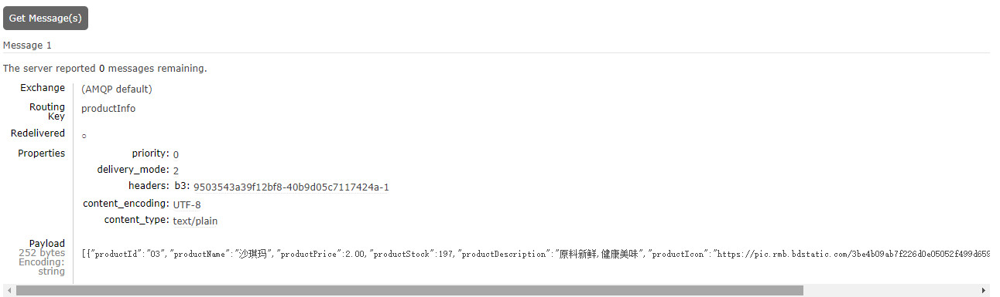
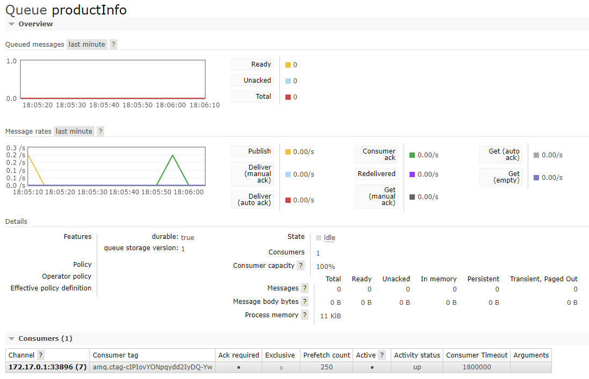
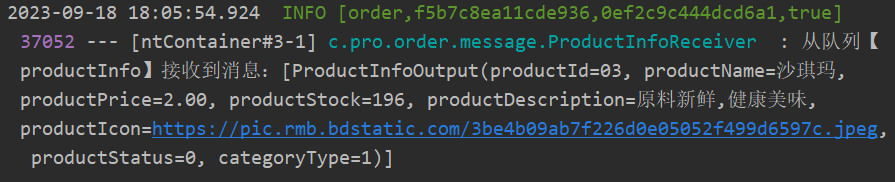

# 订单异步处理

## 概述

为了优化用户下单的速度，减少服务器和数据库的压力，我们可以从**限流角度，缓存角度，异步角度**对系统进行优化。

在秒杀系统用户进行抢购的过程中，由于在同一时间会有大量请求涌入服务器，如果每个请求都立即访问数据库进行扣减库存+写入订单的操作，对数据库的压力是巨大的。为了减轻数据库的压力，**我们将每一条秒杀请求存入消息队列（例如RabbitMQ）中，放入消息队列后，给用户返回类似“抢购请求发送成功”的结果。而在消息队列中，我们将收到的下订单请求发送给订单微服务，让订单微服务一个一个的将订单写入数据库中**，比起多线程同步修改数据库的操作，大大缓解了数据库的连接压力，最主要的好处就表现在数据库连接的减少：

- 同步方式：大量请求快速占满数据库框架开启的数据库连接池，同时修改数据库，导致数据库读写性能骤减。
- 异步方式：一条一条消息以顺序的方式写入数据库，连接数几乎不变（当然，也取决于消息队列消费者的数量）。

**这种实现可以理解为是一种流量削峰：让数据库按照他的处理能力，从消息队列中拿取消息进行处理。**

## Product微服务改造

### 接入配置中心

> 将Product微服务接入到配置中心

#### Step1 引入依赖

作为客户端引入`spring-cloud-config-client`和`spring-cloud-starter-bus-amqp`即可

```xml
<!--    配置中心相关依赖    -->
<dependency>
    <groupId>org.springframework.cloud</groupId>
    <artifactId>spring-cloud-config-client</artifactId>
</dependency>
<dependency>
    <groupId>org.springframework.cloud</groupId>
    <artifactId>spring-cloud-starter-bus-amqp</artifactId>
</dependency>
```

#### Step2 远端Git存储中心，新增product模块的配置文件

> 将原来配置在application.yml中的配置信息拆分到bootstrap.yml及远端的git文件中
>
> - application.yml —端口信息
> - 远端git：artisan-product-dev.yml --数据库等
> - bootstrap.yml: Config Server，Eureka等信息

application.yml

```yaml
server:
  port: 1080
```

远端git：product-dev.yml

```yaml
spring:
 datasource:
   driver-class-name: com.mysql.jdbc.Driver
   username: root
   password: abc123
   url: jdbc:mysql://127.0.0.1:13306/springcloudsell?characterEncoding=utf-8&useSSL=false
 jpa:
   show-sql: true
 rabbitmq:
    host: 127.0.0.1
    port: 5672
    username: guest
    password: guest 
boy:
 name: haha
 age: 23

```

bootstrap.yml

```yaml
spring:
  application:
    name: product
  cloud:
    config:
      discovery:
        enabled: true
        service-id: CONFIG
      profile: dev
eureka:
  client:
    service-url:
      defaultZone: http://localhost:8761/eureka/
```

#### Step3 验证

通过config server访问下远端的Git配置文件，浏览器访问http://127.0.0.1:8080/product-dev.yml



将git中product-dev.yml的属性boy的信息修改如下：



通过Product微服务访问http://127.0.0.1:1080/boy/print，查看配置中的属性，发现自动更新成功：



### 接入消息队列

#### Step1 引入依赖

> 使用 spring-boot-starter-amqp

```xml
<dependency>
    <groupId>org.springframework.boot</groupId>
    <artifactId>spring-boot-starter-amqp</artifactId>
</dependency>
```

#### Step2 配置RabbitMQ

> 在git仓库中product-dev文件中新增RabbitMQ的属性

```yaml
spring:
 rabbitmq:
    host: 127.0.0.1
    port: 5672
    username: guest
    password: guest 
```

### Product微服务改造

#### Step1 分析

> 流程如下：
>
> **商品----------->消息队列<---------------订单**
>
> 商品微服务在扣减库存完成之后，通知消息队列，订单微服务订阅消息队列中的消息后，再处理写入订单的请求。

#### Step2 扣减库存方法中增加发送消息队列的代码

> 为了方便观察，可以将productInfoOutputList转成Json格式，万一有消息挤压的话，方便在RabbitMQ的管理页面查看挤压的消息。 

```java
@Override
public void decreaseStock(List<DecreaseStockInput> decreaseStockInputList) {
    List<ProductInfo> productInfoList = decreaseStockProcess(decreaseStockInputList);
    //productInfoList -> productInfoOutputList
    List<ProductInfoOutput> productInfoOutputList = productInfoList.stream().map(e -> {
        ProductInfoOutput output = new ProductInfoOutput();
        BeanUtils.copyProperties(e, output);
        return output;
    }).collect(Collectors.toList());
    //发送mq消息
    amqpTemplate.convertAndSend("productInfo", JsonUtil.toJson(productInfoOutputList));
}
```

#### Step3 验证发送到消息队列的数据

由于还没有写接收方，先在RabbitMQ中手动创建一个名为productInfo的消息队列，看下是否正确。启动product 微服务， 使用postman测试如下:



发送请求，观察RabbitMQ 和 数据库中库存是否扣减成功：



可以看到RabbitMQ 消息接收正常，只是没有被消费，查看挤压的消息：



到目前为止，消息已成功发送到了消息队列，数据扣减也正常。 下一步就是该在订单服务中去写消息接收方的业务逻辑了。

### Order微服务接收消息队列中的消息

#### Step1 开发消息接收类

```java
/**
 * 从消息队列中接收来自商品服务的消息
 */
@Component
@Slf4j
public class ProductInfoReceiver {

    private static final String PRODUCT_STOCK_TEMPLATE = "product_stock_%s";

    @Autowired
    private StringRedisTemplate stringRedisTemplate;

    // 自动创建productInfo队列
    @RabbitListener(queuesToDeclare = @Queue("productInfo"))
    public void process(String message){
        //message => productInfoOutputList
        List<ProductInfoOutput> productInfoOutputList = (List<ProductInfoOutput>)JsonUtil.fromJson(message,
                new TypeReference<List<ProductInfoOutput>>() {});
        log.info("从队列【{}】接收到消息：{}", "productInfo", productInfoOutputList);
        //存储到redis中
        for (ProductInfoOutput productInfoOutput : productInfoOutputList) {
            stringRedisTemplate.opsForValue().set(String.format(PRODUCT_STOCK_TEMPLATE, productInfoOutput.getProductId()),
                    String.valueOf(productInfoOutput.getProductStock()));
        }
    }
}
```

#### Step2 验证

> 消息接收方中使用了`@RabbitListener(queuesToDeclare = @Queue("productInfo"))`会自动创建消息队列，因此在测试之前，需要把之前手动创建的productInfo删掉，验证下消息队列通过代码自动创建

启动Order微服务后，在postman中发送消息，观察RabbitMQ和日志


查看RabbitMQ中已经成功接收到消息：



查看控制台日志已经成功打印：

