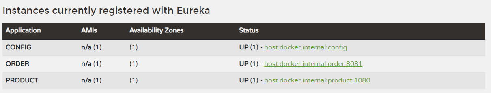
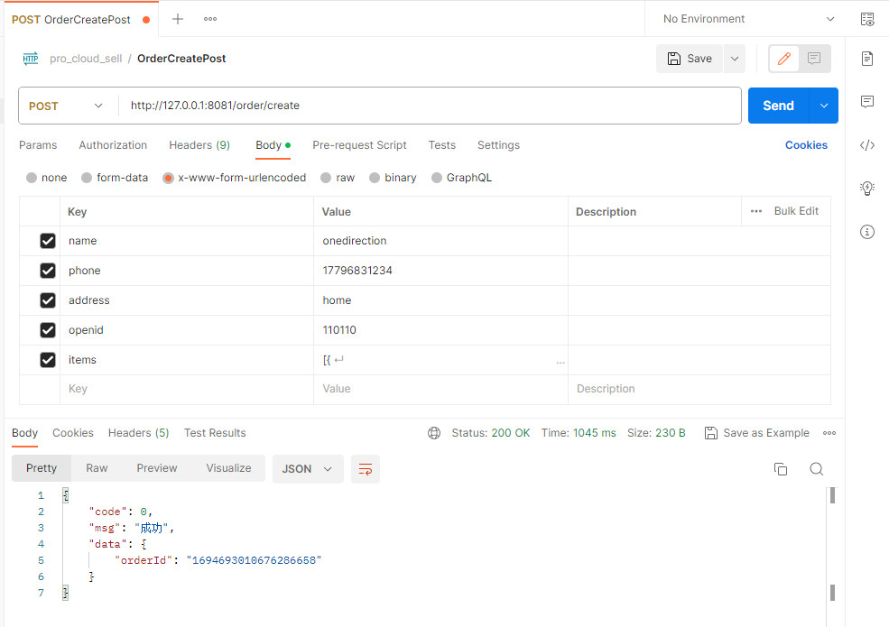
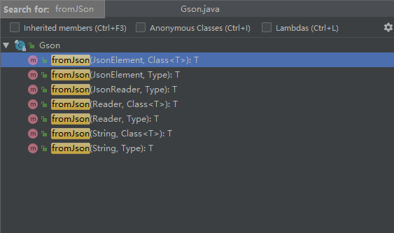
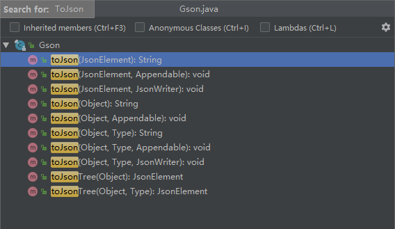

# 订单微服务

## 数据模型

>  通常来讲，微服务都是分数据库的，我们需要为订单微服务新建一个数据库

**订单与订单详情是一对多的关系，一个订单中可能包含多个订单详情**，比如我下一个订单，这个订单中买了1杯奶茶、2杯可乐等;

order_detail中不仅设计了product_id，同时也冗余了 product_name product_price product_icon等，主要是考虑到有些促销活动这些字段会经常更改这些因素。

```sql
-- 订单
CREATE TABLE `order_master` (
    `order_id` VARCHAR(32) NOT NULL,
    `buyer_name` VARCHAR(32) NOT NULL COMMENT '买家名字',
    `buyer_phone` VARCHAR(32) NOT NULL COMMENT '买家电话',
    `buyer_address` VARCHAR(128) NOT NULL COMMENT '买家地址',
    `buyer_openid` VARCHAR(64) NOT NULL COMMENT '买家微信openid',
    `order_amount` DECIMAL(8,2) NOT NULL COMMENT '订单总金额',
    `order_status` TINYINT(3) NOT NULL DEFAULT '0' COMMENT '订单状态, 默认为新下单',
    `pay_status` TINYINT(3) NOT NULL DEFAULT '0' COMMENT '支付状态, 默认未支付',
    `create_time` TIMESTAMP NOT NULL DEFAULT CURRENT_TIMESTAMP COMMENT '创建时间',
    `update_time` TIMESTAMP NOT NULL DEFAULT CURRENT_TIMESTAMP ON UPDATE CURRENT_TIMESTAMP COMMENT '修改时间',
    PRIMARY KEY (`order_id`),
    KEY `idx_buyer_openid` (`buyer_openid`)
);

-- 订单商品
CREATE TABLE `order_detail` (
    `detail_id` VARCHAR(32) NOT NULL,
    `order_id` VARCHAR(32) NOT NULL,
    `product_id` VARCHAR(32) NOT NULL,
    `product_name` VARCHAR(64) NOT NULL COMMENT '商品名称',
    `product_price` DECIMAL(8,2) NOT NULL COMMENT '当前价格,单位分',
    `product_quantity` INT NOT NULL COMMENT '数量',
    `product_icon` VARCHAR(512) COMMENT '小图',
    `create_time` TIMESTAMP NOT NULL DEFAULT CURRENT_TIMESTAMP COMMENT '创建时间',
    `update_time` TIMESTAMP NOT NULL DEFAULT CURRENT_TIMESTAMP ON UPDATE CURRENT_TIMESTAMP COMMENT '修改时间',
    PRIMARY KEY (`detail_id`),
    KEY `idx_order_id` (`order_id`)
);
```

## API

创建订单

```shell
POST /sell/buyer/order/create
```

参数

> 后端尽量少依赖前端传递的数据，为了安全起见，产品相关的数据，只传递了一个productId
>
> productQuantity，而没有将价格、描述等等一并传递，不传递就不会被篡改，也减少了交互数据的大小。

```shell
name: "任豪"
phone: "1779683xxxx"
address: "电子科技大学"
openid: "ew3euwhd7sjw9diwkq" //用户的微信openid
items: [{
    productId: "1423113435324",
    productQuantity: 2 //购买数量
}]

```

返回

```json
{
  "code": 0,
  "msg": "成功",
  "data": {
      "orderId": "147283992738221" 
  }
}
```

## 业务逻辑分析

1. 校验前台入参
2. 查询商品信息（**调用商品微服务**）
3. 计算订单总价
4. 扣减库存（**调用商品微服务**）
5. 订单入库

## 创建订单微服务

### 引入依赖

```xml
<dependency>
    <groupId>org.springframework.cloud</groupId>
    <artifactId>spring-cloud-starter-netflix-eureka-client</artifactId>
</dependency>
<dependency>
    <groupId>org.springframework.boot</groupId>
    <artifactId>spring-boot-starter-test</artifactId>
    <scope>test</scope>
</dependency>
<dependency>
    <groupId>org.springframework.boot</groupId>
    <artifactId>spring-boot-starter-web</artifactId>
</dependency>
<dependency>
    <groupId>org.springframework.boot</groupId>
    <artifactId>spring-boot-starter-data-jpa</artifactId>
</dependency>
<dependency>
    <groupId>mysql</groupId>
    <artifactId>mysql-connector-java</artifactId>
    <version>5.1.39</version>
</dependency>
<dependency>
    <groupId>org.projectlombok</groupId>
    <artifactId>lombok</artifactId>
    <optional>true</optional>
</dependency>
```

### 添加配置

> 这里我们需要连接到 order微服务的数据库。 

```yaml
spring:
  application:
    name: order
  datasource:
    driver-class-name: com.mysql.jdbc.Driver
    username: root
    password: abc123
    url: jdbc:mysql://127.0.0.1:13306/springcloudsell?characterEncoding=utf-8&useSSL=false
  jpa:
    show-sql: true
eureka:
  client:
    service-url:
      defaultZone: http://localhost:8761/eureka/
```

### 注册订单微服务

> 在application.yml中配置了Eureka的信息后，我们在启动类增加`@EnableEurekaClient`即可
>
> 可以使用@SpringCloudApplication代替，因为@SpringCloudApplication包含@SpringBootApplication、@EnableDiscoveryClient以及@EnableCircuitBreaker

```java
@SpringCloudApplication
public class OrderApplication {

    public static void main(String[] args)  {
        SpringApplication.run(OrderApplication.class, args);
    }

}
```

启动注册中心微服务，启动该服务，访问http://localhost:8761/，可以看到，注册成功



## 订单微服务功能实现

### 创建实体类

> 包括OrderMaster以及OrderDetail

```java
@Data
@Entity
public class OrderMaster {

    /** 订单id. */
    @Id
    private String orderId;

    /** 买家名字. */
    private String buyerName;

    /** 买家手机号. */
    private String buyerPhone;

    /** 买家地址. */
    private String buyerAddress;

    /** 买家微信Openid. */
    private String buyerOpenid;

    /** 订单总金额. */
    private BigDecimal orderAmount;

    /** 订单状态, 默认为0新下单. */
    private Integer orderStatus;

    /** 支付状态, 默认为0未支付. */
    private Integer payStatus;

    /** 创建时间. */
    private Date createTime;

    /** 更新时间. */
    private Date updateTime;
}
```

### 创建DAO层

> 创建订单无非就是往这两个表里写入数据，直接利用jpa提供的save方法即可。
>
> 包括OrderMasterRepository以及OrderDetailRepository，两者都是空实现，利用jpa本身提供的save方法

```java
public interface OrderMasterRepository extends JpaRepository<OrderMaster, String> {
}
```

#### DAO层单元测试

```java
@Component
public class OrderMasterRepositoryTest extends OrderApplicationTests {

    @Autowired
    private OrderMasterRepository orderMasterRepository;

    @Test
    public void testSave() {
        OrderMaster orderMaster = new OrderMaster();
        orderMaster.setOrderId("1234567");
        orderMaster.setBuyerName("任豪");
        orderMaster.setBuyerPhone("1886131241241");
        orderMaster.setBuyerAddress("电子科技大学");
        orderMaster.setBuyerOpenid("110110");
        orderMaster.setOrderAmount(new BigDecimal(2.5));
        orderMaster.setOrderStatus(OrderStatusEnum.NEW.getCode());
        orderMaster.setPayStatus(PayStatusEnum.WAIT.getCode());

        OrderMaster result = orderMasterRepository.save(orderMaster);
        Assert.assertTrue(result != null);
    }
}
```

### 创建Service层

> 为了向order_master 和 order_detail中写入数据，肯定要传入Order和OrderDetail实体类，类似于 createOrder(Order order , OrderDetail orderDetail) ，根据业务规则，一个Order中可能有多个OrderDetail， 所以入参OrderDetail 必须是个集合，并且返回结果也不好定义。 因此需要将这俩合并一下，封装成DTO来使用，作为入参和返回结果。

#### 将OrderMaster 和OrderDetail 合并为一个DTO对象

```java
@Data
public class OrderDTO {

    /** 订单id. */
    private String orderId;

    /** 买家名字. */
    private String buyerName;

    /** 买家手机号. */
    private String buyerPhone;

    /** 买家地址. */
    private String buyerAddress;

    /** 买家微信Openid. */
    private String buyerOpenid;

    /** 订单总金额. */
    private BigDecimal orderAmount;

    /** 订单状态, 默认为0新下单. */
    private Integer orderStatus;

    /** 支付状态, 默认为0未支付. */
    private Integer payStatus;
	//1个订单可能包含多个OrderDetail(即一个订单中购买了多种商品)，因此使用List来存放该属性
    private List<OrderDetail> orderDetailList;
}
```

#### 创建接口

```java
/**
 * 订单相关业务逻辑
 */
public interface OrderService {

    /**
     * 创建订单
     * @param orderDTO
     * @return
     */
    OrderDTO create(OrderDTO orderDTO);
    /**
     * 完结订单(只能卖家操作)
     * @param orderId
     * @return
     */
    OrderDTO finish(String orderId);
}

```

#### 创建实现类

> 业务逻辑：
>
> - 校验前台入参
> - 查询商品信息（调用商品微服务）
> - 计算订单总价
> - 扣减库存（调用商品微服务）
> - 订单入库
>
> 可行性分析：
>
> - 参数校验，我们放在Controller层校验，所以Service层这里不写
> - 调用微服务的，我们目前还不具备，没法做
> - 计算订单总价，前台入参仅仅传了ProductId, 而Product的数据需要调用商品微服务，目前没法做
> - 订单入库分两部分，第一个是order_master 表，第二个是Order_detail表。 order_detail表包含了Product的内容，目前也是做不了
>
> 综合分析，目前在Service层能做的仅仅是 入库order_master表；

```java
@Service
public class OrderServiceImpl implements OrderService {

    @Autowired
    private OrderDetailRepository orderDetailRepository;
    @Autowired
    private OrderMasterRepository orderMasterRepository;

    @Override
    @Transactional
    public OrderDTO create(OrderDTO orderDTO) {
        String orderId = KeyUtil.genUniqueKey();

        // TODO 查询商品信息(调用商品微服务)
        // TODO 计算订单总价
        // TODO 扣减库存(调用商品微服务)

        //订单入库
        OrderMaster orderMaster = new OrderMaster();
        orderDTO.setOrderId(orderId);
        //复制属性
        BeanUtils.copyProperties(orderDTO, orderMaster);
        //设置其它属性
        orderMaster.setOrderAmount(orderAmout);
        orderMaster.setOrderStatus(OrderStatusEnum.NEW.getCode());
        orderMaster.setPayStatus(PayStatusEnum.WAIT.getCode());
        orderMasterRepository.save(orderMaster);
        
        return orderDTO;
    }
    
    @Override
    @Transactional
    public OrderDTO finish(String orderId) {
        //1. 先查询订单
        Optional<OrderMaster> orderMasterOptional = orderMasterRepository.findById(orderId);
        if (!orderMasterOptional.isPresent()) {
            throw new OrderException(ResultEnum.ORDER_NOT_EXIST);
        }

        //2. 判断订单状态
        OrderMaster orderMaster = orderMasterOptional.get();
        //不是新创建的订单无法完结
        if (OrderStatusEnum.NEW.getCode() != orderMaster.getOrderStatus()) {
            throw new OrderException(ResultEnum.ORDER_STATUS_ERROR);
        }

        //3. 修改订单状态为完结
        orderMaster.setOrderStatus(OrderStatusEnum.FINISHED.getCode());
        orderMasterRepository.save(orderMaster);

        //查询订单详情
        List<OrderDetail> orderDetailList = orderDetailRepository.findByOrderId(orderId);
        if (CollectionUtils.isEmpty(orderDetailList)) {
            throw new OrderException(ResultEnum.ORDER_DETAIL_NOT_EXIST);
        }

        OrderDTO orderDTO = new OrderDTO();
        BeanUtils.copyProperties(orderMaster, orderDTO);
        orderDTO.setOrderDetailList(orderDetailList);

        return orderDTO;
    }
}

```

### 创建Controller层

> 目前仅包含订单创建接口

```java
@RestController
@RequestMapping("/order")
@Slf4j
public class OrderController {

    @Autowired
    private OrderService orderService;

    /**
     * 1. 参数检验
     * 2. 查询商品信息(调用商品服务)
     * 3. 计算总价
     * 4. 扣库存(调用商品服务)
     * 5. 订单入库
     */
    @PostMapping("/create")
    public ResultVO<Map<String, String>> create(@Valid OrderForm orderForm,
                                                BindingResult bindingResult) {
        if (bindingResult.hasErrors()){
            log.error("【创建订单】参数不正确, orderForm={}", orderForm);
            throw new OrderException(ResultEnum.PARAM_ERROR.getCode(),
                    bindingResult.getFieldError().getDefaultMessage());
        }
        // orderForm -> orderDTO
        OrderDTO orderDTO = OrderForm2OrderDTOConverter.convert(orderForm);
        if (CollectionUtils.isEmpty(orderDTO.getOrderDetailList())) {
            log.error("【创建订单】购物车信息为空");
            throw new OrderException(ResultEnum.CART_EMPTY);
        }

        OrderDTO result = orderService.create(orderDTO);

        Map<String, String> map = new HashMap<>();
        map.put("orderId", result.getOrderId());
        return ResultVOUtil.success(map);
    }
    
    /**
     * 完结订单
     * @param orderId
     * @return
     */
    @PostMapping("/finish")
    public ResultVO<OrderDTO> finish(@RequestParam("orderId") String orderId) {
        return ResultVOUtil.success(orderService.finish(orderId));
    }
}
```

### 订单微服务功能测试

> 使用PostMan访问http://127.0.0.1:8081/order/create



## 知识点总结

### Gson库

> 谷歌提供的 JSON – Java Object 相互转换的 Java序列化/反序列化库

#### 将Json转换为对象



#### 解析json数组

```java
orderDetailList = gson.fromJson(orderForm.getItems(),
                    new TypeToken<List<OrderDetail>>() {
                    }.getType());

```

#### 将Java对象转换为Json

