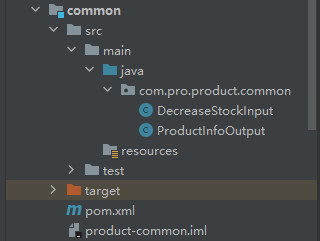
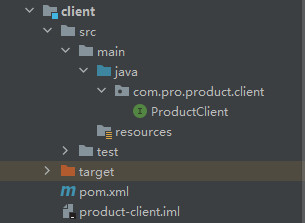
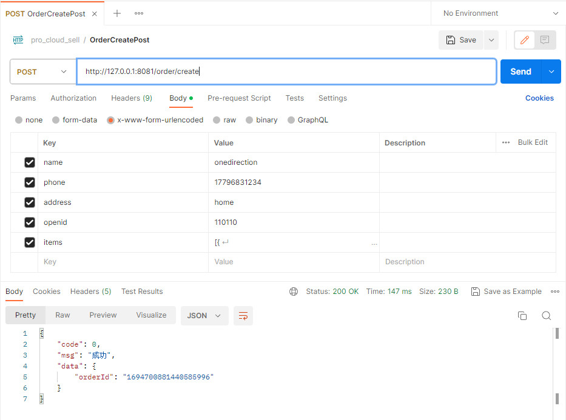

# 项目改造成多模块

## 概述

> 待改进的几个问题：
>
> - 问题一：将数据表映射的实体类暴露出去了，出于安全考虑，需要再封装一层
>
>   比如Product类就是我们库表映射的实体类，项目中直接返回给客户端了；
>
> - 问题二：同一个对象在不同微服务之间重复定义
>
>   我们在Order微服中使用Feign调用Product微服务提供的一些接口时 ，原本属于product微服务的Product和CartDTO类为了不报错却不得不在Order微服务中重复定义，维护较为麻烦。
>
>    原则是：这些类该属于哪个模块就只在哪个模块中定义。
>
> - 问题三： 将对方的服务定义到自己的服务中
>
>   order和product 可能是两个小组来开发，而我们要在order微服中将product微服务的请求url写到自己的微服务中，将对方的服务定义到自己的服务中是不是不太合理？
>
>    应该自己管理自己的对外接口，暴露出去供外部调用者使用。

**可以利用maven的多模块技术，将服务拆分为多个子模块。**

## Product微服务功能分析及多模块拆分

### 拆分原则

> 我们将Product划分为3个子模块:
>
> - product Server ： 所有业务逻辑
>
> - product Client ： 对外暴露的接口（目前有查询商品和扣减库存）
>
> - product Common ： 公用的对象
>
> 三者的依赖关系:
> product Server 依赖 product Common
> product Client 依赖 product Common

### Step1. 调整主（父）工程的工程类型 packaging为pom

将packaging 由 jar 改为 pom

```xml
<packaging>pom</packaging>
```

## Step2. 新建子模块

新建三个父工程为product的子模块，product-server、product-common以及product-client

父工程的pom.xml 已经新增了 modules节点如下信息：

```xml
<modules>
    <module>common</module>
    <module>client</module>
    <module>server</module>
</modules>
```

### Step3. 移动代码以及依赖

将代码按照模块的划分分别整合到各个子模块中，再将依赖移动到子模块中

### 注意事项

1. 凡是版本的定义，都建议放在最外层的dependencyManagement中，方便做到统一管理
2. 依赖的模块，需要先mvn install，其他模块才可以正确的引用

### 父工程pom

```xml
<?xml version="1.0" encoding="UTF-8"?>
<project xmlns="http://maven.apache.org/POM/4.0.0" xmlns:xsi="http://www.w3.org/2001/XMLSchema-instance"
         xsi:schemaLocation="http://maven.apache.org/POM/4.0.0 https://maven.apache.org/xsd/maven-4.0.0.xsd">
    <modelVersion>4.0.0</modelVersion>
    <packaging>pom</packaging>

    <modules>
        <module>common</module>
        <module>client</module>
        <module>server</module>
    </modules>

    <parent>
        <groupId>org.springframework.boot</groupId>
        <artifactId>spring-boot-starter-parent</artifactId>
        <version>2.3.12.RELEASE</version>
        <relativePath/> <!-- lookup parent from repository -->
    </parent>

    <groupId>com.pro</groupId>
    <artifactId>product</artifactId>
    <version>0.0.1-SNAPSHOT</version>
    <name>product</name>
    <description>product</description>

    <properties>
        <java.version>1.8</java.version>
        <spring-cloud.version>Hoxton.SR12</spring-cloud.version>
        <product-common.version>0.0.1-SNAPSHOT</product-common.version>
    </properties>

    <dependencyManagement>
        <dependencies>

            <dependency>
                <groupId>org.springframework.cloud</groupId>
                <artifactId>spring-cloud-dependencies</artifactId>
                <version>${spring-cloud.version}</version>
                <type>pom</type>
                <scope>import</scope>
            </dependency>

            <dependency>
                <groupId>com.pro</groupId>
                <artifactId>product-common</artifactId>
                <version>${product-common.version}</version>
            </dependency>

        </dependencies>
    </dependencyManagement>

</project>

```

### product-common

> 解决问题1: 对暴露出去的实体类进行重新封装



pom.xml

```xml
<?xml version="1.0" encoding="UTF-8"?>
<project xmlns="http://maven.apache.org/POM/4.0.0"
         xmlns:xsi="http://www.w3.org/2001/XMLSchema-instance"
         xsi:schemaLocation="http://maven.apache.org/POM/4.0.0 http://maven.apache.org/xsd/maven-4.0.0.xsd">
    <parent>
        <artifactId>product</artifactId>
        <groupId>com.pro</groupId>
        <version>0.0.1-SNAPSHOT</version>
    </parent>
    <modelVersion>4.0.0</modelVersion>

    <artifactId>product-common</artifactId>

    <properties>
        <maven.compiler.source>8</maven.compiler.source>
        <maven.compiler.target>8</maven.compiler.target>
        <project.build.sourceEncoding>UTF-8</project.build.sourceEncoding>
    </properties>

    <dependencies>

        <dependency>
            <groupId>org.projectlombok</groupId>
            <artifactId>lombok</artifactId>
            <optional>true</optional>
        </dependency>

    </dependencies>


</project>
```

### product-client

> 解决问题2：避免不同微服务之间重复定义
>
> 解决问题3：将属于product微服务的ProductClient定义在该模块中



pom.xml

> product-client 需要依赖 product-common

```xml
<?xml version="1.0" encoding="UTF-8"?>
<project xmlns="http://maven.apache.org/POM/4.0.0"
         xmlns:xsi="http://www.w3.org/2001/XMLSchema-instance"
         xsi:schemaLocation="http://maven.apache.org/POM/4.0.0 http://maven.apache.org/xsd/maven-4.0.0.xsd">
    <parent>
        <artifactId>product</artifactId>
        <groupId>com.pro</groupId>
        <version>0.0.1-SNAPSHOT</version>
    </parent>
    <modelVersion>4.0.0</modelVersion>

    <artifactId>product-client</artifactId>
    <dependencies>

        <dependency>
            <groupId>com.pro</groupId>
            <artifactId>product-common</artifactId>
        </dependency>

        <dependency>
            <groupId>org.springframework</groupId>
            <artifactId>spring-web</artifactId>
        </dependency>

        <dependency>
            <groupId>org.springframework.cloud</groupId>
            <artifactId>spring-cloud-openfeign-core</artifactId>
        </dependency>

    </dependencies>

    <properties>
        <maven.compiler.source>8</maven.compiler.source>
        <maven.compiler.target>8</maven.compiler.target>
        <project.build.sourceEncoding>UTF-8</project.build.sourceEncoding>
    </properties>

</project>
```

> 将属于product微服务的ProductClient定义在该模块中，接口暴露出去等待订单微服务调用

```java
@FeignClient(name = "product")
public interface ProductClient {

    /**
     * 获取商品列表(给订单服务用的)
     *
     * @param productIdList
     * @return
     */
    @PostMapping("/product/listForOrder")
    List<ProductInfoOutput> listForOrder(@RequestBody List<String> productIdList);

    @PostMapping("/product/decreaseStock")
    void decreaseStock(@RequestBody List<DecreaseStockInput> decreaseStockInputList);

}
```

### product-server

> 包含product微服务的核心功能
>
> 将Controller层和Service层中的Product和CartDTO替换为自己维护的对象，而不是使用数据库的映射模型或者Order模块的CartDTO类

pom.xml

```xml
<?xml version="1.0" encoding="UTF-8"?>
<project xmlns="http://maven.apache.org/POM/4.0.0"
         xmlns:xsi="http://www.w3.org/2001/XMLSchema-instance"
         xsi:schemaLocation="http://maven.apache.org/POM/4.0.0 http://maven.apache.org/xsd/maven-4.0.0.xsd">
    <parent>
        <artifactId>product</artifactId>
        <groupId>com.pro</groupId>
        <version>0.0.1-SNAPSHOT</version>
    </parent>
    <modelVersion>4.0.0</modelVersion>
    <artifactId>product-server</artifactId>

    <properties>
        <maven.compiler.source>8</maven.compiler.source>
        <maven.compiler.target>8</maven.compiler.target>
        <project.build.sourceEncoding>UTF-8</project.build.sourceEncoding>
    </properties>

    <dependencies>
        <dependency>
            <groupId>com.pro</groupId>
            <artifactId>product-common</artifactId>
        </dependency>
        <dependency>
            <groupId>org.springframework.cloud</groupId>
            <artifactId>spring-cloud-starter-netflix-eureka-client</artifactId>
        </dependency>
        <dependency>
            <groupId>org.springframework.boot</groupId>
            <artifactId>spring-boot-starter-test</artifactId>
            <scope>test</scope>
        </dependency>
        <dependency>
            <groupId>org.springframework.boot</groupId>
            <artifactId>spring-boot-starter-web</artifactId>
        </dependency>
        <dependency>
            <groupId>org.springframework.boot</groupId>
            <artifactId>spring-boot-starter-data-jpa</artifactId>
        </dependency>
        <dependency>
            <groupId>mysql</groupId>
            <artifactId>mysql-connector-java</artifactId>
            <version>5.1.39</version>
        </dependency>
        <dependency>
            <groupId>junit</groupId>
            <artifactId>junit</artifactId>
            <version>4.13.2</version>
            <scope>test</scope>
        </dependency>
        <dependency>
            <groupId>org.projectlombok</groupId>
            <artifactId>lombok</artifactId>
            <optional>true</optional>
        </dependency>
            <groupId>org.springframework.cloud</groupId>
            <artifactId>spring-cloud-starter-sleuth</artifactId>
        </dependency>

    </dependencies>

    <build>
        <plugins>
            <plugin>
                <groupId>org.springframework.boot</groupId>
                <artifactId>spring-boot-maven-plugin</artifactId>
            </plugin>
        </plugins>
    </build>
</project>
```

> 将ProductController以及ProductService中的Product和CartDTO替换为ProductInfoOutput和DecreaseStockInput


```java


/**
     * 获取商品列表(给订单服务用的)
     * 根据productIdList查询商品列表，提供给Order微服务用
     * @param productIdList
     * @return
     */
@PostMapping("/listForOrder")
public List<ProductInfoOutput> listForOrder(@RequestBody List<String> productIdList) {
    return productService.findList(productIdList);
}

/**
     * 扣减库存
     * 提供给Order微服务
     * @param decreaseStockInputList
     */
@PostMapping("/decreaseStock")
public void decreaseStock(@RequestBody List<DecreaseStockInput> decreaseStockInputList) {
    productService.decreaseStock(decreaseStockInputList);
}
```

>  替换为自己模块维护的实体类ProductInfoOutput和DecreaseStockInput

```java
public interface ProductService {

    /**
     * 查询所有在架商品列表
     */
    List<ProductInfo> findUpAll();

    /**
     * 根据productId查询商品列表
     * @param productIdList
     * @return
     */
    List<ProductInfoOutput> findList(List<String> productIdList);

    /**
     * 扣库存
     * @param decreaseStockInputList
     */
    void decreaseStock(List<DecreaseStockInput> decreaseStockInputList);

}
```

## Order微服务功能分析以及多模块拆分

> 同Product微服务
>
> Order微服务中的order-common和order-client暂时为空，后续按需求完善

### order-server

> 因为要调用商品微服务来查询商品和扣减库存，所以要依赖product-client包

```xml
<dependency>
    <groupId>com.pro</groupId>
    <artifactId>product-client</artifactId>
</dependency>
```

> 为了让order server微服务启动时实例化Feign接口，**需要配置扫描基包** （因为他们不在一个工程的同一级或者子孙级目录中）

```java
@SpringCloudApplication
@EnableHystrixDashboard
@EnableFeignClients(basePackages = "com.pro.product.client")
public class OrderApplication {

    public static void main(String[] args)  {
        SpringApplication.run(OrderApplication.class, args);
    }

}
```

## 测试多模块改造是否成功

> 启动Eureka-server以及Product和Order，下单并查看是否返回成功

