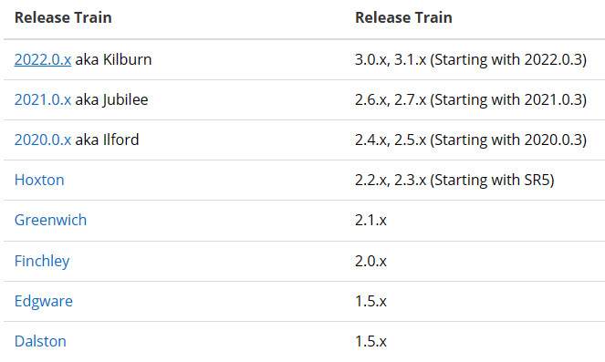

# SpringCloud

**SpringCloud是什么：**

Spring Cloud是一系列框架的有序集合，一套简单易懂、易部署和易维护的分布式系统开发工具包。

微服务是可以独立部署、水平扩展、独立访问（或者有独立的数据库）的服务单元，springcloud就是这些微服务的大管家。

**SpringCloud组件：**

- 服务治理组件 Eureka / Consul
- 客户端负载均衡组件 Ribbon 
- 声明式服务调用组件 Feign 
- API网关治理组件 Zuul / GateWay(高并发) 
- 熔断机制 HyStrix 
- 分布式配置中心组件 Spring Cloud Config / 携程 Apollo 
-  消息总线组件 Bus
-  消息驱动组件 Stream 
- 分布式服务跟踪组件 Sleuth 
-  全链路监控 SkyWalking

**SpringCloud与SpringBoot之间的关系：**

- Spring Boot 是 Spring 的一套快速配置脚手架，可以基于Spring Boot 快速开发单个微服务；
- Spring Cloud是一个基于Spring Boot实现的云应用开发工具；
- Spring Boot专注于快速、方便集成的单个个体，Spring Cloud是关注全局的服务治理框架；
- Spring Boot使用了默认大于配置的理念，很多集成方案已经帮你选择好了，能不配置就不配置;
- Spring Boot可以离开Spring Cloud独立使用开发项目，但是Spring Cloud离不开Spring Boot，属于依赖的关系；

**Spring boot 和 Spring Cloud的对应关系：**

