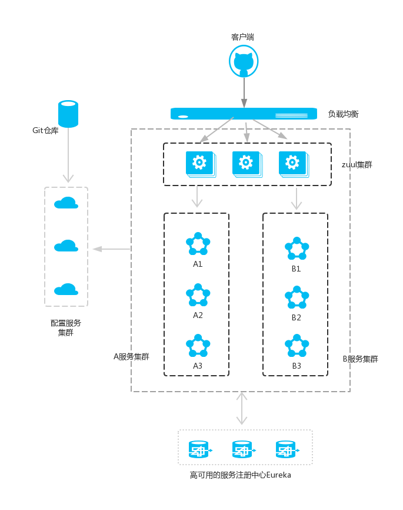

# 微服务

**微服务的特点：**

 - 一系列微小的服务共同组成
 - 跑在自己的进程里
 - 每个服务为独立的业务开发
 - 独立部署
 - 分布式的管理

 **架构演进：**
```
单体应用架构（orm） --> 垂直应用架构（mvc） --> 分布式服务架构（rpc） --> 流动计算架构（soa）--> 微服务架构
SOA架构：多个应用之间通过企业数据总线ESB通信的架构，其应用程序通过网络协议提供服务，消费服务，不同业务提供不同的服务。(阿里的服务治理框架Dubbo)
微服务架构：一个大型的应用拆分为多个相互独立的微服务，每个服务之间松耦合，通过REST API或者HTTP进行通信。
```
**什么是微服务?**

微服务是一种架构风格，将一个完整的应用从数据存储开始拆分成多个不同的服务，每个服务都能独立部署、独立维护、独立扩展，服务与服务间通过诸如RESTful API的方式互相调用，旨在解决复杂系统的开发和维护难题。

**为什么要使用微服务?**

 - 提高开发效率、降低系统复杂度
 - 提高系统的可扩展性，每个服务可以独立部署、升级和扩展
 - 提高系统的容错能力，一个服务崩溃不会影响整个系统的稳定性

**微服务的优缺点**
优点：

 - 高可扩展性：每个服务都是独立的，可以独立部署和扩展。
 - 灵活性：每个服务可以采用不同的编程语言、技术栈和开发团队。
 -  高可靠性：一个服务崩溃不会影响整个系统的稳定性。
 - 易于维护：每个服务都是小而简单的，易于理解、修改和测试。

 缺点：
  - 服务间通信开销大：由于服务间需要通过网络进行通信，所以通信开销相对较大。
 - 分布式事务难以处理：由于每个服务都是独立的，所以涉及多个服务的事务难以处理。
 - 部署和运维成本高：由于每个服务都是独立部署的，所以需要进行更多的部署和运维工作。

**微服务架构的应用场景**

微服务架构适用于大型、复杂的应用场景。特别是在高并发、大数据量、不断变化的业务场景下，微服务可以更加灵活地响应业务需求和用户需求。例如，电商平台、社交网络、在线视频等应用场景都可以考虑使用微服务架构。

**微服务架构的设计原则**
单一职责、服务自治、轻量级通信（跨平台、跨语言）、接口明确
 - 将应用程序拆分成小的、自治的服务：每个服务都有自己独立的生命周期，可以独立部署和升级。
 - 服务之间通过轻量级协议进行通信：例如REST、HTTP等，以减少通信开销和复杂度。
 - 每个服务都有自己的数据存储：这可以提高系统的可伸缩性和可用性，并减少服务之间的依赖关系。
 - 统一管理服务的配置和发布：可以通过集中式的配置管理和CI/CD流水线来管理服务的配置和发布过程。
 - 异步通信和事件驱动架构：这可以提高系统的可伸缩性和可用性，并减少服务间的依赖关系。

**微服务架构的主要组成部分**

在微服务架构中，需要几个基础的服务治理组件，包括服务注册与发现、服务消费、负载均衡、断路器、智能路由、配置管理等，由这几个基础组件相互协作，共同组建了一个简单的微服务系统。一个简单的微服务系统如下图：

